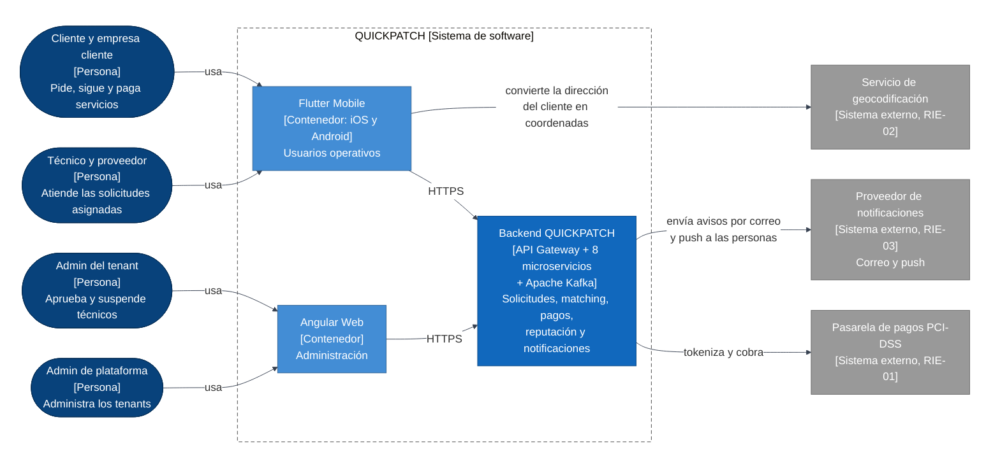
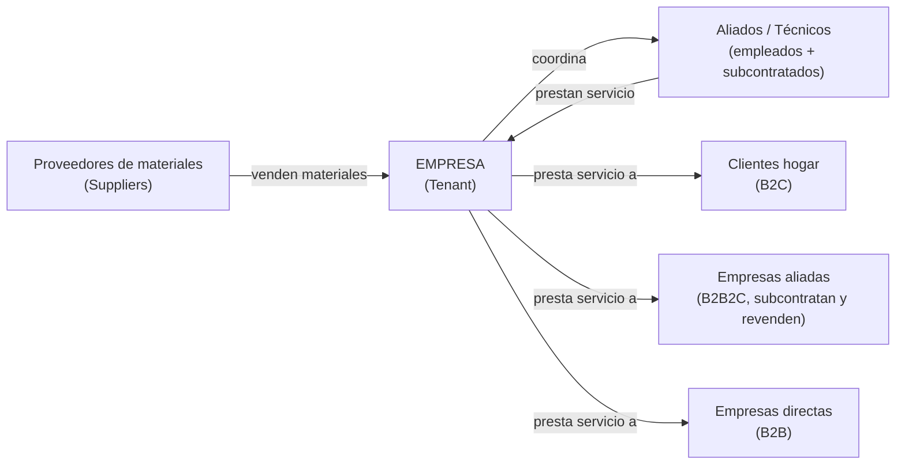
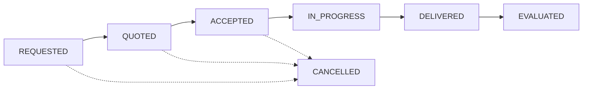
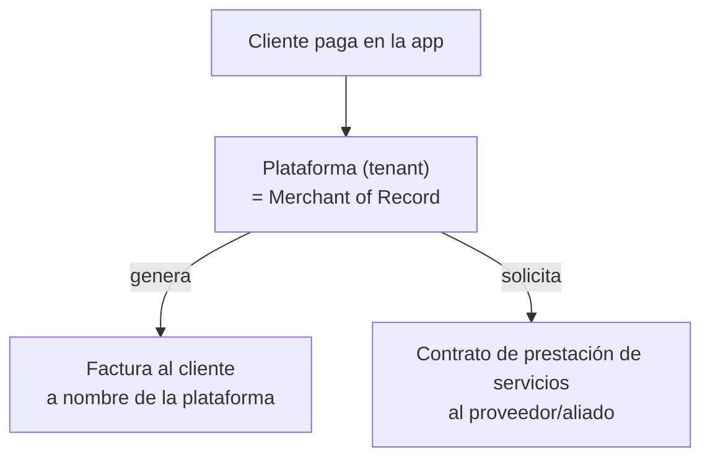

# Documento de Arquitectura de Software (SAD) V2.25 — QUICKPATCH

---

## 1. Drivers, killers y restricciones

Esta sección identifica las fuerzas que determinan las decisiones de arquitectura del sistema. Los _drivers_ son las necesidades de negocio y técnicas que impulsan la arquitectura hacia cierta forma. Los _killers_ son condiciones no negociables: una solución que las incumple queda invalidada, sin importar sus demás méritos. Las _restricciones_ son condiciones del proyecto (tiempo, presupuesto, hardware, red, equipo y alcance) que limitan el espacio de diseño, pero que podrían cambiar si cambia el contexto del proyecto.

### 1.1 Drivers

Cada driver es un requisito que da forma a la arquitectura. **Criterio de inclusión:** un requisito es driver solo si obliga a tomar una decisión de arquitectura (un ADR o un elemento de la arquitectura de alto nivel); los requisitos que se resuelven dentro de un servicio sin afectar la estructura del sistema se quedan en el SRS, y los killers y las restricciones (sección 1.2) no son drivers: limitan las alternativas, no impulsan el diseño. La columna "Origen" indica el requisito del SRS del que sale; "Atributos" indica los atributos de calidad (sección 2) que tienen al menos un escenario que mide el driver (sección 1.4); "Riesgo" describe qué falla si la arquitectura no lo atiende. La sección 1.4 traza cada driver hasta los escenarios de calidad y las decisiones de arquitectura que motiva.

|ID|Driver|Origen (SRS)|Atributos|Riesgo|Implicación arquitectónica|
|---|---|---|---|---|---|
|D1|Asignar automáticamente al técnico más cercano y disponible|RF-09, RF-10, RNF-05; SRS, sección 2.2 (función 3)|AC1, AC2, AC9|Si la búsqueda por cercanía o la reasignación son lentas o fallan, la asignación supera los 60 segundos de RNF-05 o la solicitud queda sin técnico|Consultas geoespaciales (PostGIS), estado de disponibilidad por técnico y reasignación automática ante rechazo o falta de respuesta. La asignación es inmediata: no hay agendamiento por horario|
|D2|Seguimiento del servicio en tiempo real|RF-11, RNF-06; diferenciador frente a la competencia (SRS, sección 6)|AC2, AC4|Si el cliente depende de consultar por su cuenta o se pierden cambios de estado, la interfaz no se actualiza en menos de 1 minuto (RNF-06) y se pierde el diferenciador del producto|Cada cambio de estado se publica como evento y se entrega al cliente a través del API Gateway, sin que el cliente consulte por su cuenta|
|D3|Reputación del técnico basada en calificaciones|RF-12; SRS, sección 2.2 (función 6)|AC4, AC9|Si el cálculo de reputación se acopla al flujo del servicio, una falla del ranking bloquea el cierre de servicios; una reputación incorrecta expone al cliente a técnicos mal evaluados|Ranking Service separado que consume los eventos de evaluación. El ranking de proveedores de materiales queda fuera del MVP|
|D4|Comprobante automático a nombre de la plataforma (merchant of record)|RF-22, RF-23, RF-24; SRS, sección 2.2 (función 5)|AC3, AC9|Si la emisión depende de una llamada síncrona o el evento de pago se pierde o se duplica, queda un pago confirmado sin comprobante o con comprobante duplicado|Payments emite el comprobante al consumir el evento `payment.approved`, publicado con Outbox y procesado de forma idempotente, y la plataforma es la única emisora frente al cliente. No incluye liquidación a técnicos ni contabilidad (R1)|
|D5|Multi-tenancy y soporte a múltiples empresas oferentes|RF-04, RF-06, RNF-09, RNF-10; modelo de negocio B2B2E|AC6, AC8|Si el aislamiento depende solo de que cada consulta recuerde filtrar por tenant, un error de código expone datos de una empresa a otra|Aislamiento de datos por tenant desde el diseño inicial|
|D6|Trazabilidad ante reclamaciones|RF-28; necesidad de resolver disputas entre cliente y técnico|AC6, AC7|Sin un historial completo del ciclo de vida, no es posible reconstruir quién hizo qué ante una reclamación|Registro histórico de eventos del ciclo de vida del servicio|
|D7|Evidencia fotográfica obligatoria para completar un servicio|RF-15; SRS, Feature F3.2 (cierre del servicio con evidencia fotográfica obligatoria)|AC6|Si las fotos se guardan en la base de datos o en un servicio externo, se satura PostgreSQL o se viola R5; sin el bloqueo, un servicio se completa y se cobra sin evidencia|Almacenamiento de objetos en infraestructura propia (Garage en VM7, ADR-016), tabla `service_evidence` y bloqueo de la transición a `completado` sin al menos una foto|
|D8|Ambiente de pruebas separado de producción y bloqueo del despliegue ante fallos|RNF-07, RNF-08; SRS, sección 5.3|AC7, AC9|Sin un ambiente aislado y un bloqueo automático, un cambio defectuoso en el flujo crítico llega a producción; con 7 VMs fijas (R10), el ambiente de pruebas compite por capacidad con producción|Ambiente de QA permanente en VM2 con sus propios k3s, PostgreSQL, Redis, Kafka y Garage (ADR-015), y quality gate que bloquea el despliegue si fallan las pruebas del flujo crítico|

> Los requisitos de pago con PCI-DSS, que antes eran el driver D4, pasan al killer K2: son una condición no negociable, no una fuerza que impulse el diseño. La numeración anterior saltaba del D5 al D8 sin que existieran D6 ni D7; en esta versión los drivers se numeran de forma consecutiva (equivalencias en la sección 9, versión 2.10).

### 1.2 Killers y restricciones

Los dos conceptos descartan alternativas de diseño, pero por razones distintas. Un **killer** viene de una norma o de una obligación externa al proyecto: no se negocia y una solución que lo incumple no es válida. Una **restricción** viene de las condiciones en que se construye el proyecto: se respeta en esta versión, pero dejaría de aplicar si esas condiciones cambian (más tiempo, presupuesto, hardware o personas). Los recortes de alcance que no descartan alternativas de arquitectura se listan aparte, en la sección 1.3.

#### 1.2.1 Killers

|ID|Killer|Origen|Qué invalida|
|---|---|---|---|
|K2|Cumplimiento PCI-DSS|La norma PCI-DSS prohíbe almacenar el código de seguridad (CVV) tras la autorización; el equipo decide además no almacenar el número de tarjeta (PAN) para reducir su alcance de cumplimiento|Almacenar o registrar en logs el CVV o el número de tarjeta, y que los datos de tarjeta pasen por el backend propio: la captura va directo a la pasarela certificada, que devuelve solo un token|
|K12|Protección de datos personales (Ley 1581 de 2012)|Norma colombiana de protección de datos personales, que aplica porque el producto opera en Bogotá (R6) y trata datos de clientes y técnicos (nombre, teléfono, dirección, ubicación y fotos de evidencia)|Tratar datos personales sin autorización previa del titular o para una finalidad distinta a la informada, y un diseño que impida al titular consultar, actualizar o suprimir sus datos|
|K13|Protección al consumidor (Ley 1480 de 2011, Estatuto del Consumidor)|Norma colombiana que aplica porque la plataforma ofrece servicios a consumidores finales por un medio electrónico (comercio electrónico, artículo 50)|Un diseño que no informe al cliente el precio total y las condiciones antes de aceptar (cotización, RF-34 y RF-35), que no deje constancia consultable de cada transacción, o que no tenga un mecanismo para recibir y atender reclamos y la garantía del servicio|
|K14|Facturación electrónica (Estatuto Tributario, artículo 616-1, y la regulación de la DIAN)|Al actuar como merchant of record (D4), la plataforma es la emisora de la factura de cada servicio cobrado, y en Colombia la factura con validez fiscal es electrónica y validada por la DIAN|Emitir a nombre de la plataforma un documento que se presente como factura sin la validación de la DIAN|

#### 1.2.2 Restricciones

|ID|Restricción|Origen|Qué limita|
|---|---|---|---|
|R1|No es un ERP|Alcance del MVP definido por el equipo con el Product Owner (SRS, sección 2.2: las funciones del producto no incluyen contabilidad ni nómina)|Contabilidad general, nómina legal, liquidación y pagos a técnicos, inventarios. La facturación del modelo merchant of record (D4) se limita a emitir el comprobante de cada pago confirmado|
|R3|Tiempo académico de aproximadamente 3 meses|Calendario del curso|Módulos y funcionalidades que no quepan en los sprints del curso; lo que no entra se declara fuera de alcance (sección 1.3)|
|R5|Sin presupuesto: producción corre en infraestructura propia|El proyecto no tiene presupuesto; las VMs las aprovisiona la universidad|Que el cómputo o los datos que atienden usuarios en producción corran fuera de las 7 VMs del laboratorio (bases de datos, colas o almacenamiento administrados en la nube, aunque tengan capa gratuita) y cualquier servicio con costo. Se permiten herramientas gratuitas de desarrollo y CI que no guardan datos de usuarios (GitHub Actions, GitHub Container Registry). La única dependencia externa de producción es la pasarela de pagos, exigida por K2|
|R6|Operación limitada a Bogotá D.C.|Alcance geográfico del MVP|Otras ciudades o países: multi-moneda, varios idiomas, despliegue multi-región y normativa extranjera. No exime de la normativa colombiana que aplica al producto: protección de datos personales (K12) y facturación|
|R7|Sin operación 24/7|Equipo de estudiantes, sin turnos ni guardias|Failover automático entre máquinas, despliegue multi-zona y cualquier diseño que dependa de que alguien atienda incidentes fuera del horario de trabajo. El reinicio de pods y el rollback de k3s dentro de una misma VM sí se permiten|
|R9|Red privada del laboratorio, sin dominio público|Las 7 VMs viven en la red privada de la universidad (`10.43.x.x`) y no son alcanzables desde Internet (Documento de Infraestructura, sección 11)|Exponer servicios directamente a Internet, usar dominio y DNS públicos, certificados de una autoridad pública (Let's Encrypt) y depender de llamadas entrantes de terceros, como los webhooks de la pasarela de pagos, sin un mecanismo de acceso aprobado por el equipo|
|R10|Hardware fijo: 7 VMs idénticas|Aprovisionadas por el laboratorio: 4 vCPU, 11 GiB de RAM y 68 GB de disco cada una (Documento de Infraestructura, sección 3)|Diseños que requieran más máquinas o capacidad distinta por rol, como un clúster de Kubernetes de varios nodos o una VM por microservicio; los recursos de cada servicio se ajustan a esta capacidad (Documento de Infraestructura, sección 5.6)|
|R11|Una sola persona administra la infraestructura|Estructura del equipo: un único rol de DevOps|Configuración manual o no reproducible de las VMs: toda configuración se hace con Ansible desde un solo inventario (sección 5.4)|
|R12|El técnico no es subordinado de la plataforma|Riesgo de que se configure un contrato realidad (Código Sustantivo del Trabajo, artículos 23 y 24) si la plataforma ejerce subordinación sobre los técnicos; el equipo lo adopta como restricción de diseño, pendiente de validación jurídica|Funcionalidades que impongan turnos u horarios, exclusividad o sanciones por rechazar ofertas. El técnico decide su disponibilidad (RF-13) y puede rechazar una oferta sin penalización (RF-10)|

> **Equivalencias con versiones anteriores (2.16):** las restricciones conservan el número que tenían como killers, con prefijo R: K1 → R1, K3 → R3, K5 → R5, K6 → R6, K7 → R7, K9 → R9, K10 → R10, K11 → R11. K2 sigue siendo killer y K12 es nuevo (antes la Ley 1581 solo se mencionaba dentro de K6). En la versión 2.17 se agregan K13 y K14 (normativa de consumo y de facturación) y la restricción R12. K4 y K8 se retiraron en la versión 2.9 y pasaron a la sección 1.3 como FA1 y FA2. El stack tecnológico no es una restricción: es una decisión del equipo, documentada en ADR-012.

> **Conflicto de K13 con FA3, por resolver:** el Estatuto del Consumidor exige un mecanismo para recibir y atender reclamos, y la sección 1.3 deja fuera del MVP el módulo de reclamos (FA3). El equipo debe decidir entre (a) un canal mínimo de reclamos en el MVP (por ejemplo, un formulario que registra el reclamo y lo asocia a la solicitud, con la trazabilidad de D6), o (b) atenderlos por un canal externo documentado (correo de soporte) y dejar el módulo en el roadmap.

> **Conflicto de K14 con R5 y R9, por resolver:** validar facturas ante la DIAN exige un proveedor tecnológico autorizado o la solución gratuita de la DIAN, y en ambos casos una conexión saliente a Internet. R5 (sin presupuesto) descarta un proveedor con costo y R9 limita la conectividad de la red del laboratorio. El equipo debe decidir entre (a) emitir en el MVP un comprobante de pago sin validez fiscal, rotulado como tal, y dejar la factura electrónica para producción real, o (b) integrar la solución gratuita de la DIAN, que exige resolver la conectividad de R9 y el registro del facturador.

> **Consecuencia de R9 sin resolver:** los técnicos en campo con datos móviles y los webhooks de la pasarela de pagos necesitan alcanzar el sistema desde fuera de la red del laboratorio, lo que R9 hoy impide. El equipo debe decidir el mecanismo: (a) limitar la demostración a la red del campus y reemplazar los webhooks por consulta periódica del estado del pago; (b) exponer solo el API Gateway mediante un túnel gratuito, evaluado contra R5; o (c) solicitar a la universidad una IP pública o una regla de NAT hacia VM1.

> **Sobre R7 y la recuperación en 12–24 h:** la ventana de recuperación manual de 12 a 24 horas (AC5-E1) no la impone R7: es el objetivo que el equipo fijó para operar dentro de R7, sin guardias.

### 1.3 Fuera de alcance

Recortes del MVP derivados de R3. No son restricciones de arquitectura: el diseño no los impide, simplemente no se construyen en esta versión.

|ID|Fuera de alcance|Consecuencia|
|---|---|---|
|FA1|Modo offline o manejo de conectividad intermitente (antes K4)|La aplicación móvil asume conexión con el sistema; no hay sincronización diferida|
|FA2|Sitio público con SEO (antes K8)|El frontend web se limita al panel administrativo: sin páginas públicas indexables ni integración con redes sociales|
|FA3|Chat y módulo de reclamos dentro de la aplicación (roadmap 1.x)|Las disputas se resuelven fuera de la aplicación, con la trazabilidad de D6 como evidencia|

### 1.4 Trazabilidad de los drivers

Cada driver se sigue desde los requisitos que lo originan hasta los escenarios de calidad que lo miden y las decisiones de arquitectura que motiva.

|Driver|Requisitos (SRS)|Escenarios de calidad|Decisiones de arquitectura|
|---|---|---|---|
|D1 Asignación automática|RF-09, RF-10, RF-13, RNF-05, RIE-02|AC1-E1, AC2-E1, AC2-E3, AC2-E4, AC9-E4|ADR-004 (PostgreSQL + PostGIS), ADR-006 (Kafka)|
|D2 Seguimiento en tiempo real|RF-11, RNF-06, RIE-03|AC2-E3, AC4-E9|ADR-006 (Kafka), ADR-007 (Outbox)|
|D3 Reputación del técnico|RF-12, RF-19, RF-20|AC4-E6, AC9-E2|ADR-003 (Ranking Service independiente)|
|D4 Comprobante a nombre de la plataforma|RF-22, RF-23, RF-24, RIE-01|AC3-E1, AC9-E5|ADR-006 (Kafka), ADR-007 (Outbox e idempotencia), ADR-009 (tokenización de pagos)|
|D5 Multi-tenancy|RF-04, RF-06, RF-21, RNF-09, RNF-10|AC6-E2, AC8-E1|ADR-005 (shared-schema con RLS)|
|D6 Trazabilidad ante reclamaciones|RF-28, RNF-04|AC6-E5, AC6-E6, AC6-E7, AC7-E4|ADR-006 (Kafka), ADR-007 (Outbox)|
|D7 Evidencia fotográfica|RF-15|AC6-E5|ADR-016: almacenamiento de objetos con Garage en VM6 (producción) y VM7 (QA) (sección 5.5, ADR-022)|
|D8 Ambiente de pruebas y bloqueo del despliegue|RNF-07, RNF-08|AC7-E6, AC9-E7|ADR-015 y ADR-022: ambiente de QA permanente en VM2, VM5 y VM7 (sección 5.5)|

## 2. Atributos de Calidad

Los atributos de calidad expresan, en términos medibles, las propiedades que el sistema debe cumplir. Cada atributo seleccionado está sustentado por uno o más de los drivers, killers o restricciones definidos en la sección anterior.

Los 9 ACs mapean 1 a 1 con las **9 características de ISO/IEC 25010:2023**, en su orden canónico. Donde QUICKPATCH tenía dos ACs distintos sustentando en el fondo la misma característica ISO, se fusionaron (ver nota de fusión debajo de la tabla); donde una característica no tenía ningún AC, se agregó.

|ID|Atributo (característica ISO)|Sustentado por|Prioridad|
|---|---|---|---|
|AC1|Functional Suitability|D1; SRS — requisitos funcionales, cumplimiento funcional del sistema|Media|
|AC2|Performance Efficiency|D1, D2|**Alta**|
|AC3|Compatibility|D4, ISO/IEC 25010:2023 — RIE-01|Baja|
|AC4|Interaction Capability|D2, D3; ISO/IEC 25010:2023 — RNF-11, RNF-12|Baja|
|AC5|Reliability|R5, R7|**Alta**|
|AC6|Security|K2, D5, D6, D7|**Alta**|
|AC7|Maintainability|R3, D6, D8|Media|
|AC8|Flexibility|D5, ISO/IEC 25010:2023 — ADR-002, RNF-09, RIE-02|Media|
|AC9|Safety|D1, D3, D4, D8; decisión del equipo con el Product Owner: riesgo físico y patrimonial por fallos de la plataforma, ver sección 3.9|**Alta**|

**Prioridad del atributo:** se deriva de la priorización de sus escenarios (sección 3.10): **Alta** si tiene al menos dos escenarios prioritarios y uno de ellos es Alta/Alta; **Media** si tiene al menos uno; **Baja** si no tiene ninguno. Orden resultante: AC5 Reliability (5 prioritarios, 3 Alta/Alta), AC6 Security (4, 1), AC2 Performance Efficiency (2, 1) y AC9 Safety (2, 1); después AC1, AC7 y AC8 (1 cada uno) y, al final, AC3 y AC4 (ninguno). Parte de esta priorización usa la valoración propuesta (†) de la sección 3.10.

**Fusiones aplicadas:**
- El AC de Seguridad (antes AC2) absorbe los escenarios de *Accountability* del antiguo AC de Trazabilidad (antes AC6) — ambos son, a nivel de característica ISO, **Security**. El escenario de idempotencia (antes AC6-E3) no es Accountability, así que se reclasificó dentro de **Reliability** (subcaracterística *Fault Tolerance*), no dentro de Security.
- El AC de Flexibilidad (antes AC9) absorbe los escenarios de *Adaptability*/*Scalability* del antiguo AC de Escalabilidad (antes AC4) — ambos son, a nivel de característica ISO, **Flexibility**. Un escenario de cada AC resultó redundante (medía literalmente lo mismo que otro ya existente) y se retiró en vez de mantenerse duplicado — ver sección 3.
- Un escenario del antiguo AC de Compatibilidad (antes AC8) en realidad es *Replaceability*, y se movió al AC de Flexibilidad — su sustento (RIE-02) se movió con él, hacia AC8.

> **Pendiente, y más relevante de lo que parece:** RIE-03 (servicio de notificaciones) sustentaba al antiguo AC de Compatibilidad junto con RIE-01 y RIE-02, y no tiene un AC propio que lo sustente formalmente. Esto no significa que el sistema de notificaciones esté fuera de todo escenario — AC2-E3 ya mide "menos de 7 segundos desde la creación de la solicitud hasta la notificación" y AC5-E5 usa "doble notificación" como ejemplo de efecto duplicado a evitar — sino que **una dependencia externa (RIE-03) queda dentro de un SLO comprometido (los 7 segundos de AC2-E3) sin que ningún escenario de interoperabilidad la cubra explícitamente**. Communication Service (que incluye Notifications) es uno de los 8 microservicios de dominio con VM propia (sección 5.1, 4.2.2) — no es un módulo transversal. Un escenario nuevo bajo *Co-existence* o *Functional Completeness* cerraría este hueco; *Interoperability* no serviría porque AC3-E1 ya la cubre y no sumaría al conteo de subcaracterísticas.

> **Regla de relación driver–atributo:** un driver sustenta un atributo cuando al menos un escenario de ese atributo mide el driver (matriz de la sección 1.4); la columna "Atributos" de la sección 1.1 y la columna "Sustentado por" de esta tabla aplican la misma regla. AC1 y AC4 se sustentan además en los requisitos del SRS y en los atributos genéricos de la norma **ISO/IEC 25010:2023**, y AC3 y AC8 combinan un driver (D4 y D5) con la norma. AC5 no tiene driver: sus escenarios responden a las restricciones R5 y R7. AC9 (Safety) se sustenta en D1, D3, D4 y D8 y en la definición que el equipo acordó con el Product Owner de qué significa Safety para QUICKPATCH — ver sección 3.9.

---

### 2.1 Escenarios arquitectónicamente significativos

Son los escenarios prioritarios de la sección 3.10 (importancia de negocio Alta y dificultad Media o Alta), ordenados por la prioridad de su atributo. Son los que condicionan la arquitectura de la sección 4 y los ADR de las secciones 5.5 y 6; las seis partes de cada uno están en la sección 3. **†** marca una valoración propuesta, pendiente de ratificación (sección 3.10). "Relacionado" indica que el ADR atiende el escenario, pero su justificación todavía no lo cita.

|Escenario|Atributo|Importancia / Dificultad|Driver, killer o restricción|Medida|ADR|
|---|---|---|---|---|---|
|AC5-E3 Caída de un microservicio|Reliability|Alta / Alta|R7|0% de eventos perdidos; el servicio procesa el backlog al reiniciar|ADR-003|
|AC5-E4 Kafka no disponible|Reliability|Alta / Alta|R7|0 eventos perdidos; reintento automático sin intervención manual|ADR-003, ADR-006, ADR-007|
|AC5-E5 Evento duplicado por reintento|Reliability|Alta / Alta|R7|0 efectos duplicados, verificable por `eventId`|ADR-007|
|AC5-E1 Caída de un componente no crítico|Reliability|Alta / Media|R7|Recuperación manual en 12 a 24 horas|—|
|AC5-E6 Operación sin fallos del flujo crítico †|Reliability|Alta / Media|—|Menos del 1% de respuestas 5xx y 0 fallos en la prueba E2E programada|—|
|AC6-E2 Aislamiento multi-tenant|Security|Alta / Alta|D5|0 fugas de datos entre tenants|ADR-005|
|AC6-E1 Protección de datos de pago|Security|Alta / Media|K2|0 números de tarjeta o CVV en base de datos o logs|ADR-009|
|AC6-E4 Token comprometido o expirado|Security|Alta / Media|—|100% de los tokens inválidos o expirados rechazados|—|
|AC6-E5 Reconstrucción de una disputa|Security|Alta / Media|D6, D7|100% de las transiciones de estado registradas, sin pasos faltantes|—|
|AC2-E1 Búsqueda de técnicos cercanos|Performance Efficiency|Alta / Alta|D1|Menos de 3 segundos para el 95% de las solicitudes|ADR-004, ADR-012|
|AC2-E3 Procesamiento en segundo plano|Performance Efficiency|Alta / Media|D1, D2|Menos de 7 segundos desde la creación de la solicitud hasta la notificación|ADR-006|
|AC9-E5 Pasarela de pagos sin respuesta †|Safety|Alta / Alta|D4|0 servicios en `pagado` sin `payment.approved` y 0 cobros duplicados por reintento|ADR-007 (relacionado)|
|AC9-E1 Transiciones seguras del ciclo de servicio †|Safety|Alta / Media|—|0 transiciones inválidas en `service_requests`|—|
|AC1-E1 Filtro de especialidad en el matching †|Functional Suitability|Alta / Media|D1|0% de asignaciones a un técnico de otra especialidad|—|
|AC7-E6 Validación del incremento en QA antes de producción †|Maintainability|Alta / Media|D8|100% de los despliegues pasan antes por QA (VM2, VM5 y VM7); 0 pruebas de carga o de seguridad contra producción|ADR-015 (relacionado)|
|AC8-E3 Incorporación de un nuevo canal o tipo de cliente|Flexibility|Alta / Media|—|0 cambios en los microservicios de dominio para un nuevo tipo de cliente|—|

### 2.2 Validación de la arquitectura contra los RNF

Cada requisito no funcional del SRS (sección 5) se sigue hasta el escenario que lo mide, las decisiones y componentes que lo atienden y la evidencia que existe hoy en el código o en la operación. La validación se hizo el 7 de octubre de 2026 sobre `develop` de los 12 repositorios.

**Estado:** *Cubierto* = hay escenario, decisión y evidencia en el código o en un pipeline; *Parcial* = la arquitectura lo atiende, pero falta el escenario o la evidencia; *Sin cobertura* = ningún componente lo implementa todavía.

|RNF|Escenario|Decisiones y componentes|Evidencia actual|Estado|
|---|---|---|---|---|
|RNF-01 PCI-DSS, tarjeta en un proveedor certificado|AC6-E1|ADR-009 (tokenización); Payments Service|Payments Service es todavía un esqueleto sin flujo de pago|Parcial|
|RNF-02 HTTPS/TLS cliente-servidor|Ninguno|API Gateway Nginx con TLS 1.2/1.3 (VM1); la app móvil fija el certificado de QA (`CERT_SHA256`)|`gateway-nginx.conf.j2` y `qa-nginx.conf.j2` limitan los protocolos a TLS 1.2 y 1.3; `cliente_api.dart` valida el certificado|Parcial|
|RNF-03 Contraseñas con *hashing* seguro|Ninguno|Identity Service|`BCryptPasswordHasher` con factor de trabajo configurable; una prueba de integración verifica que el registro guarda un hash BCrypt|Parcial|
|RNF-04 Log de todo acceso denegado (403)|AC6-E3, AC6-E8|Identity, Catalog y ServiceRequest; Loki (ADR-016)|Manejador de autorización que registra método, ruta, usuario y rol en cada 403, en los tres servicios con endpoints protegidos|Cubierto|
|RNF-05 Matching inicia en menos de 60 s|AC2-E3 (7 s, más exigente)|ADR-006 (Kafka), ADR-007 (Outbox); ServiceRequest → `service-request.created` → Matching|Prueba local del 7 de octubre: la solicitud llega a Matching por el Outbox (`tests/e2e/evidencias/mvp-local-2026-10-07.txt`); sin medición en QA|Parcial|
|RNF-06 Cambio de estado visible en menos de 1 minuto|AC2-E3, AC4-E9|ADR-006; Communication Service; canal en tiempo real de la app|La app tiene el modelo del mensaje en tiempo real, pero la pantalla de detalle solo se actualiza al deslizar; Communication Service no emite notificaciones|Sin cobertura|
|RNF-07 Ambiente de QA permanente|AC7-E6|ADR-015 y ADR-022 (QA en VM2, VM5 y VM7)|Los pipelines despliegan `release/**` en QA (`deploy-k3s.yml`); el despliegue real depende de los secretos y las VMs de DevOps|Parcial|
|RNF-08 Un fallo en QA bloquea producción|AC7-E6, AC9-E7|ADR-015; pipelines por repositorio; `pruebas-sistema.yml`|Las pruebas del sistema corren al hacer *push* a `release/**`, pero el job `produccion` de cada servicio solo depende de la imagen: nada impide desplegar en producción si fallaron|Parcial|
|RNF-09 Nuevos tenants sin afectar a los existentes|AC8-E1|ADR-005 (RLS); Identity (`tenants`, administradores iniciales)|Listado y activación de tenants (`/v1/platform/tenants`, SCRUM-112); el alta de un tenant es por datos semilla, no por la API|Parcial|
|RNF-10 Filtro automático por `tenant_id`|AC6-E2|ADR-005, ADR-019 (roles de base de datos)|RLS con `app.current_tenant` en Identity, Catalog y ServiceRequest; pruebas de aislamiento contra PostgreSQL real|Cubierto|
|RNF-11 Solicitud en máximo 3 pasos|AC4-E1|Flutter (ADR-002)|`nueva_solicitud_page.dart`: un formulario con categoría, descripción, dirección y ubicación, y una pantalla de confirmación|Cubierto|
|RNF-12 Diseño responsivo|AC4-E2|Flutter (ADR-002) y Angular|Sin pruebas de tamaños de pantalla en ninguna de las dos apps|Parcial|
|RNF-13 Control de versiones de entregables y Jira|— (requisito de proceso)|Repositorio `quickpatch`, Working Agreements|Historial de versiones de SRS, SAD, SDD y DD; trazabilidad a SCRUM en los commits|Cubierto|

**RNF sin escenario.** RNF-02 y RNF-03 no tienen un escenario de calidad que los mida. Se registran como decisión abierta: o se agregan como escenarios de AC6 (*Confidentiality*), o se aceptan como restricciones verificables por inspección y se mueven a la sección 1.2.2.

**Acciones correctivas.**

|RNF|Acción|Responsable|
|---|---|---|
|RNF-08|Hacer que el despliegue a producción dependa del resultado de `pruebas-sistema.yml` sobre la misma versión, o un ambiente protegido con aprobación en GitHub|DevOps|
|RNF-06|Implementar el canal de estado en Communication Service y suscribir la pantalla de detalle; mientras tanto, consultar el estado cada 30 segundos|Backend y Frontend|
|RNF-05, RNF-07|Medir en QA el tiempo desde `POST /v1/service-requests` hasta el consumo en Matching, cuando el ambiente esté desplegado|QA|
|RNF-09|Exponer el alta de tenants en la API de plataforma y medir AC8-E1 (tenant funcional en menos de 1 hora)|Backend|
|RNF-12|Agregar pruebas de diseño por tamaño de pantalla (widget tests en Flutter, viewport en Angular)|Frontend|
|RNF-01|Validar AC6-E1 cuando Payments implemente la tokenización|Backend y QA|

**Hallazgo de contratos.** La app móvil llama a `POST /v1/auth/register/company`, que el DD lista como pendiente (DEP-13) pero que no existe en `identity.v1.yaml`. Hasta que Backend lo publique en el contrato, el registro de empresas desde la app falla.

---

## 3. Escenarios de Calidad

Cada escenario sigue la estructura de seis partes: fuente del estímulo, estímulo, ambiente, artefacto, respuesta y medida de la respuesta.

Cada escenario se clasifica en uno de tres tipos:

- **Uso**: operación normal del sistema, lo que ocurre en el día a día.
- **Cambio**: crecimiento o modificación esperada del sistema con el tiempo (nuevos tenants, nuevo código, nuevos servicios).
- **Fallo**: algo se rompe o deja de responder — cómo reacciona el sistema ante condiciones adversas o inesperadas.

### 3.1 AC1 — Functional Suitability

Característica agregada en esta versión (ver sección 2). Cubre si el sistema hace lo que promete (*Functional Correctness*), si ofrece las funciones necesarias (*Functional Completeness*) y si esas funciones son las apropiadas para las tareas del usuario (*Functional Appropriateness*). Cada una de las tres subcaracterísticas tiene un escenario.

**Escenario 1 — Filtro de especialidad en el matching** · _Tipo: Uso_ · _(Functional Correctness)_

|Parte|Contenido|
|---|---|
|Fuente|Sistema (tras crear una solicitud)|
|Estímulo|El motor de matching busca técnicos candidatos para una categoría de servicio específica|
|Ambiente|Operación normal|
|Artefacto|Motor de matching — filtro de especialidad|
|Respuesta|Solo se consideran candidatos cuya especialidad registrada coincide con la categoría solicitada|
|Medida|0% de asignaciones a un técnico de especialidad distinta a la solicitada, verificable en `matching_attempts`|

**Escenario 2 — Cobertura de requisitos del MVP** · _Tipo: Uso_ · _(Functional Completeness)_

|Parte|Contenido|
|---|---|
|Fuente|Equipo de QA o evaluador|
|Estímulo|Verifica que el sistema implementa los requisitos funcionales del MVP antes de la entrega|
|Ambiente|Release candidate desplegado|
|Artefacto|Requisitos funcionales de prioridad Alta del SRS y sus pruebas de aceptación|
|Respuesta|Cada requisito tiene al menos una prueba de aceptación ejecutable, y el flujo crítico solicitud → pago → calificación (RF-27) se ejecuta completo|
|Medida|100% de los requisitos funcionales de prioridad Alta con una prueba de aceptación aprobada en el checklist de aceptación del release|

**Escenario 3 — Información suficiente para ejecutar el servicio** · _Tipo: Uso_ · _(Functional Appropriateness)_

|Parte|Contenido|
|---|---|
|Fuente|Técnico|
|Estímulo|Consulta el detalle de una solicitud que se le asignó (RF-14)|
|Ambiente|Operación normal|
|Artefacto|Pantalla de detalle de la solicitud|
|Respuesta|Muestra lo necesario para ejecutar el servicio sin contactar al cliente por otro canal|
|Medida|100% de las solicitudes asignadas muestran categoría, dirección y descripción del problema|

> **Pendiente:** la votación ATAM de los escenarios de este AC (requiere al cliente/stakeholders de negocio, no solo al equipo).

### 3.2 AC2 — Performance Efficiency

**Escenario 1 — Búsqueda de técnicos cercanos** · _Tipo: Uso_ · _(Time Behaviour)_

|Parte|Contenido|
|---|---|
|Fuente|Cliente|
|Estímulo|Solicita técnicos cercanos disponibles|
|Ambiente|Horario de alta demanda|
|Artefacto|Mecanismo de búsqueda por ubicación y disponibilidad|
|Respuesta|Devuelve lista ordenada por distancia y ranking|
|Medida|Menos de 3 segundos para el 95% de las solicitudes|

**Escenario 2 — Consulta de historial** · _Tipo: Uso_ · _(Time Behaviour)_

|Parte|Contenido|
|---|---|
|Fuente|Cliente o técnico|
|Estímulo|Consulta su historial de servicios|
|Ambiente|Operación normal, historial con múltiples solicitudes acumuladas|
|Artefacto|Módulo de gestión de solicitudes|
|Respuesta|Devuelve el historial paginado|
|Medida|Menos de 1.5 segundos para cargar una página de resultados|

**Escenario 3 — Procesamiento en segundo plano** · _Tipo: Uso_ · _(Time Behaviour)_

|Parte|Contenido|
|---|---|
|Fuente|Sistema (tras la creación de una solicitud)|
|Estímulo|Se dispara la búsqueda de técnicos candidatos|
|Ambiente|Operación normal|
|Artefacto|Mecanismo de procesamiento asíncrono|
|Respuesta|Identifica y notifica a los técnicos candidatos|
|Medida|Menos de 7 segundos desde la creación de la solicitud hasta la notificación|

**Escenario 4 — Pico de carga inesperado** · _Tipo: Fallo_ · _(Capacity)_

|Parte|Contenido|
|---|---|
|Fuente|Carga de usuarios|
|Estímulo|Un pico de solicitudes supera la capacidad prevista (ej. campaña o promoción viral)|
|Ambiente|Evento de demanda no anticipado|
|Artefacto|Matching Service|
|Respuesta|El sistema degrada de forma controlada (cola de espera) en vez de caerse por completo|
|Medida|El sistema soporta hasta **150 solicitudes de matching concurrentes** (estimado como 3 veces una carga esperada de ~50 solicitudes concurrentes en hora pico) sin devolver errores ni caerse por completo; el tiempo de respuesta puede degradarse más allá de los 3 segundos definidos en el Escenario 1, pero el servicio sigue respondiendo|

**Escenario 5 — Uso de recursos bajo carga normal** · _Tipo: Uso_ · _(Resource Utilization)_

|Parte|Contenido|
|---|---|
|Fuente|Carga de usuarios|
|Estímulo|Operación sostenida en hora pico, con ~50 solicitudes de matching concurrentes (la carga esperada del Escenario 4)|
|Ambiente|Ambiente de QA (VM2, VM5 y VM7; ADR-015 y ADR-022), con los 8 microservicios desplegados con los mismos `requests` y `limits` de producción|
|Artefacto|Pods en k3s con los `requests` y `limits` del Documento de Infraestructura, sección 5.6|
|Respuesta|Cada servicio opera dentro de sus límites declarados y el consumo queda registrado|
|Medida|0 reinicios por OOMKilled y cada pod dentro de sus `limits` declarados, medidos con `kubectl` y Grafana durante la prueba de carga con k6 en QA; el consumo de CPU y RAM queda registrado como línea base. El total de RAM no se compara con el presupuesto de VM3, porque en QA todos los componentes comparten una sola VM|

> **Nota:** el antiguo escenario "crecimiento del catálogo de técnicos" (Escalabilidad) medía literalmente el mismo umbral que el Escenario 1 (<3s) bajo crecimiento de datos en vez de carga concurrente — se retiró por redundante en vez de mantenerse como escenario aparte.

### 3.3 AC3 — Compatibility

**Escenario 1 — Integración con la pasarela de pagos externa** · _Tipo: Uso_ · _(Interoperability)_

|Parte|Contenido|
|---|---|
|Fuente|Cliente o Empresa|
|Estímulo|Confirma el pago de un servicio|
|Ambiente|Operación normal|
|Artefacto|Integración con la pasarela de pagos certificada PCI-DSS (RIE-01)|
|Respuesta|El sistema envía la solicitud de cobro en el formato esperado por la pasarela y procesa la respuesta sin errores de interoperabilidad|
|Medida|100% de las transacciones se procesan sin errores de formato o protocolo con la pasarela|

**Escenario 2 — Convivencia de los 8 microservicios en VM3** · _Tipo: Fallo_ · _(Co-existence)_

|Parte|Contenido|
|---|---|
|Fuente|Un microservicio de baja prioridad (ej. Ranking Service)|
|Estímulo|Alcanza su límite de CPU o RAM|
|Ambiente|Operación normal, los 8 servicios comparten VM3|
|Artefacto|Matching Service (QoS Guaranteed) y los demás pods|
|Respuesta|Kubernetes limita únicamente al pod que excede su límite, sin desalojar ni degradar a los demás|
|Medida|El Matching mantiene menos de 3 segundos para el 95% de las solicitudes (AC2-E1) y 0 pods ajenos desalojados|

### 3.4 AC4 — Interaction Capability

**Escenario 1 — Creación de solicitud en pocos pasos** · _Tipo: Uso_ · _(Operability)_

|Parte|Contenido|
|---|---|
|Fuente|Cliente|
|Estímulo|Inicia el flujo de creación de una solicitud de servicio|
|Ambiente|Operación normal, desde la app móvil|
|Artefacto|Interfaz de creación de solicitud|
|Respuesta|Completa el flujo indicando categoría, dirección y descripción|
|Medida|100% de las solicitudes se crean en un máximo de 3 pasos (RNF-11)|

**Escenario 2 — Uso en distintos dispositivos** · _Tipo: Uso_ · _(Operability)_

|Parte|Contenido|
|---|---|
|Fuente|Cualquier usuario autenticado (Cliente, Técnico, Admin)|
|Estímulo|Accede a la plataforma desde un dispositivo móvil o de escritorio|
|Ambiente|Operación normal|
|Artefacto|Interfaces Angular (panel admin) y Flutter (app móvil)|
|Respuesta|La interfaz se adapta al tamaño de pantalla sin pérdida de funcionalidad|
|Medida|100% de las pantallas son utilizables sin scroll horizontal ni elementos cortados en los tamaños soportados (RNF-12)|

**Escenario 3 — Reconocer si la aplicación sirve para lo que necesito** · _Tipo: Uso_ · _(Appropriateness Recognizability)_

|Parte|Contenido|
|---|---|
|Fuente|Cliente nuevo (hogar)|
|Estímulo|Abre la aplicación por primera vez con un problema del hogar por resolver (ej. una fuga)|
|Ambiente|Primer uso, sin instrucciones previas|
|Artefacto|Pantalla inicial de la aplicación móvil|
|Respuesta|Muestra las categorías de servicio disponibles y la acción para solicitar un servicio, de modo que el usuario reconoce que la aplicación resuelve su necesidad|
|Medida|Al menos 4 de 5 usuarios de prueba identifican en menos de 30 segundos cómo solicitar un servicio, sin ayuda|

**Escenario 4 — Primer uso del técnico sin capacitación** · _Tipo: Uso_ · _(Learnability)_

|Parte|Contenido|
|---|---|
|Fuente|Técnico nuevo, ya aprobado|
|Estímulo|Recibe su primera solicitud asignada y debe aceptarla, ejecutarla y marcarla como completada (RF-10, RF-14, RF-15)|
|Ambiente|Primer uso, sin capacitación previa ni manual|
|Artefacto|Aplicación móvil del técnico|
|Respuesta|El técnico completa el ciclo sin ayuda externa|
|Medida|Al menos 4 de 5 técnicos de prueba completan el ciclo sin asistencia y en menos de 10 minutos, sin contar el tiempo del servicio en sí|

**Escenario 5 — Protección ante errores del usuario** · _Tipo: Fallo_ · _(User Error Protection)_

|Parte|Contenido|
|---|---|
|Fuente|Cliente o Empresa|
|Estímulo|Envía una solicitud con datos incompletos o con una dirección que no se puede validar, o está por confirmar una acción irreversible como el pago|
|Ambiente|Operación normal|
|Artefacto|Formulario de solicitud (RF-07, RF-08) y flujo de pago (RF-22)|
|Respuesta|Valida antes de enviar, indica el campo y cómo corregirlo, y pide confirmación explícita antes de una acción irreversible|
|Medida|0 solicitudes creadas con campos obligatorios vacíos o con dirección no validada por el servicio de geolocalización (RIE-02); 100% de los errores de validación indican el campo y la corrección esperada|

**Escenario 6 — Motivación para calificar el servicio** · _Tipo: Uso_ · _(User Engagement)_

|Parte|Contenido|
|---|---|
|Fuente|Cliente|
|Estímulo|Su servicio pasa a `completado`|
|Ambiente|Operación normal|
|Artefacto|Pantalla de calificación (RF-12) y seguimiento del estado (RF-11)|
|Respuesta|Presenta la calificación de 1 a 5 de forma inmediata y sencilla, sin pasos adicionales|
|Medida|Al menos el 60% de los servicios completados reciben calificación del cliente, medido con `ratings` frente a `service_requests` en estado `completado`|

**Escenario 7 — Uso con distintas capacidades** · _Tipo: Uso_ · _(User Assistance)_

|Parte|Contenido|
|---|---|
|Fuente|Cliente con baja visión o dificultad motriz|
|Estímulo|Crea una solicitud de servicio con el texto del sistema ampliado al 200% o con lector de pantalla|
|Ambiente|Aplicación móvil (Flutter)|
|Artefacto|Pantallas del flujo de solicitud|
|Respuesta|El flujo se completa sin que el contenido se corte o se superponga, y los controles tienen etiquetas accesibles para el lector de pantalla|
|Medida|100% de las pantallas del flujo de solicitud pasan las pruebas de accesibilidad de Flutter (contraste de texto, etiquetas y tamaño mínimo de las áreas táctiles) y el flujo se completa con el texto al 200%|

**Escenario 8 — Uso en dispositivos de gama baja** · _Tipo: Uso_ · _(Inclusivity)_

|Parte|Contenido|
|---|---|
|Fuente|Técnico o cliente con un teléfono Android de gama baja|
|Estímulo|Usa el flujo principal: solicitar un servicio o aceptar una solicitud|
|Ambiente|Conexión móvil estable (FA1: sin modo offline)|
|Artefacto|Aplicación móvil (Flutter)|
|Respuesta|El flujo funciona con fluidez sin exigir un dispositivo reciente|
|Medida|El flujo completo de solicitud y de aceptación se completa sin cierres inesperados y cada pantalla carga en menos de 3 segundos en el dispositivo de referencia de gama baja que defina el equipo|

**Escenario 9 — Seguimiento del servicio que se explica solo** · _Tipo: Uso_ · _(Self-descriptiveness)_

|Parte|Contenido|
|---|---|
|Fuente|Cliente|
|Estímulo|Consulta el estado de su solicitud en curso (RF-11)|
|Ambiente|Operación normal|
|Artefacto|Pantalla de seguimiento del servicio|
|Respuesta|Muestra por sí sola el estado actual, qué sigue y quién es el técnico asignado, sin abrir otras pantallas ni consultar ayuda externa|
|Medida|100% de los estados de la solicitud (mínimo 4, RF-11) muestran un texto que explica qué ocurre y cuál es el siguiente paso; al menos 4 de 5 usuarios de prueba describen correctamente el estado sin ayuda|

> **Nota:** los escenarios 3, 4 y 9 se miden con pruebas de usabilidad con 5 usuarios, y el 5 y el 7 con pruebas automáticas y manuales sobre la aplicación; hay que definir quién las ejecuta (QA o Product Owner) y cuándo. El escenario 8 requiere que Frontend defina el dispositivo de referencia de gama baja.

### 3.5 AC5 — Reliability

**Escenario 1 — Caída de un componente no crítico** · _Tipo: Fallo_ · _(Availability / Recoverability)_

|Parte|Contenido|
|---|---|
|Fuente|Falla de infraestructura|
|Estímulo|Un componente no crítico deja de responder|
|Ambiente|Operación normal|
|Artefacto|Sistema en general|
|Respuesta|Las funciones core (autenticación, solicitud de servicio) siguen operando desde los componentes restantes|
|Medida|Recuperación manual en un plazo de **12 a 24 horas**, dado que no hay operación 24/7|

**Escenario 2 — Mantenimiento planeado** · _Tipo: Uso_ · _(Availability)_

|Parte|Contenido|
|---|---|
|Fuente|Equipo de DevOps|
|Estímulo|Se requiere aplicar una actualización o mantenimiento programado|
|Ambiente|Ventana anunciada al equipo|
|Artefacto|Sistema en general|
|Respuesta|El mantenimiento se realiza sin pérdida de datos, con downtime acotado y comunicado|
|Medida|Downtime planeado menor a **2 horas**|

**Escenario 3 — Caída de un microservicio individual** · _Tipo: Fallo_ · _(Fault Tolerance)_

|Parte|Contenido|
|---|---|
|Fuente|Falla de infraestructura o bug de despliegue|
|Estímulo|Un microservicio (ej. Ranking Service) deja de responder|
|Ambiente|Operación normal|
|Artefacto|Sistema de microservicios (VM3)|
|Respuesta|Los demás 7 servicios siguen operando; los eventos dirigidos al servicio caído se acumulan en Kafka sin perderse|
|Medida|0% de eventos perdidos durante la caída; el servicio recupera y procesa el backlog pendiente al reiniciar|

**Escenario 4 — Kafka no disponible temporalmente** · _Tipo: Fallo_ · _(Fault Tolerance)_

|Parte|Contenido|
|---|---|
|Fuente|Falla de infraestructura|
|Estímulo|El bus de eventos deja de responder|
|Ambiente|Operación normal|
|Artefacto|Todos los microservicios|
|Respuesta|Las operaciones síncronas críticas (vía API Gateway) siguen funcionando; los eventos se reintentan vía Transactional Outbox (ADR-007) hasta que Kafka se recupere|
|Medida|0 eventos perdidos; reintento automático sin intervención manual dentro de la ventana de recuperación del Escenario 1|

**Escenario 5 — Evento duplicado por reintento** · _Tipo: Fallo_ · _(Fault Tolerance — reubicado desde el antiguo AC de Trazabilidad, no es Accountability)_

|Parte|Contenido|
|---|---|
|Fuente|Sistema (reintento tras falla temporal de red o de Kafka)|
|Estímulo|Un mismo evento se publica o se consume más de una vez|
|Ambiente|Tras recuperación de una falla temporal (ver Escenario 4)|
|Artefacto|Consumidores de eventos (idempotencia, ADR-007)|
|Respuesta|El efecto del evento se aplica una sola vez, pese a llegar duplicado|
|Medida|0 efectos duplicados (ej. doble notificación, doble cálculo de ranking), verificable por `eventId`|

**Escenario 6 — Operación sin fallos del flujo crítico** · _Tipo: Uso_ · _(Faultlessness)_

|Parte|Contenido|
|---|---|
|Fuente|Clientes y técnicos, y la prueba E2E automatizada (RF-27)|
|Estímulo|Uso normal del sistema durante la semana de evaluación|
|Ambiente|Producción, operación normal|
|Artefacto|Flujo crítico solicitud → pago → calificación|
|Respuesta|Las peticiones se completan sin errores del servidor|
|Medida|Menos del 1% de respuestas 5xx (medido con los logs del gateway en Loki) y 0 fallos en las ejecuciones programadas de la prueba E2E|

### 3.6 AC6 — Security

**Escenario 1 — Protección de datos de pago** · _Tipo: Uso_ · _(Confidentiality)_

|Parte|Contenido|
|---|---|
|Fuente|Cliente|
|Estímulo|Ingresa datos de tarjeta en el checkout|
|Ambiente|Cualquier transacción de pago|
|Artefacto|Mecanismo de procesamiento de pagos|
|Respuesta|Tokeniza la información sin que el backend la almacene ni la registre en logs|
|Medida|0 ocurrencias de número de tarjeta o CVV en base de datos o logs|

**Escenario 2 — Aislamiento multi-tenant** · _Tipo: Uso_ · _(Confidentiality)_

|Parte|Contenido|
|---|---|
|Fuente|Usuario autenticado de un tenant|
|Estímulo|Realiza una consulta a la API|
|Ambiente|Operación normal|
|Artefacto|Backend — control de acceso a datos|
|Respuesta|Solo devuelve datos correspondientes a su propio tenant|
|Medida|0 casos de fuga de datos entre tenants en pruebas de aislamiento|

**Escenario 3 — Control de acceso por rol** · _Tipo: Uso_ · _(Confidentiality / Integrity — Confidentiality si la acción reservada es de lectura, Integrity si es de escritura como aprobar un pago o cambiar un estado)_

|Parte|Contenido|
|---|---|
|Fuente|Usuario autenticado con un rol específico|
|Estímulo|Intenta acceder a una acción reservada a otro rol|
|Ambiente|Operación normal|
|Artefacto|Backend — control de acceso basado en roles|
|Respuesta|Rechaza la acción con un error de autorización|
|Medida|100% de los endpoints sensibles validan el rol en el backend, no solo en el cliente|

**Escenario 4 — Token comprometido o expirado** · _Tipo: Fallo_ · _(Authenticity)_

|Parte|Contenido|
|---|---|
|Fuente|Atacante externo o cliente con sesión vencida|
|Estímulo|Intenta usar un token JWT robado, manipulado o expirado|
|Ambiente|Cualquier momento|
|Artefacto|Identity Service|
|Respuesta|Rechaza la petición antes de que llegue a cualquier microservicio downstream y fuerza reautenticación|
|Medida|100% de los tokens inválidos o expirados son rechazados en el Identity Service / API Gateway|

**Escenario 5 — Reconstrucción de una disputa** · _Tipo: Uso_ · _(Accountability — antiguo AC de Trazabilidad)_

|Parte|Contenido|
|---|---|
|Fuente|Administrador del tenant|
|Estímulo|Recibe un reclamo de un cliente sobre un servicio específico|
|Ambiente|Operación normal|
|Artefacto|Registro de eventos del ciclo de vida del servicio|
|Respuesta|Puede reconstruir la línea de tiempo completa del servicio (cotización, aceptación, entrega, evaluación), incluyendo la evidencia fotográfica adjuntada por el técnico al completar el servicio|
|Medida|100% de las transiciones de estado del servicio quedan registradas, sin pasos faltantes en la secuencia|

**Escenario 6 — Registro de cambios en pagos** · _Tipo: Uso_ · _(Accountability)_

|Parte|Contenido|
|---|---|
|Fuente|Sistema|
|Estímulo|Se realiza un cambio de estado en un pago (creado, aprobado, rechazado, reembolsado)|
|Ambiente|Operación normal|
|Artefacto|Módulo de auditoría|
|Respuesta|Registra el origen del cambio, el momento, y el estado anterior y nuevo|
|Medida|100% de los cambios de estado en pagos quedan registrados con marca de tiempo|

**Escenario 7 — Acción crítica no repudiable** · _Tipo: Uso_ · _(Non-repudiation)_

|Parte|Contenido|
|---|---|
|Fuente|Técnico o cliente que niega haber realizado una acción (ej. "yo no completé ese servicio")|
|Estímulo|Disputa sobre una acción crítica: aceptar, completar o pagar un servicio|
|Ambiente|Resolución de una disputa|
|Artefacto|`audit_logs` y eventos del ciclo de vida del servicio|
|Respuesta|El sistema demuestra quién ejecutó la acción con identidad autenticada, momento y `correlationId`, en un registro que ni los servicios ni los usuarios pueden alterar|
|Medida|(1) 100% de las acciones críticas quedan asociadas a un usuario autenticado y a una marca de tiempo generada por el servidor; (2) en una prueba en staging, 100% de los intentos de modificar o borrar registros de `audit_logs` con la credencial de la aplicación son rechazados|

**Escenario 8 — Fuerza bruta contra el login** · _Tipo: Fallo_ · _(Resistance)_

|Parte|Contenido|
|---|---|
|Fuente|Atacante externo|
|Estímulo|Intentos automáticos de adivinar credenciales contra `POST auth/login`|
|Ambiente|Operación normal|
|Artefacto|Identity Service y API Gateway (bloqueo temporal, RF-03)|
|Respuesta|Bloquea temporalmente la cuenta atacada, limita la tasa de peticiones del origen y registra cada bloqueo; los usuarios legítimos siguen autenticándose|
|Medida|En un ataque simulado desde un origen (script o k6), 0 accesos exitosos con credenciales inválidas; 100% de los intentos posteriores al umbral configurado son rechazados y quedan en log (verificable en Loki)|

### 3.7 AC7 — Maintainability

**Escenario 1 — Pipeline de integración continua** · _Tipo: Cambio_ · _(Testability)_

|Parte|Contenido|
|---|---|
|Fuente|Desarrollador del equipo|
|Estímulo|Hace push de un cambio de código a un módulo|
|Ambiente|Desarrollo activo|
|Artefacto|Pipeline de integración continua (build y pruebas automáticas)|
|Respuesta|El pipeline corre y reporta si el cambio rompió algo|
|Medida|Completa build y pruebas en menos de **10 minutos**|

**Escenario 2 — Acoplamiento entre módulos** · _Tipo: Cambio_ · _(Modularity)_

|Parte|Contenido|
|---|---|
|Fuente|Desarrollador del equipo|
|Estímulo|Implementa una funcionalidad nueva o corrige un error|
|Ambiente|Desarrollo activo|
|Artefacto|Estructura de microservicios|
|Respuesta|El cambio requiere modificaciones solo en el o los servicios directamente relacionados|
|Medida|La mayoría de los cambios (80% o más) afectan un solo servicio; cambios que afectan tres o más son la excepción|

**Escenario 3 — Incorporación de un nuevo microservicio** · _Tipo: Cambio_ · _(Modifiability)_

|Parte|Contenido|
|---|---|
|Fuente|Equipo de desarrollo|
|Estímulo|Se requiere agregar una nueva capacidad de negocio no cubierta por los 8 servicios actuales|
|Ambiente|Evolución del sistema más allá del alcance académico actual|
|Artefacto|Arquitectura de microservicios|
|Respuesta|El nuevo servicio se agrega y se conecta a Kafka con sus propios eventos, sin modificar el código de los servicios existentes|
|Medida|0 cambios de código requeridos en los microservicios existentes para incorporar uno nuevo|

**Escenario 4 — Diagnóstico de un fallo en producción** · _Tipo: Fallo_ · _(Analysability)_

|Parte|Contenido|
|---|---|
|Fuente|Ingeniero de DevOps o Backend|
|Estímulo|Recibe el reporte de una solicitud en estado incorrecto (ej. pago aprobado sin cambio de estado)|
|Ambiente|Producción|
|Artefacto|Logs centralizados (Loki/Grafana) y eventos con `correlationId`|
|Respuesta|Rastrea el flujo entre servicios filtrando por `correlationId` y localiza el servicio y el evento donde falló|
|Medida|Causa identificada en 1 hora o menos desde que el ingeniero inicia la revisión, usando solo Grafana/Loki y sin acceso por SSH a los contenedores|

**Escenario 5 — Reutilización de la lógica transversal** · _Tipo: Cambio_ · _(Reusability)_

|Parte|Contenido|
|---|---|
|Fuente|Desarrollador Backend|
|Estímulo|Crea un microservicio nuevo que necesita contexto de tenant, idempotencia, Outbox y logging|
|Ambiente|Desarrollo|
|Artefacto|Módulos transversales compartidos|
|Respuesta|Los reutiliza en vez de reimplementarlos|
|Medida|0 copias de esa lógica entre servicios: una sola implementación por stack (ASP.NET Core y Spring Boot), verificable en revisión de PR|

**Escenario 6 — Validación del incremento en QA antes de producción** · _Tipo: Cambio_ · _(Testability)_

|Parte|Contenido|
|---|---|
|Fuente|Pipeline de CI/CD (runner en VM1)|
|Estímulo|Un incremento que pasó la integración continua debe promoverse a producción|
|Ambiente|Ambiente de QA permanente en VM2, VM5 y VM7 (ADR-015, ADR-022), aislado de producción y con la misma topología, con un tenant de prueba dedicado|
|Artefacto|Los 8 microservicios y el API Gateway desplegados en el k3s de VM2, con PostgreSQL y Redis propios en VM5 y Kafka y Garage propios en VM7|
|Respuesta|El incremento se despliega en QA y allí se ejecutan las pruebas funcionales, de aceptación y de seguridad (E2E, UAT, OWASP ZAP) y la prueba de carga (k6) (RNF-07); si alguna falla, la promoción a producción se bloquea (RNF-08)|
|Medida|100% de los despliegues a producción pasan antes por QA con todas esas pruebas aprobadas; 0 pruebas de carga o de seguridad se ejecutan contra producción (VM3, VM4 y VM6)|

### 3.8 AC8 — Flexibility

**Escenario 1 — Alta de nuevo tenant** · _Tipo: Cambio_ · _(Adaptability)_

|Parte|Contenido|
|---|---|
|Fuente|Equipo administrador de la plataforma|
|Estímulo|Se registra una nueva empresa (tenant) en el sistema|
|Ambiente|Operación normal, sin interrumpir a los tenants existentes|
|Artefacto|Módulo de gestión de tenants y esquema de base de datos|
|Respuesta|El nuevo tenant queda operativo con sus datos aislados, sin requerir cambios estructurales en el esquema|
|Medida|Tenant funcional en menos de **1 hora**, sin downtime para tenants existentes|

**Escenario 2 — Escalado independiente de un microservicio** · _Tipo: Cambio_ · _(Scalability)_

|Parte|Contenido|
|---|---|
|Fuente|Equipo de DevOps|
|Estímulo|El Matching Service requiere más capacidad por aumento sostenido de demanda|
|Ambiente|Crecimiento sostenido de solicitudes|
|Artefacto|Matching Service (contenedor en VM3)|
|Respuesta|Se despliegan instancias adicionales del contenedor de ese servicio, sin tocar los demás 7|
|Medida|El escalado no requiere cambios de código ni downtime en los demás microservicios|

**Escenario 3 — Incorporación de un nuevo canal o tipo de cliente** · _Tipo: Cambio_ · _(Adaptability)_

|Parte|Contenido|
|---|---|
|Fuente|Equipo de desarrollo|
|Estímulo|Se evalúa agregar un nuevo cliente (ej. una versión web para Clientes, no solo para Admin)|
|Ambiente|Evolución del sistema más allá del alcance académico actual|
|Artefacto|API Gateway y contratos REST/eventos existentes|
|Respuesta|El nuevo cliente consume los mismos contratos ya definidos, sin requerir cambios en los microservicios de dominio|
|Medida|0 cambios de código en los microservicios de dominio para incorporar un nuevo tipo de cliente|

**Escenario 4 — Cambio de proveedor de geolocalización** · _Tipo: Cambio_ · _(Replaceability — reubicado desde el antiguo AC de Compatibilidad)_

|Parte|Contenido|
|---|---|
|Fuente|Equipo de desarrollo|
|Estímulo|Se requiere reemplazar el servicio de mapas/geocodificación actual (RIE-02) por otro proveedor|
|Ambiente|Evolución del sistema|
|Artefacto|Módulo de integración de geolocalización (Matching Service)|
|Respuesta|El cambio se limita a la capa de integración externa, sin afectar la lógica de negocio del matching|
|Medida|El reemplazo del proveedor no requiere cambios en los demás microservicios|

**Escenario 5 — Reconstrucción del entorno desde cero** · _Tipo: Cambio_ · _(Installability)_

|Parte|Contenido|
|---|---|
|Fuente|Equipo de DevOps|
|Estímulo|Debe reinstalar una VM desde cero tras una falla|
|Ambiente|VM recién provisionada (Ubuntu 22.04)|
|Artefacto|Playbooks de Ansible y manifiestos de k3s|
|Respuesta|Deja la VM operativa ejecutando solo los playbooks|
|Medida|VM operativa en 4 horas o menos, dentro de la ventana de recuperación de 12–24 h (sección 1.2, nota sobre R7), sin pasos manuales fuera de los documentados; re-ejecutar el playbook da `changed=0`|

> **Nota:** dos escenarios se retiraron por redundantes con los de arriba, no por pérdida de cobertura: "nuevo tenant con reglas propias" (medía lo mismo que el Escenario 1 — alta de tenant, *Adaptability*) y ya se cuenta el crecimiento del catálogo bajo AC2/Performance Efficiency.

### 3.9 AC9 — Safety

Safety, en ISO/IEC 25010:2023, es el grado en que el producto evita causar daño a personas, al negocio, al software, a la propiedad o al entorno en su contexto de uso. A diferencia de *Security*, que protege al sistema de un atacante, Safety protege a las personas y sus bienes de los propios fallos del sistema.

Para QUICKPATCH, el equipo definió el alcance así: la plataforma no debe exponer a clientes ni técnicos a riesgo físico o patrimonial por sus propios fallos — no enviar a un domicilio a un técnico que no esté habilitado, restringir lo que puede hacer cada estado del servicio y, ante la duda, fallar hacia el lado seguro. La protección de datos y el triángulo confidencialidad-integridad-disponibilidad no se cubren aquí: son *Security* (AC6) y *Reliability* (AC5).

**Escenario 1 — Transiciones seguras del ciclo de servicio** · _Tipo: Uso_ · _(Operational Constraint)_

|Parte|Contenido|
|---|---|
|Fuente|Técnico o usuario que intenta una operación fuera de secuencia (ej. completar un servicio que no inició)|
|Estímulo|Solicita cambiar una solicitud a un estado no permitido (ej. `completado` sin pasar por `en_progreso`, o `pagado` sin pago aprobado)|
|Ambiente|Operación normal|
|Artefacto|Service Request Service (máquina de estados)|
|Respuesta|Rechaza la transición, conserva el estado anterior y deja el intento registrado en el log|
|Medida|0 transiciones inválidas en `service_requests`: `completado` solo desde `en_progreso` y `pagado` solo tras `payment.approved`, verificable en la tabla y en el log|

**Escenario 2 — Técnico con calificaciones bajas** · _Tipo: Uso_ · _(Risk Identification)_

|Parte|Contenido|
|---|---|
|Fuente|Sistema (cálculo periódico sobre las calificaciones)|
|Estímulo|Un técnico acumula un promedio de calificaciones menor a 3.0 tras al menos 5 servicios calificados|
|Ambiente|Operación normal|
|Artefacto|Panel administrativo (RF-18) y `technician_profiles.average_rating`|
|Respuesta|El técnico queda señalado para que el Admin evalúe suspenderlo (RF-20)|
|Medida|100% de los técnicos que cumplen la condición aparecen señalados en el panel del Admin, sin suspensión automática|

**Escenario 3 — Servicio sin cierre** · _Tipo: Uso_ · _(Risk Identification)_

|Parte|Contenido|
|---|---|
|Fuente|Sistema|
|Estímulo|Una solicitud permanece en `asignado` o `en_progreso` más de 4 horas sin cambiar de estado|
|Ambiente|Operación normal|
|Artefacto|Service Request Service y panel del Admin (RF-18)|
|Respuesta|La solicitud se marca para revisión del Admin (el técnico no llegó o no cerró el servicio)|
|Medida|100% de las solicitudes que superan ese tiempo quedan marcadas en el panel del Admin|

**Escenario 4 — Sin candidatos elegibles** · _Tipo: Fallo_ · _(Fail Safe)_

|Parte|Contenido|
|---|---|
|Fuente|Cliente o Empresa|
|Estímulo|Crea una solicitud y no hay ningún técnico elegible disponible (aprobado, con la especialidad, en la zona y disponible)|
|Ambiente|Operación normal|
|Artefacto|Matching Service|
|Respuesta|No relaja el criterio de elegibilidad para conseguir un técnico: la solicitud queda `en_espera` y el cliente recibe la notificación de que no hay técnicos disponibles (`matching.no-technician-available`)|
|Medida|0 asignaciones a técnicos que no cumplen el filtro, aunque no haya candidatos, verificable en `matching_attempts`|

**Escenario 5 — Pasarela de pagos sin respuesta** · _Tipo: Fallo_ · _(Fail Safe)_

|Parte|Contenido|
|---|---|
|Fuente|Falla del proveedor de pagos|
|Estímulo|La pasarela no responde o devuelve un error al procesar un pago|
|Ambiente|Operación normal|
|Artefacto|Payments Service|
|Respuesta|No confirma el pago ni cambia el estado del servicio; el cliente puede reintentar sin riesgo de cobro doble|
|Medida|0 servicios en `pagado` sin un evento `payment.approved` y 0 cobros duplicados por reintento|

**Escenario 6 — Alerta de operación en riesgo** · _Tipo: Fallo_ · _(Hazard Warning)_

|Parte|Contenido|
|---|---|
|Fuente|Sistema de monitoreo (Prometheus y Grafana)|
|Estímulo|El uso de RAM de VM3, o el de disco de VM4 o VM6, supera el 85%|
|Ambiente|Operación normal|
|Artefacto|Alertas de Grafana sobre las métricas de `node_exporter`|
|Respuesta|Emite una alerta al equipo antes de que el riesgo afecte la operación (desalojo de pods, caída de la base de datos o del almacenamiento)|
|Medida|Alerta emitida en menos de 15 minutos desde que se cumple la condición|

**Escenario 7 — Integración de un componente nuevo verificada de punta a punta** · _Tipo: Cambio_ · _(Safe Integration)_

|Parte|Contenido|
|---|---|
|Fuente|Equipo de desarrollo|
|Estímulo|Incorpora un servicio nuevo o cambia un proveedor externo que participa en el flujo de matching|
|Ambiente|Pipeline de CI, antes del despliegue|
|Artefacto|Prueba E2E del flujo crítico (RF-27)|
|Respuesta|Ejecuta el flujo completo solicitud → asignación → pago → calificación y verifica que un técnico no aprobado no recibe ofertas; si falla, bloquea el despliegue (RNF-08)|
|Medida|100% de las ejecuciones de la prueba E2E pasan antes del despliegue y 0 despliegues con la prueba fallida|

**Escenario 8 — Cambio de proveedor de geolocalización sin alterar la cobertura** · _Tipo: Cambio_ · _(Safe Integration)_

|Parte|Contenido|
|---|---|
|Fuente|Equipo de desarrollo|
|Estímulo|Reemplaza el proveedor de geolocalización (RIE-02)|
|Ambiente|Pipeline de CI|
|Artefacto|Filtro de cobertura del Matching Service|
|Respuesta|El filtro de cobertura produce los mismos resultados que con el proveedor anterior sobre un conjunto fijo de casos de regresión|
|Medida|100% de los casos de regresión de cobertura dan el mismo resultado antes y después del cambio|

> **Pendiente:** hay escenarios de Safety que dependen de dos decisiones de diseño que el equipo debe cerrar con Backend y el Product Owner: (1) el mecanismo por el que el Matching conoce el estado de verificación del técnico (`technician_profiles.verification_status`, propiedad de Identity Service; ningún evento del DD lo comunica hoy) y (2) un atributo de riesgo físico en `service_categories` (el Product Owner confirmó que algunas categorías se tratan como de riesgo físico; la lista está por definir). Con ellas se redactarían escenarios de *Operational Constraint* y *Fail Safe* sobre la habilitación del técnico, de *Risk Identification* sobre categorías de riesgo, de *Hazard Warning* sobre asignaciones a técnicos no habilitados y de *Safe Integration* con pruebas de contrato de elegibilidad.

### 3.10 Priorización de escenarios

Siguiendo el método ATAM, cada escenario se prioriza en dos ejes votados por separado, cada uno desde una perspectiva distinta:

- **Importancia de negocio** (vota el cliente / stakeholders de negocio): qué tanto le duele al éxito del proyecto si este escenario no se cumple.
- **Dificultad arquitectónica** (vota el equipo de arquitectura): qué tanto esfuerzo, riesgo técnico o incertidumbre implica lograrlo.

Un escenario con importancia de negocio **Alta** y dificultad arquitectónica **Media o Alta** se considera **prioritario** (con dificultad Baja queda en prioridad Media, como AC6-E6) — es candidato a sustentar una decisión de arquitectura (ADR) con su trade-off explícito; el resto queda documentado pero no mueve decisiones de fondo. Cuando la dificultad arquitectónica también es Alta (Alta/Alta), el escenario es el más crítico de los prioritarios, porque combina alto impacto de negocio con alto riesgo técnico. Esto no garantiza que todo escenario prioritario termine anclado a un ADR explícito, ni que todo ADR se apoye solo en escenarios Alta/Alta — ver la nota al final de esta sección y la matriz de la sección 6, que documentan el sustento real en vez de forzar una correspondencia perfecta que no existe.

> Los escenarios reubicados conservan la votación que ya tenían (el escenario en sí no cambió, solo su clasificación de característica ISO). Los escenarios nuevos o retirados están marcados abajo; los escenarios agregados desde la versión 2.6 no se votaron en una sesión ATAM. En la versión 2.15 el equipo de arquitectura les asignó una **valoración propuesta, marcada con †**, con el mismo criterio de los votados; debe ratificarse con el cliente y los stakeholders, y cualquier cambio de esa ratificación se registra en la sección 9.

> Los 10 escenarios agregados en la versión 2.6 (AC1-E2, AC1-E3, AC2-E5, AC3-E2, AC5-E6, AC6-E7, AC6-E8, AC7-E4, AC7-E5, AC8-E5) son una primera propuesta: sus medidas deben validarse con el equipo y su valoración propuesta (†) ratificarse en la sesión ATAM. AC6-E7 y AC7-E5 dependen además de confirmación de Backend.

> Los 8 escenarios de Safety agregados en la versión 2.7 (AC9-E1 a AC9-E8) también son una primera propuesta: sus medidas (calificación de 3.0, 5 servicios, 4 horas, 85%, 15 minutos) deben validarse con el equipo y su valoración propuesta (†) ratificarse en la sesión ATAM. AC9-E6 es una alerta operativa, más cercana a *Reliability* que a *Safety*, y puede reemplazarse cuando se cierre el escenario de alerta sobre la habilitación de técnicos.

> Los 7 escenarios de Interaction Capability agregados en la versión 2.8 (AC4-E3 a AC4-E9) también son una primera propuesta: sus umbrales (4 de 5 usuarios, 30 segundos, 10 minutos, 60% de calificaciones, 3 segundos) deben validarse con el equipo y su valoración propuesta (†) ratificarse en la sesión ATAM.

|Escenario|Atributo|Importancia de negocio|Dificultad arquitectónica|Prioridad|
|---|---|---|---|---|
|AC1-E1 Filtro de especialidad en el matching|Functional Suitability|Alta†|Media†|**Alta**|
|AC1-E2 Cobertura de requisitos del MVP|Functional Suitability|Alta†|Baja†|Media|
|AC1-E3 Información suficiente para ejecutar el servicio|Functional Suitability|Media†|Baja†|Baja|
|AC2-E1 Búsqueda de técnicos cercanos|Performance Efficiency|Alta|Alta|**Alta**|
|AC2-E2 Consulta de historial|Performance Efficiency|Media|Baja|Baja|
|AC2-E3 Procesamiento en segundo plano|Performance Efficiency|Alta|Media|**Alta**|
|AC2-E4 Pico de carga inesperado|Performance Efficiency|Media|Alta|Media|
|AC2-E5 Uso de recursos bajo carga normal|Performance Efficiency|Media†|Alta†|Media|
|AC3-E1 Integración con pasarela de pagos|Compatibility|Media|Media|Media|
|AC3-E2 Convivencia de los 8 microservicios en VM3|Compatibility|Media†|Alta†|Media|
|AC4-E1 Creación de solicitud en pocos pasos|Interaction Capability|Media|Baja|Baja|
|AC4-E2 Uso en distintos dispositivos|Interaction Capability|Media|Baja|Baja|
|AC4-E3 Reconocer si la aplicación sirve para lo que necesito|Interaction Capability|Media†|Baja†|Baja|
|AC4-E4 Primer uso del técnico sin capacitación|Interaction Capability|Media†|Baja†|Baja|
|AC4-E5 Protección ante errores del usuario|Interaction Capability|Media†|Media†|Media|
|AC4-E6 Motivación para calificar el servicio|Interaction Capability|Media†|Baja†|Baja|
|AC4-E7 Uso con distintas capacidades|Interaction Capability|Baja†|Baja†|Baja|
|AC4-E8 Uso en dispositivos de gama baja|Interaction Capability|Media†|Media†|Media|
|AC4-E9 Seguimiento del servicio que se explica solo|Interaction Capability|Alta†|Baja†|Media|
|AC5-E1 Caída de componente no crítico|Reliability|Alta|Media|**Alta**|
|AC5-E2 Mantenimiento planeado|Reliability|Media|Baja|Baja|
|AC5-E3 Caída de un microservicio|Reliability|Alta|Alta|**Alta**|
|AC5-E4 Kafka no disponible|Reliability|Alta|Alta|**Alta**|
|AC5-E5 Evento duplicado por reintento|Reliability|Alta|Alta|**Alta**|
|AC5-E6 Operación sin fallos del flujo crítico|Reliability|Alta†|Media†|**Alta**|
|AC6-E1 Protección de datos de pago|Security|Alta|Media|**Alta**|
|AC6-E2 Aislamiento multi-tenant|Security|Alta|Alta|**Alta**|
|AC6-E3 Control de acceso por rol|Security|Media|Baja|Baja|
|AC6-E4 Token comprometido o expirado|Security|Alta|Media|**Alta**|
|AC6-E5 Reconstrucción de una disputa|Security|Alta|Media|**Alta**|
|AC6-E6 Registro de cambios en pagos|Security|Alta|Baja|Media|
|AC6-E7 Acción crítica no repudiable|Security|Media†|Media†|Media|
|AC6-E8 Fuerza bruta contra el login|Security|Alta†|Baja†|Media|
|AC7-E1 Pipeline de integración continua|Maintainability|Media|Baja|Baja|
|AC7-E2 Acoplamiento entre módulos|Maintainability|Media|Media|Media|
|AC7-E3 Incorporación de nuevo microservicio|Maintainability|Baja|Media|Baja|
|AC7-E4 Diagnóstico de un fallo en producción|Maintainability|Media†|Media†|Media|
|AC7-E5 Reutilización de la lógica transversal|Maintainability|Media†|Media†|Media|
|AC7-E6 Validación del incremento en QA antes de producción|Maintainability|Alta†|Media†|**Alta**|
|AC8-E1 Alta de nuevo tenant|Flexibility|Media|Media|Media|
|AC8-E2 Escalado independiente de servicio|Flexibility|Media|Media|Media|
|AC8-E3 Nuevo canal o tipo de cliente|Flexibility|Alta|Media|**Alta**|
|AC8-E4 Cambio de proveedor de geolocalización|Flexibility|Baja|Baja|Baja|
|AC8-E5 Reconstrucción del entorno desde cero|Flexibility|Media†|Media†|Media|
|AC9-E1 Transiciones seguras del ciclo de servicio|Safety|Alta†|Media†|**Alta**|
|AC9-E2 Técnico con calificaciones bajas|Safety|Media†|Baja†|Baja|
|AC9-E3 Servicio sin cierre|Safety|Media†|Baja†|Baja|
|AC9-E4 Sin candidatos elegibles|Safety|Alta†|Baja†|Media|
|AC9-E5 Pasarela de pagos sin respuesta|Safety|Alta†|Alta†|**Alta**|
|AC9-E6 Alerta de operación en riesgo|Safety|Media†|Baja†|Baja|
|AC9-E7 Integración de un componente nuevo verificada de punta a punta|Safety|Media†|Media†|Media|
|AC9-E8 Cambio de proveedor de geolocalización sin alterar la cobertura|Safety|Baja†|Baja†|Baja|

**Escenarios prioritarios:** 16. Los 11 votados en sesión — AC2-E1, AC2-E3, AC5-E1, AC5-E3, AC5-E4, AC5-E5, AC6-E1, AC6-E2, AC6-E4, AC6-E5, AC8-E3 — y 5 con valoración propuesta (†) en la versión 2.15: AC1-E1, AC5-E6, AC7-E6, AC9-E1, AC9-E5. De los 16, 6 son Alta/Alta (AC2-E1, AC5-E3, AC5-E4, AC5-E5, AC6-E2, AC9-E5) y 10 son Alta importancia/Media dificultad. La sección 2.1 los presenta antes de la arquitectura, con su driver, killer o restricción y el ADR que los atiende.

De estos 16, **7 no sustentan ningún ADR todavía** (AC1-E1, AC5-E1, AC5-E6, AC6-E4, AC6-E5, AC8-E3, AC9-E1, ver matriz de la sección 6) — no implica un error, solo que ninguna decisión de arquitectura se ha tomado en torno a ellos. AC7-E6 y AC9-E5 los atienden ADR-015 y ADR-007, pero la justificación de esos ADR todavía no los cita (se completa en la revisión de trade-offs). A la inversa, **ADR-003 se apoya también en AC8-E2**, un escenario Media/Media, además de en AC5-E3 y AC5-E4 (Alta/Alta): el trade-off de escalado independiente por servicio que documenta ADR-003 es real aunque ese escenario en particular todavía no haya sido votado como prioritario.

**Total de escenarios en esta versión: 52** (AC7-E6 se agregó en la versión 2.14), cubriendo las 40 subcaracterísticas de ISO/IEC 25010:2023. En Safety hay más de un escenario para *Risk Identification*, *Fail Safe* y *Safe Integration*, y quedan pendientes los escenarios de Safety que dependen de decisiones de diseño (sección 3.9). La cobertura es completa en cantidad; la validación de las medidas y la ratificación de la valoración propuesta (†) siguen pendientes.

---

## 4. Arquitectura de Alto Nivel (HLD)

Esta sección presenta la vista general de componentes del sistema y cómo se conectan entre sí, sin entrar aún al detalle interno de cada uno. La arquitectura se plantea como un conjunto de **microservicios independientes**, organizados según los dominios de negocio, que se comunican principalmente mediante **eventos publicados en Apache Kafka** (Event-Driven Architecture) en lugar de llamadas síncronas directas entre servicios.

### 4.1 Diagrama general (C4 de alto nivel)

El diagrama de alto nivel sigue el nivel de contexto de C4: las personas que usan QUICKPATCH, las dos aplicaciones por las que entran, el backend como una sola caja y los sistemas externos de los que depende. Está orientado de izquierda a derecha para proyectarse. El detalle de contenedores (gateway, los 8 microservicios, Kafka y los almacenes de datos) está en el SDD, sección 5.1, y el de componentes de las apps cliente, en la 6.2.

**Límites y canales.**

- **Personas y canal.** Los usuarios operativos (cliente, empresa cliente, técnico y proveedor) solo entran por la app móvil; los dos administradores, solo por el panel web (SRS 2.1 y 2.2, RN-U6). El proveedor es el rol que administra un equipo de técnicos (RF-16), no el proveedor de materiales (`SUPPLIER`, sección 7.2).
- **Frontera del sistema.** Todo el tráfico de las apps entra por el API Gateway, que es la única entrada (ADR-022). Los microservicios no se llaman entre sí para cumplir su función: se integran por eventos en Kafka (sección 4.3).
- **Sistemas externos.** Son los tres del SRS (RIE-01 a RIE-03). Los proveedores concretos no están definidos.
- **Decisión abierta: canal de estado en tiempo real.** Este diagrama pone solo HTTPS entre las apps y el backend. La versión anterior de este diagrama mostraba WebSocket hacia el gateway, mientras que el SDD (5.1) descarta un canal WebSocket y resuelve RF-11 con notificaciones push y consulta por REST. La implementación todavía no tiene ninguno de los dos (sección 2.2, RNF-06). Mientras el equipo no decida, ninguno de los dos documentos debe darlo por hecho.

### 4.2 Componentes

#### 4.2.1 Clientes (frontend)

- **Angular (Web)**: panel de los dos administradores — el del tenant (aprueba y suspende técnicos, gestiona empleados, aliados y reportes de su tenant) y el de plataforma (administra los tenants, RF-21). Exclusivamente backoffice, sin sitio público indexable (ver FA2).
- **Flutter (iOS/Android)**: aplicación para clientes, empresas cliente, técnicos/aliados en campo y proveedores (el rol que administra un equipo de técnicos, RF-16). El proveedor de materiales o repuestos (`SUPPLIER`, sección 7.2) no es un rol del MVP.

Ambos clientes se comunican con el sistema a través de un **API Gateway** único, que enruta cada solicitud al microservicio correspondiente y resuelve autenticación y rate limiting de forma centralizada.

**Prototipos de interfaz.** Las pantallas del incremento del Sprint 3 de los dos clientes están en Figma, en la página "Sprint 3 — Mockups (SCRUM-286)": https://www.figma.com/design/8rVY8a5b6LMpHcDUjBcgIU/QUICKPATCH?node-id=112-2. Separan el panel web de administración de la app móvil de los usuarios operativos, y cada pantalla traza a su historia de usuario, a su contrato en `quickpatch-api-gateway` y al archivo de código que la implementa. Son un artefacto de diseño de interfaz independiente del DD (SCRUM-286, SCRUM-302, SCRUM-332).

#### 4.2.2 Microservicios

Cada servicio es responsable de un dominio de negocio, con su propio ciclo de despliegue:

|Servicio|Módulos que agrupa|
|---|---|
|Identity Service|Auth, Tenants, Users|
|Actors Service|Suppliers, Allies, Clients|
|Catalog Service|Catalog (especialidades, servicios publicados)|
|Matching Service|Matching, CoverageZone|
|ServiceRequest Service|ServiceRequest (orquesta cotización → prestación → evaluación)|
|Ranking Service|Ranking (servicio prestado; el de materiales queda fuera del MVP, ver D3)|
|Payments Service|Payments, Billing, Payroll-lite|
|Communication Service|Notifications (Chat y Complaints planificados para versiones futuras — ver Roadmap 1.x, fuera del alcance del MVP)|

#### 4.2.3 Persistencia

- **PostgreSQL + PostGIS**: cada servicio gestiona su propia base o esquema, evitando acoplamiento a nivel de datos entre servicios. PostGIS resuelve las consultas geoespaciales del Matching Service.
- **Redis**: cache y colas de corta duración, compartido como infraestructura de soporte.

#### 4.2.4 Comunicación entre servicios (Event-Driven)

**Apache Kafka** deja de ser solo un mecanismo de procesamiento en segundo plano y pasa a ser el **canal principal de comunicación entre microservicios**: cada servicio publica eventos de su dominio (por ejemplo, `SERVICE_REQUESTED`, `QUOTE_ACCEPTED`, `PAYMENT_APPROVED`) y los demás servicios interesados los consumen de forma asíncrona, sin acoplarse directamente entre sí vía llamadas REST síncronas.

Ejemplos de flujo de eventos:

- `ServiceRequest Service` publica `SERVICE_REQUESTED` → lo consume `Matching Service` (busca candidatos) y `Communication Service` (notifica)
- `ServiceRequest Service` publica `SERVICE_EVALUATED` → lo consume `Ranking Service` (recalcula reputación)
- `Payments Service` publica `PAYMENT_APPROVED` → lo consume `ServiceRequest Service` (libera el servicio) y `Communication Service` (notifica al cliente)

### 4.3 Principio rector: comunicación por eventos, no por llamadas directas

Los servicios no se llaman entre sí de forma síncrona salvo cuando el usuario necesita una respuesta inmediata (a través del API Gateway). Toda coordinación entre dominios de negocio ocurre mediante eventos publicados y consumidos vía Kafka. Esto reduce el acoplamiento entre servicios, pero introduce complejidad adicional: consistencia eventual (los datos entre servicios no se actualizan de forma instantánea) y necesidad de manejar fallos de entrega de eventos (ver ADR-007, Transactional Outbox + idempotencia, ahora crítico para _todo_ el sistema y no solo para tareas en segundo plano).

---

## 5. Arquitectura de Infraestructura

Esta sección describe cómo se distribuye el sistema sobre las 7 VMs propias (R5, R10), y cómo se automatiza su configuración y despliegue dado que una sola persona (DevOps) administra las 7 máquinas (R11).

### 5.1 Distribución de VMs

|VM|IP|Rol|Qué corre|
|---|---|---|---|
|VM1|10.43.100.168|Herramientas y entrada|Única entrada desde la VPN (R9): proxy Nginx :443 que elige destino por nombre (producción, QA o Grafana). Runner de GitHub con kubectl y k6. Prometheus, Loki y Grafana para los dos ambientes|
|VM3|10.43.98.205|Producción — aplicación|k3s de un nodo: los 8 microservicios (Identity, Actors, Catalog, Matching, ServiceRequest, Ranking, Payments, Communication), el API Gateway y el panel Angular|
|VM4|10.43.98.209|Producción — datos|PostgreSQL + PostGIS (una base por servicio, ADR-014) y Redis (caché y coordinación temporal de procesos programados)|
|VM6|10.43.99.12|Producción — mensajería y almacenamiento|Apache Kafka + Kafka UI y Garage, compatible con S3 (evidencias fotográficas, RF-15, y respaldos de PostgreSQL; ADR-016)|
|VM2|10.43.98.15|QA — aplicación|Igual que VM3|
|VM5|10.43.98.29|QA — datos|Igual que VM4|
|VM7|10.43.99.8|QA — mensajería y almacenamiento|Igual que VM6|

> **Distribución aprobada en la versión 2.22 (ADR-022), implementación en curso (SCRUM-334).** Hasta que termine la migración, la distribución operativa es la de ADR-015: QA completo en VM2, Redis en VM5 y Garage con la observabilidad en VM7 (Documento de Infraestructura, sección 3.2).

> **Nota sobre storage de evidencias (self-hosted vs. Cloudflare R2):** confirmado con el equipo que la evidencia fotográfica sí está en el alcance del MVP. El storage se aprovisiona **self-hosted en VM6** (VM7 en QA, ADR-022), consistente con R5: primero MinIO y, desde la versión 2.13, Garage (ADR-016), porque MinIO dejó de distribuir su edición comunitaria. El diagrama de la presentación de Sprint 1 mostraba "MinIO / Cloudflare R2" como si fueran intercambiables; se descarta Cloudflare R2 para esta versión por R5: guardaría datos de usuarios en producción (las evidencias) fuera de las 7 VMs, aunque su capa gratuita no tenga costo. GitHub Container Registry sí se usa porque solo guarda imágenes de contenedor, no datos de usuarios. Si en el futuro se reconsidera, debe evaluarse explícitamente contra R5 antes de adoptarlo.

Dado R10 (hardware fijo de 7 VMs), los 8 microservicios no reciben una VM cada uno. Los 8 corren dentro de VM3, orquestados con Kubernetes (k3s, clúster de un solo nodo), lo que permite escalado independiente por servicio, auto-healing y rolling updates sin downtime — ver ADR-011 (sección 5.5) y ADR-003 (sección 6).

### 5.2 Principio de distribución

- **Tres VMs por ambiente con la misma forma** (ADR-022): aplicación (k3s con los servicios y el gateway), datos (PostgreSQL y Redis) y mensajería y almacenamiento (Kafka y Garage). QA reproduce la topología y la red de producción, así que lo que se prueba en QA es lo que se despliega.
- **Separación por patrón de carga**: el estado de baja latencia (PostgreSQL y Redis) queda separado de lo que llega por ráfagas o en bloques grandes (Kafka y los archivos de Garage), así una ráfaga de eventos no compite con las consultas de la base.
- **Ambientes aislados**: las VMs de QA no se conectan con las de producción. Solo VM1, que no pertenece a ningún ambiente, llega a los dos.
- **Recursos por servicio** (vista lógica del diagrama de alto nivel: cada servicio con su base, su caché y sus archivos): en la vista física comparten la instancia de cada motor por ambiente, con aislamiento dentro del motor. Cada servicio tiene su propia base y roles (ADR-014), su usuario de Redis restringido a sus claves y su llave de Garage limitada a sus buckets (Documento de Infraestructura, sección 3.4).

> **Limitación reconocida — punto único de falla en VM3:** k3s aísla los 8 microservicios entre sí a nivel de pod, con auto-healing (si un pod falla, Kubernetes lo reinicia automáticamente sin afectar a los demás, ver escenario AC5-E3), pero **siguen compartiendo la misma máquina física** al ser un clúster de un solo nodo. Si VM3 completa falla (hardware, memoria agotada, etc.), los 8 servicios caen simultáneamente porque no hay un segundo nodo al cual Kubernetes pueda reprogramar los pods. Esto limita el beneficio de "resiliencia ante fallos aislados" atribuido a los microservicios en el ADR-003 al nivel de proceso/pod, no al nivel de máquina — un clúster multi-nodo eliminaría esta limitación, pero requeriría VMs adicionales que violan R10 (hardware fijo de 7 VMs). El presupuesto de CPU/RAM por microservicio que mitiga el riesgo de que la memoria agotada dispare esta falla se define en el Documento de Infraestructura, sección 5.6.

### 5.3 Orden de arranque

Existen dependencias de arranque entre componentes: PostgreSQL y Kafka deben estar disponibles antes que los microservicios. Este orden se garantiza con healthchecks en Docker Compose, probes de Kubernetes (`readinessProbe`/`livenessProbe`) en k3s, y/o con un script de orquestación:

1. VM1 (observabilidad y proxy de entrada) — no depende de ningún ambiente
2. VM4 (PostgreSQL/PostGIS y Redis)
3. VM6 (Kafka y Garage) — los microservicios dependen del bus de eventos para operar correctamente
4. VM3 (los 8 microservicios, el API Gateway y el panel, vía Kubernetes/k3s)

QA sigue el mismo orden en VM5, VM7 y VM2, y es independiente de producción.

### 5.4 Automatización, despliegue y CI/CD

El detalle operativo de esta sección (playbooks de Ansible, manifiestos de Kubernetes, estructura del pipeline de CI/CD, runner self-hosted, gates por rama) se documenta y se mantiene actualizado en el **Documento de Infraestructura V1**, no aquí — evita que el mismo contenido opere desde dos lugares y se desincronice. Los principios que sí son decisiones de arquitectura, y por tanto pertenecen a este documento, son:

- Una sola persona (DevOps) administra las 7 VMs → la automatización con Ansible no es opcional (Documento de Infraestructura, sección 5.1).
- Solo VM3 (producción) y VM2 (QA, ADR-015) usan Kubernetes (k3s); el resto de VMs usa Docker Compose, porque son las únicas que alojan múltiples servicios independientes que se benefician de esa orquestación (ver ADR-011, sección 5.5).
- El pipeline de CI/CD está separado por microservicio para que un cambio en uno no dispare el de los 8 (Documento de Infraestructura, sección 6).

### 5.5 ADR de infraestructura

|ID|Decisión|Atributo priorizado|Atributo sacrificado|Justificación|
|---|---|---|---|---|
|ADR-011|Kubernetes (k3s, clúster de un solo nodo en VM3) para orquestar los 8 microservicios; Docker Compose para el resto de VMs|AC5 Reliability (rolling updates sin downtime, auto-healing de contenedores)|Costo/simplicidad operativa (curva de aprendizaje y administración de un clúster, aunque sea de un solo nodo)|Kubernetes real (vía k3s) sin salirse del presupuesto de 7 VMs (R5); el equipo asume conscientemente la mayor complejidad operativa pese a R7 (sin operación 24/7), confiando en la capacidad propia para administrarlo|
|ADR-014|Una sola instancia de PostgreSQL + PostGIS en VM4 (y otra en VM5 para QA, ADR-022), con una base de datos y credenciales propias por microservicio|AC7 Maintainability (Modularity: cada servicio es dueño de sus datos y el motor impide JOINs entre bases)|AC5 Reliability: la instancia es un punto único de falla y sus recursos se comparten entre los 8 servicios|R10 y R11: un servidor por servicio no cabe en 7 VMs ni lo puede mantener una sola persona. Detalle en `docs/architecture/adr/ADR-014-postgresql-instancia-unica.md`|
|ADR-015|(Modificado por ADR-022.) VM2 como ambiente de QA permanente, con k3s, PostgreSQL, Redis y Kafka propios. El panel Angular pasa a VM1, que es la única entrada desde la VPN y elige el destino por nombre (producción, QA o Grafana)|AC7 Maintainability (Testability: el despliegue y la prueba de carga se ejecutan en QA antes de producción)|AC5 Reliability: si VM1 cae, se pierde a la vez el acceso a producción, QA y Grafana. También suma una VM más que mantener (R11)|D8 (AC7-E6: todo despliegue y toda prueba de carga pasan antes por QA). R10: no hay una octava VM, y VM2 solo servía archivos estáticos. R9: desde la VPN, el perímetro de la universidad solo deja pasar el 443 de VM1. Detalle, opciones descartadas y riesgos en `docs/architecture/adr/ADR-015-ambiente-qa-en-vm2.md`|
|ADR-016|Garage, compatible con S3, como almacenamiento de objetos para evidencias y respaldos de PostgreSQL en VM6 (y una instancia propia en VM7 para QA, ADR-022), en lugar de MinIO|AC6 Security (un solo puerto expuesto, llaves separadas por uso) y uso de recursos de VM7 (AC2)|Funciones avanzadas de S3 (versionado, bloqueo de objetos) y consola web|D7 y R5: MinIO dejó de distribuir su edición comunitaria; en la prueba de concepto Garage cumplió lo mismo que SeaweedFS con unas 20 veces menos memoria. Detalle, prueba de concepto y opciones descartadas en `docs/architecture/adr/ADR-016-garage-storage-objetos.md`|
|ADR-022|Siete VMs en 3 de producción (VM3 aplicación, VM4 datos, VM6 mensajería y almacenamiento), 3 de QA con la misma forma (VM2, VM5, VM7) y 1 de herramientas (VM1: entrada única, CI, k6 y observabilidad)|AC7 Maintainability (Testability: QA reproduce la topología y la red de producción) y AC5 en QA (las pruebas no compiten por una sola VM)|AC5 Reliability en producción (de 6 VMs a 3: PostgreSQL con Redis y Kafka con Garage comparten VM) y AC2 por esa misma convivencia|Revisión del profesor (3 + 3 + 1). R9: VM1 sigue siendo la única entrada desde la VPN, por eso es la VM de herramientas y no de un ambiente. Detalle y plan de migración en `docs/architecture/adr/ADR-022-redistribucion-vms.md`|

> **Nota:** se descartó un clúster de Kubernetes multi-nodo (vía `kubeadm` completo) por requerir VMs adicionales dedicadas al control plane, lo cual viola R10. k3s resuelve esto al ser una distribución de Kubernetes completa pero liviana, capaz de correr en un solo nodo (VM3) sin sacrificar la API estándar de Kubernetes ni los manifiestos de Deployment/Service. El resto de las VMs (base de datos, cache, mensajería, storage) se mantiene en Docker Compose simple, ya que no alojan múltiples servicios independientes que se beneficien de orquestación.

#### 5.5.1 ADR-016: almacenamiento de objetos con Garage

El contexto, la prueba de concepto (SeaweedFS frente a Garage), la decisión, las consecuencias y las opciones descartadas, que antes estaban en esta sección, se trasladaron a `docs/architecture/adr/ADR-016-garage-storage-objetos.md` en la versión 2.19, para que todos los ADR tengan su detalle en la misma carpeta.

---

## 6. Trade-offs y ADRs

Cada ADR (Architecture Decision Record) documenta una decisión de arquitectura ya tomada. Un trade-off arquitectónico siempre ocurre **entre atributos de calidad**: se prioriza uno a costa de otro. La columna "Justificación" conecta cada decisión con el driver, killer o restricción y el escenario prioritario (sección 3.10) que la motivaron. Cada ADR tiene además un documento con el contexto, las alternativas descartadas, las consecuencias y la evidencia en `docs/architecture/adr/` (índice en `docs/architecture/adr/README.md`); estas tablas conservan la síntesis del trade-off.

|ID|Decisión|Atributo priorizado|Atributo sacrificado|Justificación|
|---|---|---|---|---|
|ADR-002|Flutter como cliente único móvil|AC7 Maintainability|AC2 Performance Efficiency (nativo por plataforma)|R3: una sola base de código a cambio de perder rendimiento/APIs nativas óptimas por plataforma|
|ADR-003|Microservicios + Event-Driven Architecture|AC8 Flexibility, AC5 Reliability|AC7 Maintainability|Fallos aislados y escalado independiente por servicio (AC5-E3, AC5-E4, AC8-E2), a costa de mayor complejidad de desarrollo y riesgo frente a R3, R7|
|ADR-004|PostgreSQL + PostGIS|AC2 Performance Efficiency|AC7 Maintainability (flexibilidad de esquema de un motor NoSQL)|D1: consultas geoespaciales nativas para el matching (AC2-E1)|
|ADR-005|Shared-schema con `tenant_id` + RLS|AC7 Maintainability (costo/velocidad de implementación)|AC6 Security (aislamiento físico total)|D5, R3: aislamiento lógico vía RLS en vez de un esquema o base separada por tenant, por menor costo de implementación dentro del tiempo del curso (AC6-E2)|
|ADR-006|Kafka como bus de eventos central|AC5 Reliability, AC8 Flexibility|AC7 Maintainability, AC2 Performance Efficiency|D1, D2, D6: bajo acoplamiento entre servicios a costa de consistencia eventual (AC2-E3, AC5-E4)|
|ADR-007|Transactional Outbox + idempotencia|AC5 Reliability|AC7 Maintainability|D6 y D4: confiabilidad ante fallos de Kafka y eventos duplicados (AC5-E4, AC5-E5), y ningún pago aprobado sin su `payment.approved` ni cobrado dos veces por un reintento (AC9-E5); la idempotencia por `eventId` protege consistencia de datos, no trazabilidad de quién hizo qué (eso lo sustenta AC6-E5/E6, Accountability, sin ADR propio) — a costa de más lógica en cada escritura|
|ADR-009|Tokenización de pagos|AC6 Security|AC7 Maintainability (dependencia de la pasarela externa)|K2: reduce el alcance de cumplimiento PCI-DSS (AC6-E1), a costa de menor control directo sobre el flujo de pago|
|ADR-012|Stack polyglot: ASP.NET Core en 7 servicios, Java + Spring Boot en Matching, Angular en el panel y Flutter en la app. Los servicios solo comparten contratos (OpenAPI y eventos)|AC7 Maintainability (un stack principal para 7 de los 8 servicios; ningún servicio depende del código de otro)|Costo operativo: dos toolchains backend, dos tipos de pipeline y convenciones que deben ser equivalentes en ambos lenguajes (R3, R11)|Requisito del curso: al menos un componente en .NET y uno en Java. Matching conserva Java por su diseño especializado (D1, AC2-E1)|
|ADR-013|(Modificado por ADR-021.) Un repositorio por componente (8 servicios, web, mobile, contratos e infraestructura), unidos al repositorio principal con submódulos de Git|AC7 Maintainability (Modularity: historial, versiones y pipeline propios por componente; ningún servicio puede importar código de otro)|Costo de coordinación: un cambio que afecta a varios componentes, como un contrato, exige varios Pull Requests en orden, y son 13 repositorios que configurar (R11)|Corrección del profesor: con microservicios, un repositorio por componente funcional. El repositorio refleja la independencia que ya tienen el despliegue y el pipeline de cada servicio (ADR-003, ADR-011)|
|ADR-017|Réplicas locales de solo lectura alimentadas por eventos con el estado completo de la entidad (event-carried state transfer); por ejemplo, ServiceRequest valida la categoría contra su réplica de `catalog.category-changed`|AC5 Reliability (crear una solicitud no depende de que Catalog esté arriba), AC2 Performance Efficiency (validación local)|Consistencia inmediata (la réplica va segundos atrás) y AC7 Maintainability (una tabla y un consumidor por réplica)|D1, ADR-003: ningún servicio llama a otro de forma síncrona para cumplir su función ni lee su base (ADR-014); RN-SR10|
|ADR-018|Tokens JWT firmados con RS256: solo Identity tiene la llave privada; los demás servicios validan con la llave pública y toman el tenant del claim `tenant_id`|AC6 Security (Authenticity: un servicio comprometido no puede emitir tokens)|AC7 Maintainability (gestión y rotación de llaves) y revocación inmediata (un token vale hasta que expira)|D5, K12: el tenant y el rol de cada operación deben salir de una fuente que el cliente no puede alterar, sin poner a Identity en el camino de cada petición (AC6-E2)|
|ADR-021|Doce repositorios, uno por componente de la solución (Flutter, Angular, API Gateway, 8 microservicios y Apache Kafka), más el repositorio principal. Los contratos REST viven en `quickpatch-api-gateway` y los de eventos con sus topics en `quickpatch-kafka`; cada repositorio tiene su propio CI|AC7 Maintainability (Modularity: el gateway y el bus de eventos tienen dueño, historial y pipeline; un cambio en un repositorio no altera el CI de los demás)|Costo de coordinación: los servicios dependen de dos repositorios de contratos y el CI se repite por stack en cada repositorio|Revisión del profesor: el multirepo debe reflejar los componentes de la solución (SAD, sección 4), no los artefactos de apoyo. Detalle en `docs/architecture/adr/ADR-021-doce-repositorios.md`|

**Síntesis:** AC7 (Maintainability) es el atributo que más veces se sacrifica en los ADRs de esta tabla (7 de 12), aunque no de forma exclusiva — también aparece priorizado en ADR-002, ADR-005, ADR-012, ADR-013 y ADR-021, cuando la simplicidad de una sola base de código, de un solo esquema compartido, de un stack principal o de un repositorio por componente es en sí misma la forma más mantenible de resolver el problema. Cuatro atributos no aparecen priorizados ni sacrificados en ningún ADR: AC1 (Functional Suitability) y AC9 (Safety) se reestructuraron en las versiones 2.1 y 2.7, y AC9 solo aparece como escenario que sustenta la justificación de ADR-007 (AC9-E5); AC3 (Compatibility) y AC4 (Interaction Capability) en cambio existen desde la v2.0 y llevan una versión entera sin que ninguna decisión de arquitectura los haya priorizado o sacrificado — vale la pena que el equipo lo tenga presente al sustentar el documento.

**ADR propuestos (pendientes de decisión, no incluidos en la tabla):** ADR-019 (roles de base de datos separados por responsabilidad, según el DD 10.2; la infraestructura hoy crea un solo rol por servicio) y ADR-020 (código transversal compartido entre los servicios .NET, relacionado con AC7-E5). Su detalle está en `docs/architecture/adr/`.

### 6.1 Matriz de trade-offs

Vista consolidada de las tablas de las secciones 5.5 y 6: **+** indica el atributo que la decisión favorece y **−** el que sacrifica (o el costo que se acepta). El detalle de cada decisión está en su archivo de `docs/architecture/adr/`.

|ADR|AC1|AC2|AC3|AC4|AC5|AC6|AC7|AC8|AC9|Efecto arquitectónico|Costo aceptado|
|---|---|---|---|---|---|---|---|---|---|---|---|
|ADR-002| |−| | | | |+| | |Una sola app para todos los roles móviles|Sin optimizaciones nativas por plataforma|
|ADR-003| | | | |+| |−|+| |Fallos aislados y escalado por servicio|Sistema distribuido: más piezas que operar y probar|
|ADR-004| |+| | | | |−| | |Consultas geoespaciales indexadas en la base|Esquema rígido, cambios por migración|
|ADR-005| | | | | |−|+| | |Un tenant nuevo es una fila; RLS como segunda barrera|Aislamiento lógico, no físico|
|ADR-006| |−| | |+| |−|+| |Productores y consumidores desacoplados|Consistencia eventual y un broker más|
|ADR-007| | | | |+| |−| | |Cero eventos perdidos y cero efectos duplicados|Más lógica en cada escritura y en cada consumidor|
|ADR-009| | | | | |+|−| | |Alcance PCI-DSS reducido a la pasarela|Dependencia de la pasarela|
|ADR-011| | | | |+| |−| | |Rolling updates y auto-healing por servicio|Operar un clúster sin guardia 24/7|
|ADR-012| | | | | | |+| | |Un stack principal para 7 de 8 servicios|Dos toolchains de backend|
|ADR-013| | | | | | |+| | |Historial, versión y pipeline propios por componente|Cambios entre componentes exigen varios PR en orden|
|ADR-014| | | | |−| |+| | |Cada servicio es dueño de su base|La instancia es punto único de falla|
|ADR-015| | | | |−| |+| | |Todo cambio se valida en QA antes de producción|VM1 concentra el acceso; una VM más que mantener|
|ADR-016| |+| | | |+| | | |Un puerto y una llave por uso, casi sin memoria|Sin versionado ni consola; un solo nodo|
|ADR-022| |−| | |−| |+| | |QA con la misma topología que producción; herramientas fuera de los ambientes|Producción en 3 VMs: más componentes por VM|
|ADR-017| |+| | |+| |−| | |Validar sin llamar al dueño de los datos|La réplica va segundos atrás|
|ADR-018| | | | | |+|−| | |Validación local del token; nadie más puede emitirlo|Un token vale hasta que expira; rotación de llaves|
|ADR-021| | | | | | |+| | |El gateway y Kafka tienen repositorio; CI independiente por repositorio|Dos repositorios de contratos por servicio; CI repetido por stack|

**Lectura.** AC7 es a la vez el atributo más favorecido (8 decisiones) y el más sacrificado (8): lo favorecen las decisiones sobre cómo se organiza y se construye el código (repositorios, stack, esquema compartido) y lo pagan las de distribución (microservicios, Kafka, Outbox, réplicas). Le sigue AC5, favorecido por 5 decisiones, lo que es consistente con un sistema distribuido construido por un equipo pequeño: se paga en complejidad lo que se gana en tolerancia a fallos. Ninguna decisión prioriza ni sacrifica AC1, AC3, AC4 ni AC9: sus escenarios se atienden dentro de cada servicio, no con decisiones de estructura.

### 6.2 Puntos de sensibilidad, puntos de trade-off y riesgos

En términos de ATAM, un **punto de sensibilidad** es un parámetro de la arquitectura del que depende un atributo; un **punto de trade-off** es un parámetro que afecta a dos o más atributos en sentidos opuestos. Esta sección lista los que el equipo debe vigilar, porque cambiar el valor mueve el resultado de un escenario prioritario.

|Parámetro|Tipo|Atributos en tensión|Valor actual|Escenarios que se deben repetir si cambia|
|---|---|---|---|---|
|Intervalo del publicador del Outbox (ADR-007)|Trade-off|AC2 (latencia hasta la notificación) frente a la carga sobre PostgreSQL|1 segundo|AC2-E3 (menos de 7 s), AC2-E5|
|Vida del token de acceso (ADR-018)|Trade-off|AC6 (ventana en que un token de un usuario o tenant desactivado sigue válido) frente a AC4 (frecuencia con que se pide iniciar sesión)|`expiresIn` del login|AC6-E2; regla RN-T1|
|`requests` y `limits` de memoria en k3s (ADR-011)|Trade-off|AC2-E5 (uso de recursos) frente a AC5 (reinicios por falta de memoria)|Por medir en QA (VM2)|AC2-E5, AC5-E1|
|Tamaño de los pools de conexión por servicio (ADR-014)|Trade-off|AC2 de cada servicio frente al límite de 100 conexiones compartido|Por defecto del driver|AC2-E1, AC2-E4|
|Índices GiST y radio de búsqueda del matching (ADR-004)|Sensibilidad|AC2|Por definir en Matching|AC2-E1|
|Retraso de las réplicas por eventos (ADR-017)|Trade-off|AC5 (independencia de Catalog) frente a AC1 (una categoría recién creada o desactivada tarda en reflejarse)|Segundos (depende del Outbox y del consumidor)|AC1-E1, AC5-E3|
|Políticas RLS y rol de conexión (ADR-005, ADR-019)|Sensibilidad|AC6|`FORCE RLS`; roles del DD 10.2 pendientes en la infraestructura|AC6-E2|

**Riesgos aceptados** (decisiones cuyo costo puede materializarse):

- **Un solo nodo por componente en VM3, VM4 y VM6 (ADR-011, ADR-014, ADR-016, ADR-022, R10).** La caída de la VM tumba todos los servicios, todas las bases, el bus o las evidencias. Mitigación: respaldo diario a Garage y recuperación manual dentro de lo que fija AC5-E1 (R7).
- **Sistema distribuido con un equipo pequeño (ADR-003, ADR-006, R3).** Mitigación: contratos versionados, pruebas de integración con Testcontainers en cada servicio y la PoC POC-BE-001 entre .NET y Spring Boot (pendiente).
- **Lógica transversal copiada en cada servicio .NET (AC7-E5).** Una corrección de seguridad debe repetirse en cada copia. Mitigación propuesta: ADR-020.
- **Roles de base de datos distintos entre el DD y la infraestructura (ADR-019).** Mientras no se alineen, el servicio se conecta en producción con el rol dueño de la base. Mitigación: decisión de DevOps antes del primer despliegue a producción.

---

## 7. Arquitectura de Negocio

Esta sección describe el modelo de negocio en términos conceptuales — actores, relaciones y flujos — independiente de cómo se implementa técnicamente.

### 7.1 Modelo de tenants

QUICKPATCH se concibe como una plataforma SaaS multi-tenant. La empresa dueña original de la plataforma es el primer tenant, pero el diseño contempla que otras empresas se sumen como tenants independientes a futuro, cada una con sus propios datos, usuarios, técnicos y catálogo de servicios aislados entre sí (ver D5, sustento de AC6 y AC8).

### 7.2 Actores y roles

|Rol|Descripción|Relación|
|---|---|---|
|`PLATFORM_ADMIN`|Administra la plataforma completa y los tenants (visión SaaS)|—|
|`TENANT_ADMIN`|Dueño/administrador de la empresa (el tenant)|—|
|`EMPLOYEE`|Colaborador directo de la plantilla del tenant, presta servicios|B2E|
|`ALLY`|Profesional o empresa subcontratada, no nómina directa, presta servicios|B2E / B2B2E|
|`SUPPLIER`|Proveedor de repuestos y materiales|B2B|
|`BUSINESS_CLIENT`|Empresa que contrata directo, o que subcontrata y revende|B2B / B2B2C|
|`CLIENT`|Persona natural — servicios para el hogar|B2C|

### 7.3 Relaciones entre actores

Las tres relaciones de negocio coexisten en el mismo sistema:

- **B2B**: el tenant le compra materiales a Suppliers, y presta servicios directos a empresas (`BUSINESS_CLIENT`).
- **B2E / B2B2E**: el tenant coordina técnicos propios (`EMPLOYEE`) y subcontratados (`ALLY`) para prestar los servicios.
- **B2C / B2B2C**: el tenant presta servicios a clientes hogar (`CLIENT`) directamente, o a través de empresas aliadas que subcontratan y revenden a sus propios clientes.

### 7.4 Ciclo de vida del servicio

Todo servicio contratado pasa por tres etapas, sin excepción (requisito explícito del negocio):

|Etapa|Qué ocurre|
|---|---|
|Cotización (`QUOTED`)|El cliente describe la necesidad; se sugieren aliados/empleados vía matching; se cotiza mano de obra + materiales|
|Prestación del servicio (`IN_PROGRESS` → `DELIVERED`)|Seguimiento en tiempo real, evidencias fotográficas, chat, checklist de trabajo|
|Evaluación de la entrega (`EVALUATED`)|El cliente valida lo entregado, califica (ranking), se libera el pago/factura|

`CANCELLED` es posible desde cualquier estado previo a `IN_PROGRESS`.

### 7.5 Modelo de facturación

La plataforma opera como **merchant of record** (modelo tipo Uber, ver D4): factura ella misma al cliente final a nombre propio, y a su vez exige a proveedores/aliados un contrato de prestación de servicios (no una factura tradicional) como soporte del pago que se les hace. Este modelo se eligió explícitamente en contraste con el modelo tipo Mercado Libre/Mercado Pago, donde cada vendedor factura por su cuenta.

---

## 8. Arquitectura de Datos

Esta sección describe las entidades principales del sistema agrupadas por dominio de negocio, y la estrategia de aislamiento multi-tenant. El modelo de datos completo (diagrama entidad-relación, atributos, tipos de dato y contratos de API) se desarrolla en el Documento de Datos (DD) V1, no en esta sección.

### 8.1 Dominios de entidades

|Dominio|Entidades|
|---|---|
|Identidad y Tenancy|`Tenant`, `User`, `Role`|
|Actores de negocio|`Supplier`, `Ally`, `Employee`, `Client`, `BusinessClient`|
|Catálogo|`Specialty`, `ServiceCatalogItem`, `CoverageZone`|
|Ciclo de vida del servicio|`ServiceRequest`, `Quote`, `MatchingAttempt`, `Evidence`, `Evaluation`|
|Reputación|`Ranking` (servicio), `SupplierRanking` (materiales)|
|Pagos y facturación|`Payment`, `Invoice`, `PayoutRecord`|
|Comunicación y soporte|`Conversation`, `Message`, `Notification`, `Complaint`|
|Auditoría|`AuditLog`|

### 8.2 Aislamiento multi-tenant a nivel de datos

Consistente con D5 y ADR-005 (shared-schema con `tenant_id` + Row-Level Security), toda tabla de negocio debe incluir la columna `tenant_id`, no solo las tablas raíz (`Tenant`, `User`). Esto sustenta directamente el escenario de calidad de aislamiento multi-tenant definido en AC6 — sin `tenant_id` en cada tabla, la política RLS no puede aplicarse de forma simple y consistente en todo el esquema.

---

## 9. Control de versiones

|Versión|Fecha|Descripción del cambio|
|---|---|---|
|1.0|Ago 2026|Versión inicial del SAD: drivers, killers, AC1–AC6 (21 escenarios), arquitectura de alto nivel, infraestructura, ADRs, arquitectura de negocio y de datos.|
|2.0|13 sep 2026|Se corrige el nombre del proyecto (TécnicoCerca → QUICKPATCH). Se agregan AC7–AC9 (ISO/IEC 25010:2023) y sus 6 escenarios — 27 escenarios en total. Se corrige inconsistencia entre AC1-E1 y AC4-E2 (3 segundos en ambos). Se confirma el alcance de evidencia fotográfica obligatoria (RF-15) y su storage en MinIO (VM7); se descarta Cloudflare R2 por K5. Se recortan las secciones 5.4–5.6 (Ansible, contenedores, CI/CD) para referenciar el Documento de Infraestructura V1 en vez de duplicar contenido operativo, evitando que ambos documentos se desincronicen. Se corrige una referencia rota a "ADR-008" (inexistente) en la sección 7.5.|
|2.1|13 sep 2026|Reestructuración completa de Atributos de Calidad para mapear 1:1 con las 9 características de ISO/IEC 25010:2023 (el profesor exige mínimo 1 escenario por subcaracterística, 40 en total). Se fusionan Seguridad+Trazabilidad → **AC6 Security** y Escalabilidad+Flexibilidad → **AC8 Flexibility**; se agregan **AC1 Functional Suitability** y **AC9 Safety** (esta última sin driver de negocio todavía, pendiente de decisión del equipo). Se reubican 2 escenarios mal clasificados (idempotencia → Reliability, no Accountability; cambio de proveedor de geolocalización → Flexibility, no Compatibility) y se retiran 2 escenarios redundantes. Cobertura real verificada: 18 de 40 subcaracterísticas, con etiqueta explícita en cada escenario (antes se creía 9). Se corrige la "Síntesis" de la sección 6, que se contradecía con su propia tabla. **Pendiente:** ~22 escenarios nuevos por redactar (el bloque mayor es Interaction Capability, 7 escenarios) y la votación ATAM de todo lo nuevo con cliente/stakeholders de negocio.|
|2.2|13 sep 2026|Revisión adversarial de la aplicación de 2.1: se corrige la frase de "escenarios oro" (usaba el criterio equivocado), ADR-007 (priorizaba Security sin escenario que lo sustente), el conteo de Interaction Capability (7 pendientes, no 6), se agregan etiquetas de subcaracterística faltantes (Integrity, Recoverability) para que el "18 de 40" sea auditable, se corrige la Síntesis (solo AC1 y AC9 son adiciones nuevas, no AC3/AC4), se recupera RIE-02 en el sustento de AC8 y se documenta que RIE-03 queda sin AC, y se agrega la fila de AC9 a la tabla ATAM.|
|2.3|13 sep 2026|Se corrige la nota de RIE-03 (afirmaba que Notifications es un módulo transversal; en realidad es uno de los 8 microservicios de dominio, y sí hay escenarios que lo tocan indirectamente vía AC2-E3 y AC5-E5). `CLAUDE.md` se sincroniza: ADR-007 ya no marca AC6 Security (quedó desincronizado del SAD en la corrección anterior) y la celda de AC7 en ADR-011 queda vacía en vez de asignarle un `−` que el SAD no afirma.|
|2.4|13 sep 2026|Se corrige la regla de "escenario oro" (sección 3.10): exigía Alta/Alta pero la lista real de 11 prioritarios incluye 6 Alta/Media; se reescribe para reflejar que basta con importancia de negocio Alta, y se documenta honestamente que 4 de los 11 no sustentan ningún ADR todavía y que ADR-003 se apoya también en un escenario Media/Media (AC8-E2). Se reubica la etiqueta *Integrity* de AC5-E5 (Reliability, mal ubicada) a AC6-E3 (Security, donde corresponde estructuralmente), dejando ese escenario como Confidentiality/Integrity según si la acción es de lectura o escritura. La cobertura de 18/40 subcaracterísticas se reafirma sin cambios en el conteo, ahora auditable sin la excepción estructural.|
|2.5|21 sep 2026|Se recupera la versión 2.4 (reestructuración ISO/IEC 25010:2023) tras un reset del repositorio que la había descartado (nunca se había commiteado) y se combina con el estado actual del remoto. Se actualizan las 5 referencias al Documento de Infraestructura a su nueva numeración de 14 secciones: presupuesto de recursos 4.2 → 5.6 (2 menciones), observabilidad 8 → 7, Ansible 3 → 5.1, CI/CD 5 → 6. El cambio 4.2 → 5.6 en la nota del punto único de falla de VM3 coincide con el que ya había hecho el remoto.|
|2.6|21 sep 2026|Se agregan 10 escenarios de calidad (AC1-E2, AC1-E3, AC2-E5, AC3-E2, AC5-E6, AC6-E7, AC6-E8, AC7-E4, AC7-E5, AC8-E5) que cubren *Functional Completeness*, *Functional Appropriateness*, *Resource Utilization*, *Co-existence*, *Faultlessness*, *Non-repudiation*, *Resistance*, *Analysability*, *Reusability* e *Installability*. La cobertura sube de 26 a 36 escenarios y de 18 a 28 de las 40 subcaracterísticas. Las medidas se apoyan en las herramientas del plan (k6, Loki, `kubectl`, Ansible) y son una primera propuesta pendiente de validación del equipo y de votación ATAM; AC6-E7 y AC7-E5 requieren confirmación de Backend, y la medición de AC5-E6 y AC7-E4 requiere que el access log del gateway incluya `$status` y `$request_time` y que todos los logs lleven `correlationId`. Pendiente: AC4 Interaction Capability (7) y AC9 Safety (5).|
|2.7|21 sep 2026|Se define Safety para QUICKPATCH (riesgo físico y patrimonial por fallos de la plataforma, no protección de datos, que es Security) y se agregan 8 escenarios (AC9-E1 a AC9-E8) que cubren *Operational Constraint*, *Risk Identification*, *Fail Safe*, *Hazard Warning* y *Safe Integration*. La cobertura sube de 36 a 44 escenarios y de 28 a 33 de las 40 subcaracterísticas. Los escenarios que dependen de decisiones de diseño sin cerrar (cómo el Matching conoce el estado de verificación del técnico y un atributo de riesgo en las categorías de servicio) quedan como pendiente en la sección 3.9. Pendiente: AC4 Interaction Capability (7).|
|2.8|21 sep 2026|Se agregan 7 escenarios (AC4-E3 a AC4-E9) que cubren las subcaracterísticas de Interaction Capability que faltaban: *Appropriateness Recognizability*, *Learnability*, *User Error Protection*, *User Engagement*, *User Assistance*, *Inclusivity* y *Self-descriptiveness*. La cobertura sube de 44 a 51 escenarios y de 33 a las 40 subcaracterísticas de ISO/IEC 25010:2023. Las medidas son una primera propuesta pendiente de validación del equipo y de votación ATAM; tres se miden con pruebas de usabilidad con 5 usuarios y una requiere que Frontend defina el dispositivo de referencia de gama baja.|
|2.9|22 sep 2026|Revisión de los killers tras una revisión adversarial independiente. K5 queda con una sola lectura (producción, cómputo y datos de usuarios, corre en las 7 VMs; se permiten herramientas gratuitas de desarrollo y CI; la pasarela de pagos es la única dependencia externa de producción), lo que resuelve por qué se descarta Cloudflare R2 y se usa GitHub Container Registry. K2 pasa a "Cumplimiento PCI-DSS" con el origen corregido (la norma prohíbe guardar el CVV; no guardar el PAN es decisión del equipo). K6 se precisa a Bogotá D.C. y reconoce la normativa colombiana. K7 aclara qué permite. Se agregan K9 (red privada del laboratorio sin dominio público), K10 (hardware fijo de 7 VMs) y K11 (un solo administrador de infraestructura). K4 y K8 se retiran como killers y pasan a una nueva sección 1.3 de fuera de alcance (FA1, FA2), junto con chat y reclamos (FA3). Las citas que usaban K5 como "sin VMs adicionales" pasan a K10, y se corrigen las justificaciones de ADR-005 (K3 en vez de K5) y ADR-007 (sin K5). Queda pendiente la decisión sobre cómo alcanzar el sistema desde fuera de la red del laboratorio (nota en la sección 1.2).|
|2.10|22 sep 2026|Revisión de los drivers tras una revisión adversarial independiente. D1 deja de mencionar la ventana horaria, que el modelo de datos nunca tuvo: la asignación es inmediata (se corrigen AC1-E3 y AC9-E4, que la citaban). El antiguo D4 (PCI-DSS) pasa al killer K2. Se agregan dos drivers que ya daban forma a la arquitectura sin estar declarados: seguimiento en tiempo real y evidencia fotográfica obligatoria. El doble ranking se reduce a la reputación del técnico, porque el ranking de materiales está fuera del MVP, y el merchant of record se acota a emitir el comprobante del pago. Los orígenes citan requisitos o decisiones del equipo en vez de afirmar hechos sin respaldo. Equivalencias de numeración: D1 → D1; D2 (doble ranking) → D3; D3 (merchant of record) → D4; D4 (PCI-DSS) → K2; D5 → D5; D8 → D6; nuevos D2 (tiempo real) y D7 (evidencia fotográfica). Cada driver sustenta ahora al menos un atributo de calidad o un ADR.|
|2.11|22 sep 2026|Los orígenes de los drivers y de K1 dejan de citar la presentación del Sprint 1 y citan los requisitos y las funciones del SRS. Se agrega la sección 1.4, una matriz que traza cada driver hasta sus requisitos, escenarios de calidad y ADR.|
|2.12|3 oct 2026|Se agregan a las tablas de ADR las decisiones que solo existían como documento aparte: ADR-012 (stack polyglot) y ADR-013 (estrategia de repositorios) en la sección 6, y ADR-015 (ambiente de QA en VM2 y acceso por VM1, en estado propuesto) en la sección 5.5. Se actualiza la síntesis de la sección 6 con los dos ADR nuevos.|
|2.13|3 oct 2026|El ADR-015 pasa a aceptado: la tabla de VMs (5.1) muestra VM2 como ambiente de QA y el panel Angular en VM1, y se ajusta el orden de arranque (5.3). Se agrega el ADR-016 (Garage en lugar de MinIO) a la sección 5.5, con su detalle en la nueva sección 5.5.1, y se reemplaza MinIO por Garage en D7, la matriz de drivers, la vista de componentes y la tabla de VMs.|
|2.14|5 oct 2026|Revisión de los drivers (SCRUM-277, primera entrega del SAD V3). La sección 1.1 explicita el criterio de inclusión (un requisito es driver solo si obliga a una decisión de arquitectura) y agrega a cada driver los atributos de calidad que lo miden y el riesgo si la arquitectura no lo atiende. Se fija una sola regla de relación driver–atributo (un driver sustenta un atributo cuando un escenario de ese atributo lo mide, sección 1.4) y la tabla de la sección 2 se alinea con ella: D1 pasa a sustentar AC1; D2 y D3, AC4; D6, AC7; D4, AC9. D7 pasa a tener como origen RF-15 (SRS 3.2) y se elimina la nota que decía que el SRS no exigía la evidencia fotográfica. D4 se ancla a la emisión del comprobante por evento (`payment.approved` con Outbox e idempotencia) y su trazabilidad agrega ADR-006 y ADR-007. Se agrega D8 (ambiente de pruebas separado y bloqueo del despliegue, RNF-07 y RNF-08), que motiva ADR-015 y sustenta AC7 y AC9, y el escenario AC7-E6 (validación del incremento en QA, VM2, antes de producción), pendiente de votación. Se alinea con el SRS 3.3, que traslada la prueba de carga al ambiente de QA.|
|2.15|5 oct 2026|Atributos de calidad y escenarios (SCRUM-278). La sección 2 agrega la prioridad de cada atributo, derivada de sus escenarios, y la nueva sección 2.1 presenta los 16 escenarios arquitectónicamente significativos antes de la arquitectura, con su driver o killer, su medida y el ADR que los atiende. Los 27 escenarios que no se votaron en sesión ATAM reciben una valoración propuesta del equipo de arquitectura, marcada con † y pendiente de ratificación con el cliente; con ella, AC1-E1, AC5-E6, AC7-E6, AC9-E1 y AC9-E5 pasan a prioritarios. La regla de prioridad se precisa: Alta/Baja queda en Media. AC2-E5 se mide en el ambiente de QA (VM2) con los mismos `requests` y `limits` de producción y deja de compararse con el total de 6.5 GiB de VM3.|
|2.16|5 oct 2026|Killers y restricciones como conceptos distintos (SCRUM-328). La sección 1.2 separa los killers (condiciones no negociables por norma u obligación externa) de las restricciones (condiciones del proyecto que podrían cambiar). Quedan como killers K2 (PCI-DSS) y el nuevo K12 (protección de datos personales, Ley 1581 de 2012, que antes solo se mencionaba dentro de K6). Pasan a restricciones, con el mismo número y prefijo R, K1, K3, K5, K6, K7, K9, K10 y K11; las referencias se actualizan en el SAD, el SDD, el DD, el Documento de Infraestructura y los ADR, y el historial de versiones conserva la numeración de su momento. El stack tecnológico se mantiene como decisión (ADR-012), no como restricción.|
|2.17|6 oct 2026|Killers normativos (SCRUM-328). Se agregan K13 (protección al consumidor, Ley 1480 de 2011) y K14 (facturación electrónica validada por la DIAN), y la restricción R12 (el técnico no es subordinado de la plataforma, para evitar un contrato realidad). Se documentan dos conflictos por resolver: K13 frente a FA3 (módulo de reclamos fuera del MVP) y K14 frente a R5 y R9 (proveedor y conectividad para la DIAN).|
|2.18|6 oct 2026|La sección 4.2.1 corrige qué roles usa cada cliente, según el SRS (2.1, 2.2) y el DD (`users.role`, RN-U6): la app Flutter atiende a clientes, empresas cliente, técnicos y proveedores, y el panel Angular al administrador del tenant y al de plataforma.|
|2.19|6 oct 2026|ADR completos (SCRUM-280). Todos los ADR tienen ahora un archivo en `docs/architecture/adr/` con contexto, decisión, alternativas descartadas, consecuencias, evidencia y trazabilidad; el detalle de ADR-016 pasa de la sección 5.5.1 a su archivo. Se registra ADR-014 (una instancia de PostgreSQL con una base por servicio), que el SDD y el Documento de Infraestructura ya citaban sin documento, y se agregan ADR-017 (réplicas locales alimentadas por eventos) y ADR-018 (JWT RS256 firmado solo por Identity), decisiones ya implementadas en SCRUM-27 y SCRUM-63. ADR-019 (roles de base de datos) y ADR-020 (código transversal compartido) quedan propuestos. La sección 5.4 reconoce que VM2 también usa k3s (ADR-015). Los números ADR-001, ADR-008 y ADR-010 quedan sin asignar.|
|2.20|6 oct 2026|Trade-offs (SCRUM-281). La sección 6.1 consolida en una matriz qué atributo favorece (+) y cuál sacrifica (−) cada ADR, con el efecto arquitectónico y el costo aceptado; la 6.2 agrega los puntos de sensibilidad y de trade-off (intervalo del Outbox, vida del token, límites de memoria, pools de conexión, retraso de las réplicas) con los escenarios que se deben repetir si cambian, y los riesgos aceptados. La justificación de ADR-007 cita D4 y AC9-E5, y la de ADR-015 cita D8 y AC7-E6. La síntesis de la sección 6 se precisa: AC9 solo aparece como escenario en la justificación de ADR-007.|
|2.21|6 oct 2026|Multirepo de 12 repositorios (SCRUM-333). Se agrega ADR-021, que modifica a ADR-013 por la revisión del profesor: el multirepo tiene un repositorio por componente de la solución (Flutter, Angular, API Gateway, los 8 microservicios y Apache Kafka) más el repositorio principal. Los contratos REST pasan a `quickpatch-api-gateway`, los de eventos a `quickpatch-kafka` y cada repositorio tiene su propio CI. Se actualizan la tabla y la síntesis de la sección 6 y la matriz 6.1.|
|2.22|6 oct 2026|Redistribución de las 7 VMs (SCRUM-334, SCRUM-341). Se agrega ADR-022, que modifica a ADR-015 por la revisión del profesor: VM1 pasa a ser la VM de herramientas y la única entrada; producción ocupa VM3 (aplicación), VM4 (PostgreSQL y Redis) y VM6 (Kafka y Garage), y QA es una copia en VM2, VM5 y VM7. Se actualizan las secciones 5.1 a 5.3 y 5.5, los escenarios AC2-E5, AC7-E6 y el de disco de AC9, la trazabilidad de D7 y D8, la matriz 6.1 y los riesgos de la 6.2. La implementación está en curso; hasta que termine, la distribución operativa es la de ADR-015. Es el reparto que DevOps implementa en Ansible (`quickpatch-infrastructure`, PRs #20 a #23). La sección 5.2 relaciona los recursos por servicio con el diagrama de alto nivel.|
|2.23|7 oct 2026|Validación contra los RNF (SCRUM-283). La nueva sección 2.2 sigue los 13 RNF del SRS hasta su escenario, sus decisiones y componentes y la evidencia actual en el código: 4 cubiertos, 8 parciales y 1 sin cobertura (RNF-06). Registra que RNF-02 y RNF-03 no tienen escenario (decisión abierta), las acciones correctivas por rol —la principal: el despliegue a producción no depende hoy de las pruebas de QA (RNF-08)— y un hallazgo de contratos: la app móvil llama a `POST /v1/auth/register/company`, que no está en `identity.v1.yaml`.|
|2.24|7 oct 2026|Arquitectura de alto nivel en C4 (SCRUM-279). La sección 4.1 reemplaza el diagrama general por uno de contexto C4 horizontal: personas, Flutter Mobile para los usuarios operativos, Angular Web para los administradores, el backend como una caja y los tres sistemas externos del SRS (RIE-01 a RIE-03). Deja como decisión abierta el canal de estado en tiempo real: el diagrama anterior mostraba WebSocket y el SDD lo descarta.|
|2.25|7 oct 2026|La sección 4.2.1 enlaza los prototipos de interfaz del Sprint 3 en Figma (SCRUM-302, SCRUM-332).|
