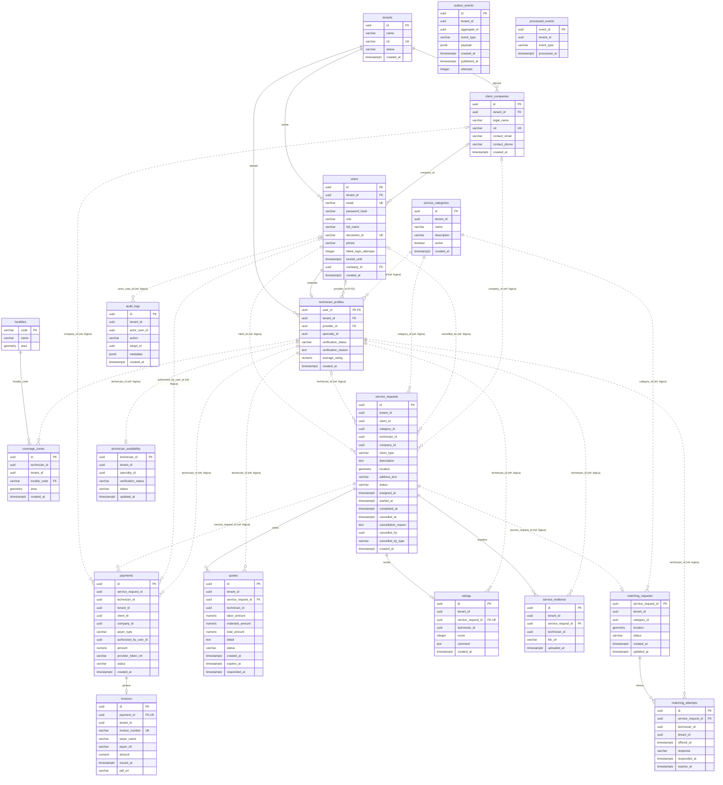
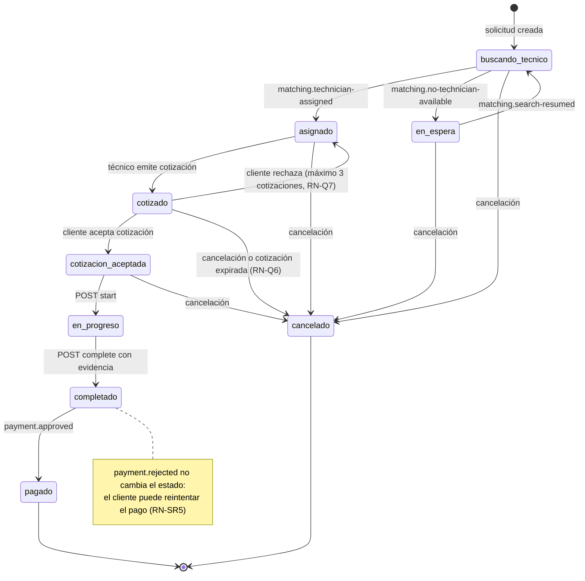
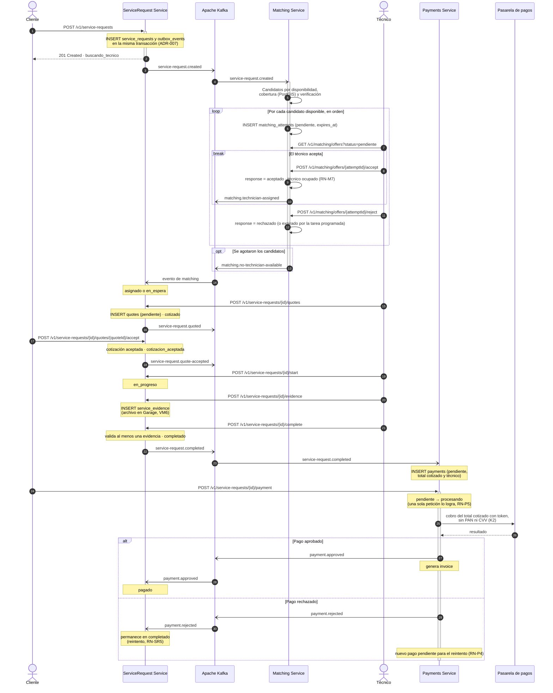
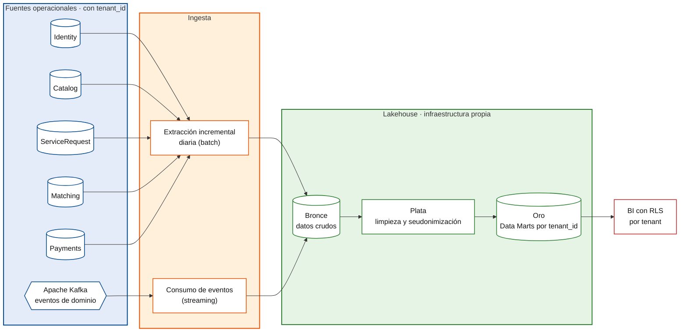

# DD — Documento de Diseño
## Modelos de Datos y Contratos — QUICKPATCH

Plataforma Digital Multi-tenant de Servicios Técnicos para el Hogar y las Empresas

|||
|---|---|
|**Tipo de documento**|Documento de Diseño Detallado: Modelos de Datos + Contratos (diccionario de datos evolutivo, DER, contratos REST y de eventos)|
|**Arquitectura**|Microservicios + Event-Driven Architecture|
|**Backend principal**|ASP.NET Core / .NET 10 (7 servicios); Matching Service: Java 25 + Spring Boot 4.1.1|
|**Mensajería**|Apache Kafka|
|**Persistencia**|PostgreSQL + PostGIS|
|**Versión**|3.1|
|**Fecha**|Octubre de 2026|
|**Alineado con**|SRS V4, SAD v2.25, SDD organizado por C4 (octubre de 2026), Documento de Infraestructura v2.5|
|**Historia en Jira**|SCRUM-259 — Documentación DD V3|
|**Curso**|Arquitectura de Software|
|**Proyecto**|QUICKPATCH|

---

## Índice

1. [Introducción](#1-introducción)
2. [Convenciones del modelo de datos](#2-convenciones-del-modelo-de-datos)
3. [Distribución de datos por servicio](#3-distribución-de-datos-por-servicio)
4. [Vista general del modelo](#4-vista-general-del-modelo)
5. [Diccionario de Datos](#5-diccionario-de-datos)
6. [Relaciones entre datos](#6-relaciones-entre-datos)
7. [Reglas de negocio](#7-reglas-de-negocio)
8. [Contratos](#8-contratos)
9. [Arquitectura de datos analítica (modelo objetivo)](#9-arquitectura-de-datos-analítica-modelo-objetivo)
10. [Multi-tenancy](#10-multi-tenancy)
11. [Consideraciones de evolución del modelo](#11-consideraciones-de-evolución-del-modelo)
12. [Control de evolución](#12-control-de-evolución)
13. [Conclusión](#13-conclusión)

---

## 1. Introducción

### 1.1 Propósito

Este documento define el modelo de datos y los contratos de QUICKPATCH para las funcionalidades contempladas en el estado actual del backlog y del SRS.

Su núcleo sigue siendo un diccionario de datos vivo, en el cual se documentan las entidades que actualmente pueden identificarse y justificarse a partir de los requisitos funcionales y no funcionales existentes. A partir de la versión 3.0 el documento también incluye la especificación detallada de los contratos REST y de eventos. Los diagramas de flujo de datos, la lógica crítica y la organización del código se documentan en el SDD V2, y la relación entre pantallas y contratos en el artefacto Front (SCRUM-332); ver la sección 9.

Este documento desarrolla la Arquitectura de Datos del SAD (sección 8) y se mantiene alineado con la descomposición por microservicios del SAD (sección 4.2.2) y del SDD (sección 6). Las decisiones de arquitectura que lo sustentan son ADR-004 (PostgreSQL + PostGIS), ADR-005 (shared-schema con `tenant_id` + RLS), ADR-006 (Kafka como bus de eventos), ADR-007 (Transactional Outbox + idempotencia), ADR-009 (tokenización de pagos), ADR-012 (stack tecnológico), ADR-013 (estrategia de repositorios) y ADR-016 (Garage como almacenamiento de objetos).

### 1.2 Carácter evolutivo del modelo

El modelo cubre únicamente las entidades que pueden justificarse con los requisitos actuales; las entidades que existirán en etapas posteriores se incorporarán en versiones futuras.

QUICKPATCH se desarrolla utilizando Scrum, por lo cual el modelo de datos evolucionará incrementalmente a medida que nuevos Sprint incorporen funcionalidades, reglas de negocio y necesidades de persistencia.

Cada nueva entidad, atributo, relación o restricción que surja durante el desarrollo deberá incorporarse en futuras versiones de este documento.

Por esta razón, únicamente se modelan en esta versión las entidades que pueden sustentarse con el SRS vigente y con las decisiones arquitectónicas actualmente definidas. La única excepción es la sección 9, que describe un modelo analítico objetivo por solicitud de la revisión de arquitectura del curso y que se declara explícitamente fuera del alcance implementable del MVP.

### 1.3 Alcance actual

En esta versión se modelan las capacidades relacionadas con:

- Multi-tenancy.
- Registro y autenticación.
- Usuarios y técnicos, incluido el equipo de técnicos de un proveedor (RF-16).
- Categorías de servicios.
- Solicitudes de servicio de clientes hogar y de empresas (RF-07, RF-08), incluida su cancelación antes de iniciar el servicio (RF-36).
- Cotización de mano de obra y materiales (RF-34, RF-35).
- Disponibilidad y cobertura de técnicos por localidades de Bogotá (RF-13).
- Matching, incluida la aceptación o rechazo de la oferta por parte del técnico (RF-10) y el reintento de las solicitudes en espera.
- Calificaciones.
- Evidencia fotográfica obligatoria al completar un servicio (RF-15).
- Pagos.
- Facturación.
- Auditoría.
- Publicación confiable de eventos mediante Kafka.

Funcionalidades futuras como chat, reclamos, ranking avanzado, inteligencia artificial, payroll-lite o proveedores de materiales no se modelan todavía, debido a que el objetivo de este documento es representar los modelos que pueden justificarse actualmente a partir del SRS del MVP.

### 1.4 Correspondencia con el backlog

La versión 3.0 corresponde a la historia SCRUM-259 (Documentación DD V3). Cada subtarea se resuelve en las siguientes secciones:

|Subtarea|Contenido|Secciones|
|---|---|---|
|SCRUM-284|Modelo entidad-relación y diccionario de datos|4, 5, 6, 7|
|SCRUM-285|Diagramas de flujo de datos de los procesos principales|Trasladado al SDD V2 (sección 11, flujos de negocio)|
|SCRUM-286|Mockups y wireframes de las interfaces de usuario|Trasladado a SCRUM-332 — Prototipos Front (sección 9)|
|SCRUM-287|Contratos de las APIs y de los eventos|8|
|SCRUM-288|Estructura de carpetas y organización del código fuente|Trasladado al SDD V2 (sección 10)|
|SCRUM-289|Algoritmos complejos y lógica de negocio crítica|Trasladado al SDD V2 (secciones 7, 8 y 11)|

_Cuadro 1: Correspondencia entre las subtareas de SCRUM-259 y las secciones del documento_

### 1.5 Propuestas de diseño de esta versión

Algunos elementos de esta versión resuelven dependencias que el DD v2.2 dejaba abiertas (sección 11). Como afectan a otros documentos o a decisiones del equipo, se marcan como **propuestas** y **no son decisiones definitivas**: siguen el flujo Propuesta → Validación de Arquitectura → SAD/SDD/ADR si aplica → Contrato → Implementación. Todo elemento del modelo marcado con P-01 a P-06 queda sujeto a esa validación:

|ID|Propuesta|Dependencia que resuelve|Documento que debe reflejarla|
|---|---|---|---|
|P-01|Matching Service mantiene una proyección local de la especialidad y del estado de verificación de cada técnico, alimentada por los eventos `technician.registered` y `technician.verification-changed` de Identity Service.|DEP-01|SAD, sección 3.9; SDD, sección 6.8|
|P-02|Mientras Actors Service no tenga persistencia, `technician_profiles.provider_id` referencia al usuario con rol `proveedor` dentro de Identity Service (FK física).|DEP-02 (parcial)|SDD, sección 6.14|
|P-03|La especialidad de un técnico es una categoría de servicio: `technician_profiles.specialty_id` referencia `service_categories.id`.|DEP-02 (parcial)|SDD, sección 6.6|
|P-04|La cobertura de un técnico se expresa por localidades de Bogotá, a partir de un catálogo de referencia `localities` en Matching Service.|RF-13 (SCRUM-33)|SDD, sección 6.8|
|P-05|Matching Service persiste las solicitudes que debe asignar (`matching_requests`) para poder reintentar las que quedan en espera.|SCRUM-29, criterio 3|SDD, sección 8.3|
|P-06|Las tareas programadas que recorren filas de todos los tenants usan un rol `<servicio>_scheduler` que solo puede leer identificadores y aplica cada cambio con el rol `_app` y el tenant de la fila.|RN-M3, RN-Q6|Documento de Infraestructura, sección 5.7|
|P-07|Agregar `code` a Problem Details con el catálogo del Cuadro 7.|Errores homogéneos para el frontend|Contratos OpenAPI (cambio compatible)|
|P-08|Aceptar `Idempotency-Key` en la creación de solicitudes y en el pago.|AC5-E5|Contratos OpenAPI (cambio compatible)|

_Cuadro 2: Propuestas de diseño pendientes de validación del equipo_

### 1.6 Conciliación con los contratos y el código de develop (versión 3.1)

El DD v3.0 se escribió sobre la versión 2.2, en paralelo con las versiones 2.3 y 2.4 de develop, que ya tenían contratos publicados en `quickpatch-contracts` (hoy `quickpatch-api-gateway` y `quickpatch-kafka`, ADR-021) y código mergeado. La versión 3.1 une ambas. Donde chocaban, se conservó lo implementado; lo demás del v3.0 se mantiene.

|Tema|v3.0|Versión 3.1|Motivo|
|---|---|---|---|
|RN-SR9 y RN-SR10|`client_type` y visibilidad del contacto|Pasan a **RN-SR12** y **RN-SR13**; RN-SR9 a RN-SR11 son las de la versión 2.3 (cobertura de Bogotá, categoría disponible, longitudes)|Los contratos y el código ya citan RN-SR9 y RN-SR10|
|Token|`userId`, `tenantId`, `role` sin algoritmo definido|RS256 con `sub`, `tenant_id`, `role` (+`company_id`)|Código de Identity (`RsaTokenIssuer`) y ADR-018: solo Identity puede firmar; TD IDN-005 pide los claims|
|Errores|`code` propio y `errors` como lista|Forma del contrato v1 (`errors` como mapa); `code` queda como P-07|Contratos v1 publicados y consumidos|
|Ubicación|`lat`, `lng`|`latitude`, `longitude`|Contratos v1|
|Endpoint de categorías|`/v1/service-categories`|`/v1/catalog/categories`|Contrato v1. El Gateway enruta por el prefijo de cada ruta (`/v1/auth`, `/v1/users` y `/v1/platform` a Identity; `/v1/catalog` a Catalog; `/v1/service-requests` a ServiceRequest); las rutas de administración de otros servicios necesitan su propia regla en el gateway|
|Categoría inexistente|`400 VALIDATION_ERROR`|`422 categoria-no-disponible`|Contrato v1|
|Cobertura al crear|Localidades de Bogotá|Rectángulo configurable (RN-SR9); las localidades (P-04) siguen para la cobertura del técnico en Matching|ServiceRequest no tiene las localidades|
|`service-request.created`|Sin `description`, con `clientType` y `companyId`|Con `description` (decisión del equipo); `clientType` y `companyId` llegan con RF-08|Contrato v1|
|Réplica de categorías|—|Tabla 5.20 y evento `catalog.category-changed`|SAD 4.3: sin llamadas síncronas entre servicios|
|`service_categories.updated_at`|—|Columna nueva; el nombre es único por tenant sin distinguir mayúsculas (`lower(name)`)|`catalog.category-changed` necesita ordenar versiones|
|Matriz RBAC|Columna **Roles** del catálogo 8.2|La matriz de la versión 2.4 (antes sección 10.5) se integra en la columna Roles de 8.2; el registro de cada 403 queda en 8.1.1|Una sola fuente por endpoint|
|Numeración|Multi-tenancy sigue en la sección 10|Los artefactos relacionados pasan a la 1.7 para no correr la numeración: las referencias "DD 10.2", "DD 10.3" y "DD 10.4" de los contratos y del código siguen vigentes|—|
|`Idempotency-Key`|Convención vigente|Propuesta P-08|No está en los contratos v1|
|`POST /v1/auth/refresh`|Nuevo|Se conserva en el catálogo, sin contrato todavía; antes de emitir refresh tokens hay que definir su revocación|Un refresh token de larga vida sin revocación es un riesgo|


### 1.7 Artefactos relacionados

**Cambio v3 (Sprint 3).** El DD contiene solo modelos de datos y contratos. Los temas siguientes se documentan en su artefacto propio y aquí solo se referencian; su contenido de la versión 3.0 se entregó en `DD-v3_contenido_trasladado_SDD-V2_y_Front.md` para incorporarlo en esos artefactos:

|Tema|Artefacto que lo documenta|
|---|---|
|Diagramas de flujo de datos (DFD)|SDD V2|
|Algoritmos y lógica de negocio crítica (matching, máquina de estados, cotizaciones, pago, Outbox, consumo idempotente, inicio de sesión)|SDD V2|
|Organización del código y estructura multirepo|SDD V2, ADR-013 y Working Agreements|
|Mockups, wireframes y relación pantalla–contrato|SCRUM-332 — Prototipos Front|

_Cuadro 3: Temas documentados fuera del DD_

Cuando este documento cita «antes DD §10.x», «§11.x» o «§12.x», se refiere a ese contenido trasladado.


---

## 2. Convenciones del modelo de datos

|Convención|Descripción|
|---|---|
|PK|Primary Key. Identificador principal del registro.|
|FK|Foreign Key física entre entidades pertenecientes al mismo servicio.|
|UK|Restricción de unicidad.|
|Ref. lógica|Identificador perteneciente a una entidad administrada por otro microservicio. No existe una Foreign Key física entre las bases de datos independientes.|
|UUID|Identificador universal utilizado para las entidades principales.|
|NOT NULL|El campo es obligatorio.|
|NULL|El campo puede no contener un valor.|
|TIMESTAMPTZ|Fecha y hora con información de zona horaria.|
|snake_case|Convención utilizada para nombres de tablas y columnas.|
|tenant_id|Identificador utilizado para garantizar el aislamiento multi-tenant.|
|Línea continua|En los diagramas, relación física (FK) dentro de un mismo servicio.|
|Línea punteada|En los diagramas, referencia lógica entre servicios distintos.|
|camelCase|Convención de los campos JSON en contratos REST y eventos (sección 8.1). La base de datos conserva snake_case.|
|**Nuevo v3**|Elemento agregado en la versión 3.0.|
|P-xx|Elemento que depende de una propuesta de diseño pendiente de validación (sección 1.5).|

_Cuadro 4: Convenciones utilizadas en el diccionario de datos_

---

## 3. Distribución de datos por servicio

QUICKPATCH se descompone en 8 microservicios de dominio (SAD, sección 4.2.2), desplegados en VM3 sobre k3s (ADR-011). Cada servicio es propietario de sus datos en su propia base dentro de PostgreSQL (VM4). La asignación de tablas sigue la descomposición lógica del SDD (sección 6).

|Servicio|Entidades persistentes en esta versión|
|---|---|
|Identity Service|`tenants`, `users`, `technician_profiles`. El equipo de un proveedor se representa con `technician_profiles.provider_id` (P-02).|
|Actors Service|Ninguna todavía. `Supplier`, `Ally` y `Client` son conceptos evolutivos (SDD, sección 6.14).|
|Catalog Service|`service_categories`|
|Matching Service|`technician_availability` (incluye la proyección de especialidad y verificación, P-01), `coverage_zones`, `matching_attempts`, `matching_requests` (P-05) y el catálogo de referencia `localities` (P-04).|
|ServiceRequest Service|`service_requests`, `quotes`, `ratings`, `service_evidence` y la réplica de lectura `service_request_categories`|
|Ranking Service|Ninguna todavía. Consume el evento `service-request.rated`; su persistencia es evolutiva (SDD, sección 6.14).|
|Payments Service|`payments`, `invoices`|
|Communication Service|Ninguna todavía. Consume eventos para notificar; `Notification`, `Conversation` y `Complaint` son evolutivos.|
|Transversal (en cada servicio)|`audit_logs`, `outbox_events`, `processed_events`|

_Cuadro 5: Propiedad de las entidades por microservicio_

Cada servicio será propietario de sus datos y no deberá modificar directamente las tablas pertenecientes a otro servicio.

Las relaciones entre servicios deberán realizarse mediante referencias lógicas, contratos REST o eventos publicados mediante Apache Kafka.

---

## 4. Vista general del modelo

La Figura 1 presenta los dominios de datos: cada recuadro corresponde a un microservicio y encierra únicamente las entidades de las que es propietario. La Figura 2 presenta el mismo modelo como diagrama entidad-relación con atributos, claves y cardinalidades. Ambas figuras describen exactamente las mismas entidades y relaciones que el diccionario de la sección 5 y el listado de la sección 6.

El diagrama no representa necesariamente la totalidad de los modelos que existirán en QUICKPATCH. Nuevas entidades podrán incorporarse en Sprint posteriores conforme aparezcan nuevas historias de usuario y necesidades de persistencia.

**Figura 1: Dominios de datos por microservicio**

```mermaid
flowchart TB
    classDef entity fill:#FFFFFF,stroke:#00468C,stroke-width:1.5px,color:#111111
    classDef empty fill:#FFFFFF,stroke:#9E9E9E,stroke-width:1px,stroke-dasharray:4 3,color:#616161
    classDef store fill:#FFF8E1,stroke:#B8860B,stroke-width:1.5px,color:#111111

    subgraph IDN["Identity Service"]
        direction TB
        tenants["tenants"]:::entity
        users["users"]:::entity
        technician_profiles["technician_profiles"]:::entity
        client_companies["client_companies"]:::entity
        tenants -->|"1 : N"| client_companies
        client_companies -->|"1 : N"| users
        tenants -->|"1 : N"| users
        tenants -->|"1 : N"| technician_profiles
        users -->|"1 : 0..1"| technician_profiles
        users -->|"provider_id · 1 : N (P-02)"| technician_profiles
    end

    subgraph CAT["Catalog Service"]
        direction TB
        service_categories["service_categories"]:::entity
    end

    subgraph SRQ["ServiceRequest Service"]
        direction TB
        service_requests["service_requests"]:::entity
        quotes["quotes"]:::entity
        ratings["ratings"]:::entity
        service_evidence["service_evidence"]:::entity
        service_requests -->|"1 : N"| quotes
        service_requests -->|"1 : 0..1"| ratings
        service_requests -->|"1 : N"| service_evidence
    end

    subgraph MAT["Matching Service · Java 25 + Spring Boot 4.1.1"]
        direction TB
        technician_availability["technician_availability"]:::entity
        coverage_zones["coverage_zones"]:::entity
        matching_attempts["matching_attempts"]:::entity
        matching_requests["matching_requests"]:::entity
        localities["localities<br/>(referencia)"]:::entity
        matching_requests -->|"1 : N"| matching_attempts
        localities -->|"1 : N"| coverage_zones
    end

    subgraph PAY["Payments Service"]
        direction TB
        payments["payments"]:::entity
        invoices["invoices"]:::entity
        payments -->|"1 : 0..1"| invoices
    end

    subgraph ACT["Actors Service"]
        act_empty["Sin tablas en esta versión"]:::empty
    end

    subgraph RNK["Ranking Service"]
        rnk_empty["Sin tablas en esta versión"]:::empty
    end

    subgraph COM["Communication Service"]
        com_empty["Sin tablas en esta versión"]:::empty
    end

    subgraph TRV["Transversal · en cada servicio"]
        direction TB
        audit_logs["audit_logs"]:::entity
        outbox_events["outbox_events"]:::entity
        processed_events["processed_events"]:::entity
    end

    garage[("Garage · VM6<br/>archivos de evidencia")]:::store

    users -.->|"client_id"| service_requests
    technician_profiles -.->|"technician_id"| service_requests
    service_categories -.->|"category_id"| service_requests
    technician_profiles -.->|"technician_id"| technician_availability
    technician_profiles -.->|"technician_id"| coverage_zones
    technician_profiles -.->|"technician_id"| matching_attempts
    service_requests -.->|"service_request_id"| matching_requests
    service_categories -.->|"category_id"| matching_requests
    service_categories -.->|"specialty_id (P-03)"| technician_profiles
    service_categories -.->|"specialty_id (P-01)"| technician_availability
    users -.->|"cancelled_by"| service_requests
    client_companies -.->|"company_id"| service_requests
    client_companies -.->|"company_id"| payments
    technician_profiles -.->|"technician_id"| quotes
    technician_profiles -.->|"technician_id"| ratings
    technician_profiles -.->|"technician_id"| service_evidence
    service_requests -.->|"service_request_id · 1 : N"| payments
    technician_profiles -.->|"technician_id"| payments
    users -.->|"authorized_by_user_id"| payments
    users -.->|"actor_user_id"| audit_logs
    service_evidence -.->|"file_url"| garage

    style IDN fill:#E3ECF8,stroke:#00468C,stroke-width:2px
    style CAT fill:#FDF6DD,stroke:#9A7B00,stroke-width:2px
    style SRQ fill:#E6F4E6,stroke:#2E7D32,stroke-width:2px
    style MAT fill:#FFF0DC,stroke:#E65100,stroke-width:2px
    style PAY fill:#FBE4E4,stroke:#C62828,stroke-width:2px
    style ACT fill:#F3E8FA,stroke:#6A1B9A,stroke-width:2px
    style RNK fill:#F2E8DF,stroke:#6D4C41,stroke-width:2px
    style COM fill:#ECEFF1,stroke:#455A64,stroke-width:2px
    style TRV fill:#F5F5F5,stroke:#616161,stroke-width:2px
```



_Todas las tablas de la figura, excepto `tenants` y el catálogo de referencia `localities`, tienen la columna `tenant_id` (sección 10.1). Esas referencias se omiten del dibujo para no saturarlo: dentro de Identity Service son FK físicas (sección 6.1) y en los demás servicios son referencias lógicas (sección 6.2)._

**Figura 2: Diagrama entidad-relación**



_En la Figura 2, la línea continua es una FK física dentro del mismo servicio y la línea punteada una referencia lógica entre servicios; las referencias lógicas llevan la etiqueta `(ref. lógica)` y el nombre del campo. El servicio dueño de cada campo referenciado se indica en la sección 6.2. Las referencias lógicas se dibujan desde `technician_profiles` porque todo técnico referenciado debe tener perfil; el valor almacenado es `users.id`, que coincide con `technician_profiles.user_id`. `localities` es un catálogo de referencia sin tenant (sección 5.18). Las referencias de `tenant_id` hacia `tenants` solo se dibujan dentro de Identity Service; en las demás entidades la columna aparece como atributo y se lista en la sección 10.1._

---

## 5. Diccionario de Datos

### 5.1 Tabla `tenants`

**Servicio propietario:** Identity Service.

**Propósito:** Representa a cada empresa oferente que opera sobre QUICKPATCH y constituye el límite de aislamiento de datos (SAD, sección 7.1). Los clientes hogar y las empresas cliente de un tenant son usuarios de ese tenant, no tenants propios; así el matching entre clientes y técnicos ocurre siempre dentro del mismo tenant.

**Requisitos relacionados:** RF-04, RF-21, RNF-09, RNF-10. RF-06 asocia cada empresa cliente a un tenant propio, lo que difiere del modelo del SAD que sigue este documento (DEP-13).

|Campo|Tipo|Nulo|Clave|Descripción|
|---|---|---|---|---|
|id|UUID|No|PK|Identificador único del tenant.|
|name|VARCHAR(150)|No|—|Nombre de la empresa oferente.|
|nit|VARCHAR(30)|No|UNIQUE|NIT de la empresa oferente.|
|status|VARCHAR(20)|No|—|Estado del tenant: activo o inactivo.|
|created_at|TIMESTAMPTZ|No|—|Fecha de creación del registro.|

**Reglas de negocio:** RN-T1 a RN-T3 (sección 7.1).

**Índices iniciales sugeridos:**

- Índice único sobre `id`.
- Índice único sobre `nit`.
- Índice sobre `status`.

### 5.2 Tabla `users`

**Servicio propietario:** Identity Service.

**Propósito:** Almacena la identidad base de los usuarios que interactúan con la plataforma.

**Requisitos relacionados:** RF-01, RF-02, RF-03, RF-05; RF-06 con la diferencia descrita en DEP-13.

|Campo|Tipo|Nulo|Clave|Descripción|
|---|---|---|---|---|
|id|UUID|No|PK|Identificador único del usuario.|
|tenant_id|UUID|No|FK local|Tenant al que pertenece el usuario.|
|email|VARCHAR(150)|No|UNIQUE por tenant|Correo electrónico utilizado para autenticación.|
|password_hash|VARCHAR(255)|No|—|Hash seguro de la contraseña.|
|role|VARCHAR(30)|No|—|Rol principal del usuario.|
|full_name|VARCHAR(150)|No|—|Nombre completo.|
|document_id|VARCHAR(30)|Sí|UNIQUE por tenant|Documento de identidad. Requerido para técnicos y proveedores.|
|phone|VARCHAR(30)|Sí|—|Número de teléfono.|
|failed_login_attempts|INTEGER|No|—|Cantidad de intentos fallidos consecutivos.|
|locked_until|TIMESTAMPTZ|Sí|—|Fecha hasta la cual permanece bloqueada la cuenta.|
|company_id|UUID|Sí|FK local|**Nuevo v3.** Empresa cliente a la que pertenece el usuario (`client_companies.id`). Obligatorio cuando `role = 'empresa_contacto'` y nulo en los demás roles (RN-CC2).|
|created_at|TIMESTAMPTZ|No|—|Fecha de creación del usuario.|

**Valores iniciales de `role`:**

- `cliente`
- `tecnico`
- `proveedor`
- `empresa_contacto`: usuario solicitante de una empresa cliente; varios pueden pertenecer a la misma empresa (SCRUM-26, criterio 3).
- `admin_tenant`: administra su propio tenant; aprueba, rechaza y suspende técnicos (RF-19, RF-20).
- `admin_plataforma`: administra los tenants (RF-21). Solo existe en el tenant dueño de la plataforma (SAD, sección 7.1).

**Reglas de negocio:** RN-U1 a RN-U6 (sección 7.2) y RN-CC1 a RN-CC3 (sección 7.12).

**Índices sugeridos:**

- UNIQUE compuesto sobre `tenant_id, email`.
- UNIQUE compuesto sobre `tenant_id, document_id` cuando exista.
- Índice sobre `tenant_id`.
- Índice compuesto sobre `tenant_id, role`.

### 5.3 Tabla `technician_profiles`

**Servicio propietario:** Identity Service.

**Propósito:** Extiende la información de un usuario cuando su rol corresponde a técnico.

**Requisitos relacionados:** RF-02, RF-13, RF-16, RF-19, RF-20.

|Campo|Tipo|Nulo|Clave|Descripción|
|---|---|---|---|---|
|user_id|UUID|No|PK / FK|Usuario correspondiente al técnico (`users.id`, mismo servicio).|
|tenant_id|UUID|No|FK local|Tenant del técnico; coincide con `users.tenant_id`.|
|provider_id|UUID|Sí|FK local (P-02)|Usuario con rol `proveedor`, del mismo tenant, a cuyo equipo pertenece el técnico (RF-16). Nulo para técnicos independientes. **Propuesta v3 (P-02, pendiente de validación):** pasaría de referencia lógica hacia Actors Service a FK física hacia `users.id`.|
|specialty_id|UUID|No|Ref. lógica (P-03)|Especialidad principal del técnico: categoría de servicio que atiende (`service_categories.id`, Catalog Service).|
|verification_status|VARCHAR(25)|No|—|Estado de verificación.|
|verification_reason|TEXT|Sí|—|Razón de rechazo o suspensión.|
|average_rating|NUMERIC(2,1)|Sí|—|Promedio de calificaciones del técnico. Proyección local; su cálculo corresponde a Ranking Service (SAD, D3).|
|created_at|TIMESTAMPTZ|No|—|Fecha de creación del perfil.|

**Estados de `verification_status`:**

- `pendiente`
- `aprobado`
- `rechazado`
- `suspendido`

**Reglas de negocio:** RN-TP1 a RN-TP4 (sección 7.3).

**Índices sugeridos:**

- Índice sobre `tenant_id`.
- Índice compuesto sobre `tenant_id, verification_status`.
- Índice sobre `provider_id` para listar el equipo de un proveedor (RF-16).

### 5.4 Tabla `service_categories`

**Servicio propietario:** Catalog Service.

**Propósito:** Define las categorías disponibles para clasificar solicitudes de servicio. Cada tenant mantiene su propio catálogo (SAD, sección 7.1).

**Requisitos relacionados:** RF-07, RF-08, RF-09.

|Campo|Tipo|Nulo|Clave|Descripción|
|---|---|---|---|---|
|id|UUID|No|PK|Identificador único de la categoría.|
|tenant_id|UUID|No|Ref. lógica|Tenant dueño del catálogo.|
|name|VARCHAR(100)|No|UNIQUE por tenant|Nombre de la categoría, único dentro del tenant.|
|description|VARCHAR(255)|Sí|—|Descripción opcional.|
|active|BOOLEAN|No|—|Indica si la categoría está disponible.|
|created_at|TIMESTAMPTZ|No|—|Fecha de creación.|
|updated_at|TIMESTAMPTZ|No|—|**Nuevo v3.1.** Momento del último cambio. Viaja como `data.updatedAt` en `catalog.category-changed` y define la versión que gana en las réplicas (5.20).|

**Ejemplos iniciales:**

- Plomería.
- Electricidad.
- Cerrajería.
- Mantenimiento.

**Índices sugeridos:**

- UNIQUE compuesto sobre `tenant_id, name`.

### 5.5 Tabla `service_requests`

**Servicio propietario:** ServiceRequest Service.

**Propósito:** Almacena las solicitudes de servicio creadas por Clientes o Empresas y constituye la entidad principal del ciclo de negocio.

**Requisitos relacionados:** RF-07, RF-08, RF-09, RF-10, RF-11, RF-14, RF-15, RF-34, RF-36.

|Campo|Tipo|Nulo|Clave|Descripción|
|---|---|---|---|---|
|id|UUID|No|PK|Identificador único de la solicitud.|
|tenant_id|UUID|No|Ref. lógica|Tenant propietario de la solicitud.|
|client_id|UUID|No|Ref. lógica|Usuario que creó la solicitud.|
|category_id|UUID|No|Ref. lógica|Categoría del servicio (Catalog Service).|
|technician_id|UUID|Sí|Ref. lógica|Técnico asignado a la solicitud.|
|company_id|UUID|Sí|Ref. lógica|**Nuevo v3.** Empresa cliente (`client_companies.id`) cuando la crea un `empresa_contacto`; sale del token (RN-SR12).|
|client_type|VARCHAR(10)|No|CHECK|**Nuevo v3.** `hogar` o `empresa`. Se fija a partir del rol del creador: `empresa_contacto` produce `empresa` (RF-08, SCRUM-28).|
|description|TEXT|No|—|Descripción del problema.|
|location|geometry(POINT,4326)|No|—|Ubicación geográfica del servicio.|
|address_text|VARCHAR(255)|No|—|Dirección escrita.|
|status|VARCHAR(30)|No|—|Estado actual de la solicitud.|
|assigned_at|TIMESTAMPTZ|Sí|—|Momento de asignación.|
|started_at|TIMESTAMPTZ|Sí|—|Inicio del servicio.|
|completed_at|TIMESTAMPTZ|Sí|—|Finalización del servicio.|
|cancelled_at|TIMESTAMPTZ|Sí|—|Momento de la cancelación, si la hubo.|
|cancellation_reason|TEXT|Sí|—|Motivo de la cancelación. Obligatorio cuando la cancela un usuario (RF-36).|
|cancelled_by|UUID|Sí|Ref. lógica|**Nuevo v3.** Usuario que canceló la solicitud. Nulo cuando la cancela el propio servicio (RN-Q6, RN-Q7).|
|cancelled_by_type|VARCHAR(15)|Sí|CHECK|**Nuevo v3.** `cliente`, `admin_tenant` o `sistema` (RN-SR8).|
|created_at|TIMESTAMPTZ|No|—|Fecha de creación.|

**Estados:**

- `buscando_tecnico`
- `en_espera`
- `asignado`
- `cotizado`
- `cotizacion_aceptada`
- `en_progreso`
- `completado`
- `pagado`
- `cancelado`

**Reglas de negocio:** RN-SR1 a RN-SR13 y máquina de estados (sección 7.4).

**Índices sugeridos:**

- Índice sobre `tenant_id`.
- Índice sobre `client_id`.
- Índice sobre `technician_id`.
- Índice sobre `status`.
- Índice compuesto sobre `technician_id, status` para el historial del técnico (RF-17).
- Índice compuesto sobre `tenant_id, status` para el panel operativo (RF-18).
- Índice geoespacial GIST sobre `location`.

### 5.6 Tabla `technician_availability`

**Servicio propietario:** Matching Service.

**Propósito:** Mantiene el estado operativo actual de cada técnico para determinar si puede participar en el proceso de matching. Desde la versión 3.0 también guarda una proyección de la especialidad y del estado de verificación del técnico, para que Matching Service pueda aplicar RN-TP1 y RN-TP2 sin consultar a Identity Service en cada búsqueda (P-01).

**Requisitos relacionados:** RF-09, RF-10, RF-13, RF-19, RF-20.

|Campo|Tipo|Nulo|Clave|Descripción|
|---|---|---|---|---|
|technician_id|UUID|No|PK (ref. lógica)|Identificador del técnico (`users.id` en Identity Service).|
|tenant_id|UUID|No|Ref. lógica|Tenant relacionado.|
|specialty_id|UUID|No|Ref. lógica|**Nuevo v3 (P-01).** Copia de `technician_profiles.specialty_id`, recibida en `technician.registered`.|
|verification_status|VARCHAR(25)|No|—|**Nuevo v3 (P-01).** Copia de `technician_profiles.verification_status`, actualizada con `technician.verification-changed`.|
|status|VARCHAR(25)|No|—|Disponibilidad actual.|
|updated_at|TIMESTAMPTZ|No|—|Última actualización. Se usa también como criterio de desempate del matching (sección 10.2).|

**Estados:**

- `disponible`
- `ocupado`
- `no_disponible` (estado inicial al registrar el técnico)

**Índices sugeridos:**

- Índice compuesto sobre `tenant_id, specialty_id, verification_status, status` para la búsqueda de candidatos (sección 10.2).

**Nota:** la fila se crea al consumir `technician.registered`. Matching Service no modifica `specialty_id` ni `verification_status` por su cuenta; solo los copia de los eventos de Identity Service.

### 5.7 Tabla `coverage_zones`

**Servicio propietario:** Matching Service.

**Propósito:** Define las zonas geográficas dentro de las cuales un técnico presta servicios. Desde la versión 3.0 cada zona corresponde a una localidad de Bogotá elegida por el técnico (SCRUM-33, P-04).

**Requisitos relacionados:** RF-09, RF-13.

|Campo|Tipo|Nulo|Clave|Descripción|
|---|---|---|---|---|
|id|UUID|No|PK|Identificador de la zona.|
|technician_id|UUID|No|Ref. lógica|Técnico propietario.|
|tenant_id|UUID|No|Ref. lógica|Tenant relacionado.|
|locality_code|VARCHAR(10)|No|FK local|**Nuevo v3 (P-04).** Localidad cubierta (`localities.code`).|
|area|geometry(MULTIPOLYGON,4326)|No|—|Polígono de cobertura. Se copia de `localities.area` al guardar la zona, para que la búsqueda de candidatos no dependa de un JOIN adicional. **Cambio v3:** pasa de `POLYGON` a `MULTIPOLYGON` porque algunas localidades tienen más de un polígono.|
|created_at|TIMESTAMPTZ|No|—|Fecha de creación.|

**Índices sugeridos:**

- Índice sobre `technician_id`.
- UNIQUE compuesto sobre `technician_id, locality_code`.
- Índice GIST sobre `area`.

### 5.8 Tabla `matching_attempts`

**Servicio propietario:** Matching Service.

**Propósito:** Registra cada oferta realizada a un técnico durante el proceso de asignación de una solicitud, y la respuesta del técnico a esa oferta (RF-10).

**Requisitos relacionados:** RF-09, RF-10.

|Campo|Tipo|Nulo|Clave|Descripción|
|---|---|---|---|---|
|id|UUID|No|PK|Identificador del intento (oferta).|
|service_request_id|UUID|No|FK local|Solicitud relacionada (`matching_requests.service_request_id`). **Propuesta v3 (P-05, pendiente de validación):** pasaría de referencia lógica a FK física si Matching Service persiste la solicitud.|
|technician_id|UUID|No|Ref. lógica|Técnico al que se realizó la oferta.|
|tenant_id|UUID|No|Ref. lógica|Tenant relacionado.|
|offered_at|TIMESTAMPTZ|No|—|Momento de la oferta.|
|response|VARCHAR(20)|No|—|Respuesta del técnico.|
|responded_at|TIMESTAMPTZ|Sí|—|Momento de respuesta.|
|expires_at|TIMESTAMPTZ|No|—|Fecha de expiración de la oferta: `offered_at` + 3 minutos (RN-M8).|
|distance_m|NUMERIC(10,1)|Sí|—|**Nuevo v3.** Distancia calculada al ofrecer, en metros (sección 10.2). Permite auditar por qué se eligió al candidato.|

**Valores de `response`:**

- `pendiente`
- `aceptado`
- `rechazado`
- `expirado`
- `cancelado` (la solicitud se canceló mientras la oferta estaba pendiente)

**Reglas de negocio:** RN-M1 a RN-M10 (sección 7.5).

**Índices sugeridos:**

- Índice sobre `service_request_id`.
- Índice compuesto sobre `technician_id, response` para consultar las ofertas pendientes de un técnico.
- Índice único parcial sobre `service_request_id` donde `response = 'pendiente'`, que garantiza RN-M1.
- Índice único parcial sobre `technician_id` donde `response = 'pendiente'`, que garantiza RN-M7.

### 5.9 Tabla `ratings`

**Servicio propietario:** ServiceRequest Service.

**Propósito:** Almacena la valoración realizada por un cliente al finalizar un servicio.

**Requisitos relacionados:** RF-12.

|Campo|Tipo|Nulo|Clave|Descripción|
|---|---|---|---|---|
|id|UUID|No|PK|Identificador de la calificación.|
|tenant_id|UUID|No|Ref. lógica|Tenant relacionado.|
|service_request_id|UUID|No|FK local / UNIQUE|Solicitud calificada.|
|technician_id|UUID|No|Ref. lógica|Técnico calificado.|
|score|INTEGER|No|CHECK|Valor entre 1 y 5 (`CHECK (score BETWEEN 1 AND 5)`).|
|comment|TEXT|Sí|—|Comentario opcional.|
|created_at|TIMESTAMPTZ|No|—|Fecha de creación.|

**Reglas de negocio:** RN-R1 a RN-R3 (sección 7.6).

### 5.10 Tabla `service_evidence`

**Servicio propietario:** ServiceRequest Service.

**Propósito:** Registra la evidencia fotográfica que el Técnico adjunta obligatoriamente al completar una solicitud de servicio. El archivo en sí se almacena en Garage (VM6; VM7 en QA); esta tabla guarda la referencia.

**Requisitos relacionados:** RF-15; driver D7 del SAD.

|Campo|Tipo|Nulo|Clave|Descripción|
|---|---|---|---|---|
|id|UUID|No|PK|Identificador único de la evidencia.|
|tenant_id|UUID|No|Ref. lógica|Tenant relacionado.|
|service_request_id|UUID|No|FK local|Solicitud a la que pertenece la evidencia.|
|technician_id|UUID|No|Ref. lógica|Técnico que adjuntó la evidencia.|
|file_url|VARCHAR(500)|No|—|Referencia al objeto almacenado en Garage.|
|uploaded_at|TIMESTAMPTZ|No|—|Fecha y hora en que se subió la evidencia.|

**Reglas de negocio:** RN-E1 a RN-E3 (sección 7.7).

**Índices sugeridos:**

- Índice sobre `service_request_id`.

### 5.11 Tabla `quotes`

**Servicio propietario:** ServiceRequest Service.

**Propósito:** Registra la cotización de mano de obra y materiales que el técnico asignado presenta al cliente antes de iniciar el servicio (etapa `QUOTED` del SAD, sección 7.4). El total de la cotización aceptada es el monto que se cobra en el pago.

**Requisitos relacionados:** RF-34, RF-35; SAD, sección 7.4 (ciclo de vida) y sección 8.1 (entidad `Quote`). **Cambio v3:** la dependencia DEP-10 queda resuelta con el SRS v3.2.

|Campo|Tipo|Nulo|Clave|Descripción|
|---|---|---|---|---|
|id|UUID|No|PK|Identificador de la cotización.|
|tenant_id|UUID|No|Ref. lógica|Tenant relacionado.|
|service_request_id|UUID|No|FK local|Solicitud cotizada.|
|technician_id|UUID|No|Ref. lógica|Técnico que emite la cotización.|
|labor_amount|NUMERIC(12,2)|No|—|Valor de la mano de obra, en pesos colombianos (R6).|
|materials_amount|NUMERIC(12,2)|No|—|Valor de los materiales; 0 si no se requieren.|
|total_amount|NUMERIC(12,2)|No|—|Total cotizado. Columna generada: `labor_amount + materials_amount`.|
|detail|TEXT|Sí|—|Descripción del trabajo y de los materiales incluidos.|
|status|VARCHAR(20)|No|—|Estado de la cotización.|
|created_at|TIMESTAMPTZ|No|—|Fecha de emisión.|
|expires_at|TIMESTAMPTZ|No|—|Fecha límite para que el cliente responda.|
|responded_at|TIMESTAMPTZ|Sí|—|Momento en que el cliente la aceptó o rechazó.|

**Estados:**

- `pendiente`
- `aceptada`
- `rechazada`
- `anulada` (la solicitud se canceló con la cotización pendiente)
- `expirada` (el cliente no respondió antes de `expires_at`)

**Reglas de negocio:** RN-Q1 a RN-Q8 (sección 7.9).

**Índices sugeridos:**

- Índice sobre `service_request_id`.
- Índice único parcial sobre `service_request_id` donde `status = 'pendiente'` (RN-Q2).
- Índice único parcial sobre `service_request_id` donde `status = 'aceptada'` (RN-Q4).

### 5.12 Tabla `payments`

**Servicio propietario:** Payments Service.

**Propósito:** Registra el resultado de los pagos realizados por Clientes o Empresas y permite al técnico consultar los pagos recibidos por sus servicios (RF-25). Una solicitud puede tener varios pagos porque un pago rechazado permite reintentar (SDD, escenario 6), pero solo uno aprobado. La liquidación al técnico (`PayoutRecord` en la sección 8.1 del SAD) no se modela porque R1 la excluye (DEP-14).

**Requisitos relacionados:** RF-22, RF-23, RF-25, RNF-01.

|Campo|Tipo|Nulo|Clave|Descripción|
|---|---|---|---|---|
|id|UUID|No|PK|Identificador del pago.|
|service_request_id|UUID|No|Ref. lógica|Solicitud asociada.|
|technician_id|UUID|No|Ref. lógica|Técnico que prestó el servicio; llega en el evento `service-request.completed`.|
|tenant_id|UUID|No|Ref. lógica|Tenant relacionado.|
|client_id|UUID|No|Ref. lógica|**Nuevo v3.** Creador de la solicitud; llega en `service-request.completed`. Permite autorizar el pago sin consultar a ServiceRequest Service.|
|company_id|UUID|Sí|Ref. lógica|**Nuevo v3.** Empresa cliente de la solicitud, si aplica; llega en `service-request.completed` (RF-23, RN-P6).|
|payer_type|VARCHAR(20)|No|—|`cliente` o `empresa`. Es `empresa` cuando `company_id` no es nulo.|
|authorized_by_user_id|UUID|Sí|Ref. lógica|Usuario que autorizó el pago (SCRUM-43, criterio 2). Nulo mientras el pago está `pendiente`.|
|amount|NUMERIC(12,2)|No|—|Monto del pago; igual al total de la cotización aceptada (RN-P3).|
|provider_token_ref|VARCHAR(255)|Sí|—|Token o referencia retornada por el PSP. Es nulo hasta que el PSP responde.|
|status|VARCHAR(20)|No|—|Estado del pago.|
|created_at|TIMESTAMPTZ|No|—|Fecha de creación.|

**Estados:**

- `pendiente`: creado al consumir `service-request.completed`, a la espera de que el cliente pague.
- `procesando`: enviado a la pasarela, a la espera de su respuesta.
- `aprobado`
- `rechazado`

**Restricción PCI-DSS (K2, ADR-009):** la tabla no almacena:

- Número completo de tarjeta.
- CVV.
- Fecha de expiración.

**Reglas de negocio:** RN-P1 a RN-P6 (sección 7.8).

**Índices sugeridos:**

- Índice sobre `service_request_id`.
- Índice único parcial sobre `service_request_id` donde `status = 'aprobado'`, que garantiza RN-P2.
- Índice único parcial sobre `service_request_id` donde `status IN ('pendiente', 'procesando')`, que garantiza RN-P5.
- Índice compuesto sobre `technician_id, status` para la consulta de RF-25.

### 5.13 Tabla `invoices`

**Servicio propietario:** Payments Service.

**Propósito:** Registra los comprobantes o facturas generados después de un pago aprobado.

**Requisitos relacionados:** RF-24.

|Campo|Tipo|Nulo|Clave|Descripción|
|---|---|---|---|---|
|id|UUID|No|PK|Identificador de la factura.|
|payment_id|UUID|No|FK local / UNIQUE|Pago relacionado.|
|tenant_id|UUID|No|Ref. lógica|Tenant relacionado.|
|invoice_number|VARCHAR(50)|No|UNIQUE|Número único del comprobante.|
|payer_name|VARCHAR(150)|No|—|Nombre o razón social del pagador. **Cambio v3:** se toma de los datos de facturación enviados en el pago (sección 8.3.12).|
|payer_nit|VARCHAR(30)|Sí|—|NIT cuando corresponde a empresa.|
|amount|NUMERIC(12,2)|No|—|Valor facturado.|
|issued_at|TIMESTAMPTZ|No|—|Fecha de emisión.|
|pdf_url|VARCHAR(500)|Sí|—|Ruta del comprobante generado.|

### 5.14 Tabla `audit_logs`

**Servicio propietario:** Transversal.

**Propósito:** Registrar operaciones administrativas y accesos no autorizados relevantes.

**Requisitos relacionados:** RF-16, RF-19, RF-20, RF-21, RF-36, RNF-04.

|Campo|Tipo|Nulo|Clave|Descripción|
|---|---|---|---|---|
|id|UUID|No|PK|Identificador del registro.|
|tenant_id|UUID|Sí|Ref. lógica|Tenant relacionado cuando aplique.|
|actor_user_id|UUID|Sí|Ref. lógica|Usuario que ejecutó la acción.|
|action|VARCHAR(100)|No|—|Acción realizada.|
|target_id|UUID|Sí|—|Recurso afectado.|
|metadata|JSONB|Sí|—|Información adicional.|
|created_at|TIMESTAMPTZ|No|—|Fecha y hora.|

**Reglas de negocio:** RN-A1 (sección 7.10).

**Ejemplos de `action`:**

- `aprobar_tecnico`
- `rechazar_tecnico`
- `suspender_tecnico`
- `acceso_denegado`
- `alta_tecnico_proveedor` (**nuevo v3**, RF-16)
- `activar_tenant` y `desactivar_tenant` (**nuevo v3**, RF-21)
- `cancelar_solicitud_admin` (**nuevo v3**, cancelación por `admin_tenant`, RF-36)
- `evento_descartado` (**nuevo v3**, consumidor que recibe un evento de una fila inexistente en su tenant, sección 10.3)

### 5.15 Tabla `outbox_events`

**Servicio propietario:** Cada microservicio productor de eventos.

**Propósito:** Permitir que el registro de una operación de negocio y el evento que posteriormente será publicado en Apache Kafka se realicen dentro de una misma transacción local (ADR-007).

|Campo|Tipo|Nulo|Clave|Descripción|
|---|---|---|---|---|
|id|UUID|No|PK|Identificador único del evento. Se publica como `eventId`.|
|tenant_id|UUID|No|—|Tenant de la operación que originó el evento. Su valor por defecto es el tenant de la sesión, y la política RLS de inserción impide cualquier otro (sección 10.2). El publicador lo copia en `tenantId` del evento.|
|aggregate_id|UUID|No|—|Identificador de la entidad que originó el evento.|
|event_type|VARCHAR(100)|No|—|Tipo de evento.|
|payload|JSONB|No|—|Información que será publicada en Kafka.|
|created_at|TIMESTAMPTZ|No|—|Fecha de creación.|
|published_at|TIMESTAMPTZ|Sí|—|Fecha en la que el evento fue publicado.|
|attempts|INTEGER|No|—|Cantidad de intentos de publicación.|

**Nota:** esta tabla corresponde a un modelo técnico y puede existir independientemente dentro de cada servicio productor de eventos.

### 5.16 Tabla `processed_events`

**Servicio propietario:** Cada microservicio consumidor de eventos.

**Propósito:** Registrar los eventos que un consumidor ya aplicó, para que un evento repetido por un reintento no produzca un segundo efecto (ADR-007, AC5-E5).

|Campo|Tipo|Nulo|Clave|Descripción|
|---|---|---|---|---|
|event_id|UUID|No|PK|`eventId` del evento aplicado.|
|tenant_id|UUID|No|Ref. lógica|`tenantId` del evento.|
|event_type|VARCHAR(100)|No|—|Tipo de evento.|
|processed_at|TIMESTAMPTZ|No|—|Momento en que se aplicó.|

**Reglas de negocio:** RN-EV1 (sección 7.11).

**Nota:** el consumidor inserta la fila en la misma transacción que aplica el efecto. Si el `event_id` ya existe, la clave primaria rechaza la inserción, la transacción se revierte y el evento se descarta sin efecto.

### 5.17 Tabla `matching_requests`

**Nuevo v3 (P-05).**

**Servicio propietario:** Matching Service.

**Propósito:** Guarda la copia mínima de cada solicitud que Matching Service debe asignar. Sin esta tabla, Matching Service solo conoce la solicitud mientras procesa el evento `service-request.created`, y no puede reintentar una solicitud que quedó `en_espera` cuando un técnico pasa a estar disponible (SCRUM-29, criterio 3; SDD, escenario 3).

**Requisitos relacionados:** RF-09, RF-10, RNF-05.

|Campo|Tipo|Nulo|Clave|Descripción|
|---|---|---|---|---|
|service_request_id|UUID|No|PK (ref. lógica)|Solicitud de ServiceRequest Service.|
|tenant_id|UUID|No|Ref. lógica|Tenant de la solicitud; llega en `tenantId` del evento.|
|category_id|UUID|No|Ref. lógica|Categoría solicitada (Catalog Service).|
|location|geometry(POINT,4326)|No|—|Ubicación del servicio.|
|status|VARCHAR(15)|No|—|Estado de la búsqueda.|
|created_at|TIMESTAMPTZ|No|—|Momento en que llegó `service-request.created`.|
|updated_at|TIMESTAMPTZ|No|—|Último cambio de estado.|

**Estados:**

- `buscando`: hay o habrá una oferta en curso.
- `en_espera`: se agotaron los candidatos (`matching.no-technician-available`).
- `asignado`: un técnico aceptó la oferta.
- `cancelado`: llegó `service-request.cancelled`.

**Reglas de negocio:** RN-M1 a RN-M10 (sección 7.5).

**Índices sugeridos:**

- Índice compuesto sobre `tenant_id, status, created_at` para reintentar primero las solicitudes más antiguas (SDD V2, antes DD §10.5).
- Índice GIST sobre `location`.

### 5.18 Tabla `localities`

**Nuevo v3 (P-04).**

**Servicio propietario:** Matching Service.

**Propósito:** Catálogo de referencia de las 20 localidades de Bogotá D.C. (R6 del SAD) con su polígono. El técnico elige localidades y Matching Service copia el polígono en `coverage_zones`. Es un dato de referencia, igual para todos los tenants, que se carga con una migración de datos y no se modifica desde la aplicación.

**Requisitos relacionados:** RF-13, RIE-02.

|Campo|Tipo|Nulo|Clave|Descripción|
|---|---|---|---|---|
|code|VARCHAR(10)|No|PK|Código de la localidad (por ejemplo, `01` para Usaquén, según la numeración oficial del Distrito).|
|name|VARCHAR(60)|No|UNIQUE|Nombre de la localidad.|
|area|geometry(MULTIPOLYGON,4326)|No|—|Polígono de la localidad.|

**Nota:** no tiene `tenant_id` ni RLS. El rol `_app` de Matching Service solo tiene `SELECT` sobre esta tabla (sección 10.1).

### 5.19 Tabla `client_companies`

**Nuevo v3.**

**Servicio propietario:** Identity Service.

**Propósito:** Representa a una empresa cliente (por ejemplo, una compañía con varias sedes) que solicita servicios dentro de un tenant. La versión 2.2 registraba a sus usuarios con el rol `empresa_contacto` pero no tenía dónde guardar la razón social y el NIT de la empresa ni cómo agrupar a varios usuarios de la misma empresa, que piden SCRUM-26 y SCRUM-43. Siguiendo el SAD (sección 7.1), la empresa cliente no es un tenant: pertenece al tenant de la empresa oferente (DEP-13).

**Requisitos relacionados:** RF-06, RF-08, RF-23, RF-24.

|Campo|Tipo|Nulo|Clave|Descripción|
|---|---|---|---|---|
|id|UUID|No|PK|Identificador de la empresa cliente.|
|tenant_id|UUID|No|FK local|Tenant al que pertenece.|
|legal_name|VARCHAR(150)|No|—|Razón social.|
|nit|VARCHAR(30)|No|UNIQUE por tenant|NIT de la empresa cliente.|
|contact_email|VARCHAR(150)|No|—|Correo de contacto corporativo.|
|contact_phone|VARCHAR(30)|Sí|—|Teléfono de contacto corporativo.|
|created_at|TIMESTAMPTZ|No|—|Fecha de registro.|

**Reglas de negocio:** RN-CC1 a RN-CC3 (sección 7.12).

**Índices sugeridos:**

- UNIQUE compuesto sobre `tenant_id, nit`.

---

### 5.20 Tabla `service_request_categories`

**Servicio propietario:** ServiceRequest Service.

**Propósito:** Réplica local de lectura de las categorías de Catalog Service, alimentada por el evento `catalog.category-changed` (event-carried state transfer). Permite validar la categoría al crear una solicitud (RN-SR10) sin llamar a Catalog Service, como exige el principio de comunicación por eventos del SAD (sección 4.3). Catalog Service sigue siendo el dueño de `service_categories`; esta tabla solo la escribe el consumidor del evento.

**Requisitos relacionados:** RF-07, RF-08.

|Campo|Tipo|Nulo|Clave|Descripción|
|---|---|---|---|---|
|category_id|UUID|No|PK|`id` de la categoría en Catalog Service (ref. lógica).|
|tenant_id|UUID|No|—|Tenant dueño de la categoría.|
|name|VARCHAR(100)|No|—|Nombre de la categoría.|
|active|BOOLEAN|No|—|Si la categoría está disponible para nuevas solicitudes.|
|updated_at|TIMESTAMPTZ|No|—|Momento del cambio en Catalog (`data.updatedAt` del evento). Un evento con un `updatedAt` anterior al guardado se descarta.|

**Reglas de negocio:** RN-SR10 (sección 7.4) y RN-EV1 (sección 7.11).

---

## 6. Relaciones entre datos

### 6.1 Relaciones físicas dentro de un servicio

Cuando dos entidades son administradas por el mismo microservicio, se implementan mediante Foreign Keys físicas.

```text
users.tenant_id                      -> tenants.id              (Identity)
technician_profiles.user_id          -> users.id                (Identity)
technician_profiles.tenant_id        -> tenants.id              (Identity)
technician_profiles.provider_id      -> users.id                (Identity, P-02)
users.company_id                     -> client_companies.id     (Identity)
client_companies.tenant_id           -> tenants.id              (Identity)
quotes.service_request_id            -> service_requests.id     (ServiceRequest)
ratings.service_request_id           -> service_requests.id     (ServiceRequest)
service_evidence.service_request_id  -> service_requests.id     (ServiceRequest)
invoices.payment_id                  -> payments.id             (Payments)
matching_attempts.service_request_id -> matching_requests.service_request_id (Matching, P-05)
coverage_zones.locality_code         -> localities.code         (Matching, P-04)
```

### 6.2 Referencias lógicas entre microservicios

Cuando las entidades pertenecen a microservicios diferentes no se utilizan Foreign Keys físicas entre sus respectivas bases de datos. Este es el listado completo para el modelo de esta versión.

```text
Hacia Identity Service
  service_requests.client_id           --> users.id
  service_requests.cancelled_by        --> users.id
  service_requests.company_id          --> client_companies.id
  payments.client_id                   --> users.id
  payments.company_id                  --> client_companies.id
  service_requests.technician_id       --> technician_profiles.user_id
  quotes.technician_id                 --> technician_profiles.user_id
  ratings.technician_id                --> technician_profiles.user_id
  service_evidence.technician_id       --> technician_profiles.user_id
  technician_availability.technician_id--> technician_profiles.user_id
  coverage_zones.technician_id         --> technician_profiles.user_id
  matching_attempts.technician_id      --> technician_profiles.user_id
  payments.authorized_by_user_id       --> users.id
  payments.technician_id               --> technician_profiles.user_id
  audit_logs.actor_user_id             --> users.id
  <tabla>.tenant_id                    --> tenants.id   (toda tabla fuera de Identity Service que tenga tenant_id, sección 10.1)

Hacia Catalog Service
  service_requests.category_id         --> service_categories.id
  matching_requests.category_id        --> service_categories.id
  technician_profiles.specialty_id     --> service_categories.id   (P-03)
  technician_availability.specialty_id --> service_categories.id   (copia, P-01)

Hacia ServiceRequest Service
  matching_requests.service_request_id --> service_requests.id
  payments.service_request_id          --> service_requests.id
```

Estas referencias se validan mediante reglas de negocio, contratos REST o eventos. Ningún servicio escribe en tablas de otro dominio.

Actors Service no aparece en el listado: en esta versión el equipo de un proveedor se resuelve dentro de Identity Service (P-02). Cuando Actors Service tenga persistencia propia, `technician_profiles.provider_id` volverá a ser una referencia lógica hacia ese servicio mediante una migración *expand-contract* (Documento de Infraestructura, sección 5.8).

---

## 7. Reglas de negocio

Las reglas de negocio se documentan aparte del diccionario de datos: el diccionario describe la estructura de cada tabla y esta sección describe las condiciones que gobiernan el comportamiento del sistema sobre esos datos. Cada tabla de la sección 5 referencia las reglas que le aplican.

### 7.1 Reglas de `tenants`

- **RN-T1:** un tenant inactivo no puede crear nuevas solicitudes.
- **RN-T2:** todo tenant corresponde a una empresa oferente identificada por su NIT; clientes hogar y empresas cliente se registran como usuarios del tenant.
- **RN-T3:** el tenant activo del usuario debe obtenerse desde el contexto autenticado.

### 7.2 Reglas de `users`

- **RN-U1:** el correo es único dentro de cada tenant.
- **RN-U2:** la contraseña nunca se almacena en texto plano.
- **RN-U3:** el tenant no se recibe libremente desde el frontend.
- **RN-U4:** después de varios intentos fallidos se puede bloquear temporalmente la cuenta.
- **RN-U5:** en el registro y en el login, el tenant se resuelve a partir del canal por el que llega la solicitud, no de un campo del formulario (sección 10.3).
- **RN-U6:** solo `admin_plataforma` administra tenants; `admin_tenant` administra únicamente su propio tenant.

### 7.3 Reglas de `technician_profiles`

- **RN-TP1:** solo técnicos aprobados pueden participar en matching.
- **RN-TP2:** un técnico suspendido no puede recibir nuevas solicitudes. Un servicio que ya estaba en curso al momento de la suspensión no se interrumpe automáticamente; el `admin_tenant` puede cancelarlo (RN-SR8).
- **RN-TP3 (nuevo v3):** `provider_id` solo puede apuntar a un usuario con rol `proveedor` del mismo tenant. El técnico que un proveedor da de alta hereda el tenant del proveedor (SCRUM-36) y queda en `pendiente` hasta que el `admin_tenant` lo apruebe, igual que cualquier técnico (RN-TP1).
- **RN-TP4 (nuevo v3):** un proveedor solo puede consultar y administrar los técnicos cuyo `provider_id` es su propio usuario.

Matching Service aplica RN-TP1 y RN-TP2 con la copia de `verification_status` que guarda en `technician_availability`, actualizada con el evento `technician.verification-changed` (P-01; SDD V2, antes DD §10.13).

### 7.4 Reglas de `service_requests` y máquina de estados

- **RN-SR1:** toda solicitud debe tener una ubicación válida.
- **RN-SR2:** `technician_id` puede ser NULL mientras no exista asignación.
- **RN-SR3:** solo se puede pasar a `completado` desde `en_progreso`, y únicamente si existe al menos un registro asociado en `service_evidence`.
- **RN-SR4:** solo se puede pasar a `pagado` cuando Payments Service confirme el pago (`payment.approved`).
- **RN-SR5:** si Payments Service informa `payment.rejected`, la solicitud permanece en `completado` y el cliente puede reintentar el pago.
- **RN-SR6:** solo se puede pasar a `en_progreso` desde `cotizacion_aceptada`; el servicio no inicia sin una cotización aceptada.
- **RN-SR7:** la solicitud puede pasar a `cancelado` desde cualquier estado anterior a `en_progreso`, igual que `CANCELLED` en el SAD (sección 7.4). La cancelación registra `cancelled_at` y `cancellation_reason`, anula la cotización pendiente y publica `service-request.cancelled`.
- **RN-SR8:** pueden cancelar una solicitud el cliente que la creó (`client_id`) y el `admin_tenant` de su tenant (RF-36). ServiceRequest Service la cancela por sí mismo en los casos de RN-Q6 y RN-Q7. **Cambio v3:** la cancelación registra `cancelled_by` y `cancelled_by_type` (`cliente`, `admin_tenant` o `sistema`); la de un `admin_tenant` queda además en `audit_logs` con la acción `cancelar_solicitud_admin`.
- **RN-SR9:** la ubicación de una solicitud debe estar dentro del área de cobertura de Bogotá D.C. (restricción R6 del SAD). El área se define en la configuración del servicio como un rectángulo de coordenadas; el valor inicial cubre el área urbana: latitud de 4.45 a 4.85 y longitud de −74.25 a −73.98. Una ubicación fuera del área se rechaza con `422 ubicacion-fuera-de-cobertura`.
- **RN-SR10:** la categoría de una solicitud nueva debe existir y estar activa en el tenant del usuario, según la réplica local `service_request_categories`. Si no, se rechaza con `422 categoria-no-disponible`.
- **RN-SR11:** `description` tiene entre 10 y 1000 caracteres y `address_text` entre 5 y 255. `address_text` complementa la ubicación con los datos que el punto no tiene (torre, apartamento, indicaciones).
- **RN-SR12 (nuevo v3):** `client_type` es `empresa` cuando el creador tiene rol `empresa_contacto` y `hogar` en los demás casos. No se recibe del cliente (RF-08).
- **RN-SR13 (nuevo v3):** la dirección exacta y el teléfono del cliente solo se entregan al técnico asignado, y solo mientras la solicitud está entre `asignado` y `completado` (SCRUM-34, criterio 2). En el historial (RF-17) el técnico ve la solicitud sin datos de contacto.

**Figura 3: Máquina de estados de `service_requests`**



_La transición `en_espera → buscando_tecnico` se ejecuta al consumir `matching.search-resumed`, que Matching Service publica cuando aparece un técnico que podría atender la solicitud (RN-M10; SDD V2, antes DD §10.5; SDD, escenario 3)._

**Correspondencia con el ciclo de vida del SAD (sección 7.4):**

|SAD|DD|
|---|---|
|`REQUESTED`|`buscando_tecnico`, `en_espera`, `asignado`|
|`QUOTED`|`cotizado`|
|`ACCEPTED`|`cotizacion_aceptada`|
|`IN_PROGRESS`|`en_progreso`|
|`DELIVERED`|`completado`|
|`EVALUATED`|Registro en `ratings` (la evaluación no cambia el estado de la solicitud)|
|`CANCELLED`|`cancelado`|
|—|`pagado` (confirmación de Payments Service, SDD escenario 6)|

### 7.5 Reglas del matching (`matching_attempts`)

Derivadas de RF-10 y del driver D1 del SAD.

- **RN-M1:** una solicitud tiene como máximo una oferta en estado `pendiente` a la vez.
- **RN-M2:** solo el técnico al que se dirigió la oferta puede aceptarla o rechazarla, y solo antes de `expires_at`.
- **RN-M3:** si el técnico rechaza la oferta o esta expira sin respuesta, Matching Service ofrece la solicitud al siguiente candidato elegible.
- **RN-M4:** Matching Service publica `matching.technician-assigned` solo cuando un técnico acepta la oferta, y publica `matching.no-technician-available` cuando se agotan los candidatos.
- **RN-M5:** al consumir `service-request.cancelled`, Matching Service marca como `cancelado` la oferta pendiente y no ofrece la solicitud a más candidatos.
- **RN-M6:** solo los técnicos con `technician_availability.status = 'disponible'` son candidatos. Cuando un técnico acepta una oferta, Matching Service cambia su `technician_availability.status` a `ocupado`. Lo devuelve a `disponible` al consumir `service-request.completed` o `service-request.cancelled` de esa solicitud. El estado `no_disponible` solo lo fija el propio técnico (RF-13).
- **RN-M7:** un técnico tiene como máximo una oferta `pendiente` a la vez, y solo puede aceptarla si sigue `disponible` en ese momento.
- **RN-M8 (nuevo v3):** una oferta vence 3 minutos después de `offered_at` (SCRUM-30, criterio 4). El valor es el parámetro `MATCHING_OFFER_TTL` (SDD V2, antes DD §10.1).
- **RN-M9 (nuevo v3):** un técnico es candidato para una solicitud solo si cumple todo lo siguiente: `verification_status = 'aprobado'`, `status = 'disponible'`, su `specialty_id` es la categoría de la solicitud, alguna de sus `coverage_zones` contiene la ubicación de la solicitud, no tiene otra oferta `pendiente` y no recibió antes una oferta para esa misma solicitud. Si nadie cumple las condiciones, el sistema no las relaja (AC9-E4).
- **RN-M10 (nuevo v3):** una solicitud `en_espera` vuelve a `buscando` cuando aparece un técnico que podría ser candidato: porque cambió su disponibilidad a `disponible`, porque cambió su cobertura, porque fue aprobado o porque terminó otro servicio. Se reintenta primero la solicitud más antigua (SDD V2, antes DD §10.5).

### 7.6 Reglas de `ratings`

- **RN-R1:** el `score` debe estar entre 1 y 5.
- **RN-R2:** una solicitud solo puede calificarse una vez.
- **RN-R3:** solo se permite calificar solicitudes en estado `pagado` (DEP-11).

### 7.7 Reglas de `service_evidence`

- **RN-E1:** una solicitud requiere al menos un registro en esta tabla antes de poder pasar al estado `completado`.
- **RN-E2:** solo el técnico asignado a la solicitud puede subir evidencia para esa solicitud.
- **RN-E3:** el archivo referenciado se almacena en Garage (VM6; VM7 en QA), no en la base de datos.

### 7.8 Reglas de `payments`

- **RN-P1:** los datos de tarjeta nunca pasan por el backend ni se almacenan; se cumple la restricción PCI-DSS descrita en la sección 5.12.
- **RN-P2:** una solicitud puede tener como máximo un pago en estado `aprobado`.
- **RN-P3:** el monto de cada pago es el total de la cotización aceptada. ServiceRequest Service lo incluye en `data` del evento `service-request.completed`.
- **RN-P4:** al consumir `service-request.completed`, Payments Service crea un registro en `payments` con estado `pendiente`, el monto y el técnico que llegan en el evento. `POST /v1/service-requests/{id}/payment` procesa ese pago; si todavía no existe porque el evento no ha llegado, el endpoint responde que el pago aún no está disponible. Tras un rechazo, el mismo endpoint crea un nuevo pago `pendiente` copiando el monto y el técnico del pago rechazado de esa solicitud, y lo procesa.
- **RN-P6 (nuevo v3):** cuando la solicitud tiene `company_id`, el pago queda asociado a la empresa y no a un usuario individual (SCRUM-43): puede pagarlo cualquier `empresa_contacto` de esa empresa, y `authorized_by_user_id` registra quién lo hizo. En los demás casos solo puede pagarlo el cliente que creó la solicitud.
- **RN-P5:** una solicitud tiene como máximo un pago abierto (`pendiente` o `procesando`). Solo una petición puede pasar un pago de `pendiente` a `procesando`; las peticiones repetidas, como un doble clic en "pagar", reciben un conflicto y no generan un segundo cobro.

### 7.9 Reglas de `quotes`

Derivadas de la etapa de cotización del SAD (sección 7.4).

- **RN-Q1:** solo el técnico asignado a la solicitud puede emitir una cotización, y solo cuando la solicitud está en `asignado`.
- **RN-Q2:** una solicitud tiene como máximo una cotización `pendiente` a la vez.
- **RN-Q3:** solo el cliente que creó la solicitud (`client_id`) puede aceptar o rechazar la cotización.
- **RN-Q4:** una solicitud tiene como máximo una cotización `aceptada`, y una cotización aceptada no se modifica.
- **RN-Q5:** si la solicitud se cancela con una cotización `pendiente`, esa cotización pasa a `anulada`.
- **RN-Q6:** si el cliente no responde antes de `expires_at`, la cotización pasa a `expirada` y la solicitud se cancela con el motivo "cotización sin respuesta", lo que libera al técnico (RN-M6).
- **RN-Q7:** una solicitud admite como máximo 3 cotizaciones. Si el cliente rechaza la tercera, la solicitud se cancela con el motivo "cotizaciones rechazadas".
- **RN-Q8 (nuevo v3):** una cotización vence 24 horas después de emitida (`expires_at = created_at + QUOTE_TTL`). El valor es una propuesta pendiente de confirmar con el equipo (DEP-16).

### 7.10 Reglas de `audit_logs`

- **RN-A1:** los registros de auditoría no se modifican ni se borran con las credenciales de la aplicación; solo se insertan y se consultan (SAD, AC6-E7).

### 7.11 Reglas de consumo de eventos

- **RN-EV1:** cada evento produce su efecto una sola vez por consumidor, aunque Kafka lo entregue varias veces.

### 7.12 Reglas de `client_companies`

**Nuevo v3.**

- **RN-CC1:** el NIT de una empresa cliente es único dentro del tenant.
- **RN-CC2:** todo usuario `empresa_contacto` pertenece a exactamente una empresa cliente (`company_id` no nulo), y ningún otro rol tiene empresa.
- **RN-CC3:** solo un `empresa_contacto` de la misma empresa puede agregar otros usuarios solicitantes a ella (SCRUM-26, criterio 3). El usuario agregado hereda el tenant y la empresa de quien lo agrega.

### 7.13 Mecanismo de cumplimiento de cada regla

Cada regla se hace cumplir con un mecanismo concreto. Cuando la regla depende de una decisión externa, se indica la dependencia.

|Regla|Mecanismo|
|---|---|
|RN-T1|Identity Service rechaza el login de usuarios de un tenant inactivo. Los tokens emitidos antes de la desactivación siguen siendo válidos hasta que expiran.|
|RN-T2, RN-T3, RN-U3, RN-U5|El tenant sale del token o del canal (sección 10.3) y RLS lo aplica en cada transacción (sección 10.2).|
|RN-U1|Índice único sobre `tenant_id, email`.|
|RN-U2|Identity Service guarda solo el hash (RNF-03).|
|RN-U4|Identity Service actualiza `failed_login_attempts` y `locked_until` en cada intento.|
|RN-U6|Autorización por rol en Identity Service. El rol `_app` no tiene permiso de escritura sobre `tenants` (sección 10.2).|
|RN-TP1, RN-TP2|Filtro de candidatos sobre la copia `technician_availability.verification_status` (P-01; SDD V2, antes DD §10.2). Identity Service publica `technician.verification-changed` con Transactional Outbox en la misma transacción que cambia el estado.|
|RN-TP3|Identity Service valida el rol y el tenant del proveedor antes de insertar; la FK sobre `provider_id` garantiza que el usuario exista.|
|RN-TP4|Las consultas del proveedor filtran por `provider_id` igual al usuario del token.|
|RN-SR1, RN-SR2|`location` es NOT NULL; `technician_id` admite nulos.|
|RN-SR3 a RN-SR7, RN-R3|Validación de transiciones en ServiceRequest Service (módulo *State Validation* del SDD). RN-SR3 cuenta las evidencias dentro de la misma transacción que cambia el estado.|
|RN-SR8, RN-SR13, RN-E2, RN-Q1, RN-Q3|Autorización en ServiceRequest Service comparando el usuario del token con `client_id`, `technician_id` o el rol.|
|RN-M1, RN-M7|Índices únicos parciales sobre `matching_attempts` (sección 5.8). La aceptación ejecuta `UPDATE technician_availability SET status = 'ocupado' WHERE technician_id = $1 AND status = 'disponible'` y la rechaza si no actualiza ninguna fila.|
|RN-M2|La aceptación actualiza la oferta con la condición `response = 'pendiente' AND expires_at > now()` y el técnico del token.|
|RN-M3, RN-M8|Tarea programada de Matching Service que marca como `expirado` cada oferta vencida y ofrece la solicitud al siguiente candidato (SDD V2, antes DD §10.4).|
|RN-SR12|ServiceRequest Service calcula `client_type` con el rol del token.|
|RN-SR9, RN-SR10, RN-SR11|Validación en ServiceRequest Service antes de crear la solicitud; RN-SR10 consulta la réplica `service_request_categories`.|
|RN-M9|Consulta de candidatos del SDD V2 (antes DD §10.2). La exclusión de técnicos ya ofrecidos es un `NOT EXISTS` sobre `matching_attempts` de la misma solicitud.|
|RN-M10|Disparadores de reintento descritos en el SDD V2 (antes DD §10.5), más un barrido periódico de respaldo.|
|RN-Q8|Igual que RN-Q6.|
|RN-M4, RN-SR7|Eventos publicados con Transactional Outbox (ADR-007).|
|RN-M5, RN-M6, RN-SR4, RN-SR5, RN-P4|Consumidores de eventos que aplican el efecto con el tenant del evento (sección 10.3) y cumplen RN-EV1.|
|RN-EV1|Inserción en `processed_events` dentro de la misma transacción del efecto; la clave primaria sobre `event_id` rechaza los duplicados (sección 5.16).|
|RN-R1|`CHECK (score BETWEEN 1 AND 5)`.|
|RN-R2|Índice único sobre `ratings.service_request_id`.|
|RN-E1|Igual que RN-SR3.|
|RN-E3|`file_url` guarda solo la referencia al objeto en Garage.|
|RN-P1|Tokenización en el cliente contra la pasarela (ADR-009).|
|RN-P2|Índice único parcial sobre `service_request_id` con `status = 'aprobado'`.|
|RN-P3|ServiceRequest incluye en `data` del evento el total de la cotización aceptada y el técnico asignado.|
|RN-P5|Índice único parcial sobre los pagos abiertos, y paso a `procesando` con `UPDATE ... WHERE status = 'pendiente' RETURNING id`, que solo una petición concurrente puede completar. El `id` del pago viaja como clave de idempotencia hacia la pasarela cuando esta la soporte.|
|RN-Q2, RN-Q4|Índices únicos parciales sobre `quotes` (sección 5.11). ServiceRequest Service no expone ninguna operación que modifique una cotización aceptada.|
|RN-Q5, RN-Q7|Lógica de cancelación y de rechazo en ServiceRequest Service. RN-Q7 cuenta las cotizaciones con la fila de la solicitud bloqueada (`SELECT ... FOR UPDATE`) para evitar carreras.|
|RN-Q6|Tarea programada de ServiceRequest Service con coordinación temporal mediante Redis en VM4 (VM5 en QA; SAD sección 5.1).|
|RN-P6|Payments Service compara el usuario y la empresa del token con `client_id` y `company_id` del pago.|
|RN-CC1|Índice único sobre `tenant_id, nit` en `client_companies`.|
|RN-CC2|`CHECK ((role = 'empresa_contacto') = (company_id IS NOT NULL))` en `users`.|
|RN-CC3|Identity Service toma `company_id` y `tenant_id` del token, no del cuerpo de la petición.|
|RN-A1|Permisos: los roles de aplicación solo tienen `INSERT` y `SELECT` sobre `audit_logs` (sección 10.2).|

---

## 8. Contratos

Esta sección define los contratos REST y de eventos de QUICKPATCH. Siguen el principio del SAD (sección 4.3): REST solo cuando el usuario necesita una respuesta inmediata a través del API Gateway, y eventos Kafka para toda coordinación entre dominios (ADR-006), publicados con Transactional Outbox y consumidos de forma idempotente por `eventId` (ADR-007).

**Cambio v3.** La versión 2.2 listaba los endpoints y eventos sin su contenido. Esta versión agrega las convenciones comunes, los endpoints que faltaban para las historias del backlog, el rol autorizado en cada endpoint, los cuerpos de petición y respuesta de los endpoints principales, los errores y el contenido de `data` en cada evento. Los contratos publicados están en `quickpatch-api-gateway/openapi` (Identity 1.2.0, Catalog 1.1.0 y ServiceRequest 1.0.0) y en `quickpatch-kafka/events`; los demás endpoints de esta sección se transcriben allí antes de implementarlos. La organización de esos archivos se describe en el SDD V2 (antes DD §11.2).

### 8.1 Convenciones comunes

|Aspecto|Convención|
|---|---|
|URL base|Desde el exterior las peticiones llegan por el API Gateway: `https://quickpatch.internal/api/v1/...`. Dentro del clúster los servicios se llaman directamente sin el prefijo `/api`.|
|Versión|Todas las rutas empiezan por `/v1`. Un cambio incompatible crea `/v2` para el recurso afectado; los cambios compatibles (campos nuevos opcionales) no cambian la versión.|
|Formato|JSON en UTF-8. Los campos van en camelCase; la base de datos conserva snake_case.|
|Fechas|ISO 8601 en UTC con zona explícita, por ejemplo `2026-10-03T15:04:05Z`.|
|Montos|Cadena decimal con dos cifras, en pesos colombianos (R6), por ejemplo `"185000.00"`. Se usa cadena para que ningún cliente redondee con aritmética de punto flotante.|
|Identificadores|UUID en texto.|
|Ubicación|`{ "latitude": 4.6486, "longitude": -74.0628 }` en WGS 84 (SRID 4326), como en los contratos v1.|
|Autenticación|`Authorization: Bearer <accessToken>`. JWT firmado con **RS256** por Identity Service, que es el único con la llave privada; los demás servicios lo validan con la llave pública. Claims: `sub` (userId), `tenant_id` (tenantId), `role`, `iss`, `aud`, `exp` y `jti`; para `empresa_contacto`, también `company_id` (sección 10.3).|
|Cabeceras internas|El API Gateway valida el token y agrega `X-User-Id`, `X-Tenant-Id`, `X-User-Role` y `X-Correlation-Id` (SDD, sección 8.3). El Gateway elimina esas cabeceras si llegan desde fuera, así que un cliente no puede fijarlas. Además, cada servicio valida el token por su cuenta y toma el usuario, el tenant y el rol de los claims, no de esas cabeceras (defensa en profundidad).|
|Canal|Las peticiones sin token (registro, login y catálogos públicos) llevan `X-Channel-Id`, que el Gateway traduce al tenant (RN-U5, DEP-09). En el MVP opera un solo tenant y la instancia de Identity lo tiene configurado (`Channel__TenantId`); el Gateway debe sobrescribir `X-Channel-Id` y no aceptarlo del cliente.|
|Correlación|Si el cliente envía `X-Correlation-Id`, se conserva; si no, el Gateway lo genera. Viaja en los logs y en `correlationId` de los eventos (AC7-E4).|
|Idempotencia|**Propuesta P-08.** `POST /v1/service-requests` y `POST /v1/service-requests/{id}/payment` aceptarán la cabecera `Idempotency-Key` (UUID generado por el cliente). Una petición repetida con la misma clave dentro de 24 horas devuelve la respuesta original sin repetir el efecto. El pago además está protegido por RN-P5.|
|Paginación|`?page=1&size=20` (máximo 100). La respuesta es `{ "items": [...], "page": 1, "size": 20, "totalItems": 57 }`.|
|Recursos de otro tenant|Se responden como `404 Not Found`, nunca como `403`, para no revelar que existen (AC6-E2).|

_Cuadro 6: Convenciones comunes de los contratos REST_

#### 8.1.1 Formato de error

Los errores siguen el formato *Problem Details* (RFC 9457) de los contratos v1: `type` (`https://quickpatch.internal/problems/<tipo>`), `title`, `status`, `detail`, `correlationId` y, solo en los errores de validación, `errors` como mapa de campo a mensajes. **Propuesta P-07:** agregar un `code` propio de QUICKPATCH para que el frontend elija el mensaje; es una extensión compatible del contrato.

```json
{
  "type": "https://quickpatch.internal/problems/transicion-invalida",
  "title": "La solicitud no admite esta operación en su estado actual",
  "status": 409,
  "code": "INVALID_STATE_TRANSITION",
  "detail": "La solicitud está en 'asignado' y la operación requiere 'cotizacion_aceptada'.",
  "correlationId": "3f8a0c1e-6a55-4b0e-9d6f-0f6c2b7a9e11",
  "errors": {
    "description": ["Es obligatorio."]
  }
}
```

`errors` solo aparece en errores de validación.

|HTTP|`code`|Cuándo se usa|
|---|---|---|
|400|`VALIDATION_ERROR`|Campos obligatorios ausentes o con formato inválido.|
|401|`UNAUTHENTICATED`|Token ausente, inválido o expirado.|
|401|`INVALID_CREDENTIALS`|Correo o contraseña incorrectos. El mensaje es el mismo en ambos casos para no revelar si el correo existe.|
|403|`FORBIDDEN`|El rol no puede usar el endpoint. Se registra en un log WARNING con ruta, usuario, rol y `correlationId` (RNF-04, implementado) y, cuando exista, en `audit_logs` con la acción `acceso_denegado`.|
|404|`NOT_FOUND`|El recurso no existe, pertenece a otro tenant o no pertenece al usuario.|
|409|`INVALID_STATE_TRANSITION`|La entidad no está en el estado que exige la operación (SDD V2, antes DD §10.6).|
|409|`OFFER_NOT_AVAILABLE`|La oferta ya fue respondida, venció o se canceló (RN-M2).|
|409|`TECHNICIAN_NOT_AVAILABLE`|El técnico dejó de estar disponible antes de aceptar (RN-M7).|
|409|`QUOTE_LIMIT_REACHED`|La solicitud ya tiene 3 cotizaciones (RN-Q7).|
|409|`PAYMENT_NOT_READY`|El pago todavía no existe porque Payments no ha recibido `service-request.completed` (RN-P4).|
|409|`PAYMENT_IN_PROGRESS`|Ya hay un pago `procesando` para la solicitud (RN-P5).|
|409|`ALREADY_PAID`|La solicitud ya tiene un pago `aprobado` (RN-P2).|
|409|`ALREADY_RATED`|La solicitud ya fue calificada (RN-R2).|
|409|`DUPLICATE_RESOURCE`|Correo, documento, NIT o nombre de categoría ya registrado en el tenant.|
|422|`EVIDENCE_REQUIRED`|Se intenta completar sin evidencia (RN-SR3).|
|422|`LOCATION_OUT_OF_COVERAGE`|La ubicación no está dentro de ninguna localidad de Bogotá (RN-SR1).|
|422|`TENANT_INACTIVE`|El tenant está inactivo (RN-T1).|
|423|`ACCOUNT_LOCKED`|La cuenta está bloqueada por intentos fallidos (RN-U4). Incluye `lockedUntil`.|
|502|`PAYMENT_PROVIDER_ERROR`|La pasarela no respondió o respondió con error técnico. El pago queda `procesando` y se concilia (SDD V2, antes DD §10.9).|
|503|`SERVICE_UNAVAILABLE`|El servicio o la base de datos no están disponibles (SDD, sección 8.11).|

_Cuadro 7: Códigos de error propuestos (P-07). Los contratos v1 ya publicados usan, entre otros, `validacion` (400), `no-autenticado` (401), `credenciales-invalidas` (401), `no-autorizado` (403), `no-encontrado` (404), `correo-registrado` (409), `categoria-no-disponible` (422), `ubicacion-fuera-de-cobertura` (422), `tenant-inactivo` (403 en el login) y `cuenta-bloqueada` (423)._

### 8.2 Catálogo de endpoints REST

La columna **Roles** usa los valores de `users.role` (sección 5.2). "Público" significa sin token, con `X-Channel-Id`. La columna **v3** marca los endpoints nuevos en esta versión; los demás ya estaban en la versión 2.2.

#### 8.2.1 Identity Service

|Método|Endpoint|Roles|RF|v3|Descripción|
|---|---|---|---|---|---|
|POST|`/v1/auth/register/client`|Público|RF-01||Registrar cliente hogar.|
|POST|`/v1/auth/register/technician`|Público|RF-02||Registrar técnico o proveedor; queda `pendiente`.|
|POST|`/v1/auth/register/company`|Público|RF-06||Registrar empresa cliente y su primer `empresa_contacto` (DEP-13).|
|POST|`/v1/auth/login`|Público|RF-03||Autenticar y emitir tokens.|
|POST|`/v1/auth/refresh`|Público con *refresh token*|RF-03|Nuevo|Renovar el token de acceso (SDD, sección 8.2.1).|
|GET|`/v1/users/me`|Todos|RF-05, RF-19||Perfil actual. Para técnicos incluye `verificationStatus` (SCRUM-39, criterio 4).|
|POST|`/v1/companies/me/users`|`empresa_contacto`|RF-06|Nuevo|Agregar otro usuario solicitante a la empresa (SCRUM-26, criterio 3).|
|GET|`/v1/admin/technicians?verificationStatus=`|`admin_tenant`|RF-19|Nuevo|Listar técnicos y proveedores por estado de verificación.|
|POST|`/v1/admin/technicians/{userId}/approve`|`admin_tenant`|RF-19|Nuevo|Aprobar.|
|POST|`/v1/admin/technicians/{userId}/reject`|`admin_tenant`|RF-19|Nuevo|Rechazar con motivo.|
|POST|`/v1/admin/technicians/{userId}/suspend`|`admin_tenant`|RF-20|Nuevo|Suspender con motivo.|
|POST|`/v1/providers/me/technicians`|`proveedor`|RF-16|Nuevo|Dar de alta un técnico del equipo (RN-TP3).|
|GET|`/v1/providers/me/technicians?status=`|`proveedor`|RF-16|Nuevo|Listar el equipo; `status` es `activo` (aprobado) o `inactivo` (pendiente, rechazado o suspendido).|
|GET|`/v1/platform/tenants`|`admin_plataforma`|RF-21|Nuevo|Listar tenants.|
|POST|`/v1/platform/tenants`|`admin_plataforma`|RF-21|Nuevo|Crear un tenant (empresa oferente).|
|POST|`/v1/platform/tenants/{id}/activate`|`admin_plataforma`|RF-21|Nuevo|Activar.|
|POST|`/v1/platform/tenants/{id}/deactivate`|`admin_plataforma`|RF-21|Nuevo|Desactivar (RN-T1).|

#### 8.2.2 Catalog Service

|Método|Endpoint|Roles|RF|v3|Descripción|
|---|---|---|---|---|---|
|GET|`/v1/catalog/categories`|Todos (con token); público con `X-Channel-Id` para el registro de técnicos|RF-02, RF-07|Contrato v1|Categorías activas del tenant. El registro de técnicos la usa para elegir especialidad (P-03).|
|POST|`/v1/catalog/admin/categories`|`admin_tenant`|—|Nuevo|Crear categoría.|
|PATCH|`/v1/catalog/admin/categories/{id}`|`admin_tenant`|—|Nuevo|Cambiar descripción o activar y desactivar.|

#### 8.2.3 Matching Service

|Método|Endpoint|Roles|RF|v3|Descripción|
|---|---|---|---|---|---|
|GET|`/v1/localities`|Público y todos|RF-13|Nuevo|Localidades de Bogotá, sin polígono.|
|GET|`/v1/technicians/me/availability`|`tecnico`|RF-13|Nuevo|Consultar disponibilidad.|
|PUT|`/v1/technicians/me/availability`|`tecnico`|RF-13|Nuevo|Cambiar entre `disponible` y `no_disponible`.|
|GET|`/v1/technicians/me/coverage`|`tecnico`|RF-13|Nuevo|Consultar localidades cubiertas.|
|PUT|`/v1/technicians/me/coverage`|`tecnico`|RF-13|Nuevo|Reemplazar las localidades cubiertas.|
|GET|`/v1/matching/offers?status=pendiente`|`tecnico`|RF-10||Ofertas del técnico autenticado.|
|POST|`/v1/matching/offers/{attemptId}/accept`|`tecnico`|RF-10||Aceptar una oferta.|
|POST|`/v1/matching/offers/{attemptId}/reject`|`tecnico`|RF-10||Rechazar una oferta.|

#### 8.2.4 ServiceRequest Service

|Método|Endpoint|Roles|RF|v3|Descripción|
|---|---|---|---|---|---|
|POST|`/v1/service-requests`|`cliente`, `empresa_contacto`|RF-07, RF-08||Crear solicitud.|
|GET|`/v1/service-requests?status=&page=&size=`|`cliente`, `empresa_contacto`, `admin_tenant`|RF-11, RF-18|Nuevo|Listar: el cliente ve las suyas; el `admin_tenant`, todas las de su tenant.|
|GET|`/v1/service-requests/{id}`|Cliente dueño, técnico asignado, `admin_tenant`|RF-11, RF-14||Detalle. El contenido depende del rol (RN-SR13).|
|POST|`/v1/service-requests/{id}/cancel`|Cliente dueño, `admin_tenant`|RF-36||Cancelar con motivo.|
|GET|`/v1/service-requests/{id}/quotes`|Cliente dueño, técnico asignado|RF-34, RF-35|Nuevo|Cotizaciones de la solicitud.|
|POST|`/v1/service-requests/{id}/quotes`|Técnico asignado|RF-34||Emitir cotización.|
|POST|`/v1/service-requests/{id}/quotes/{quoteId}/accept`|Cliente dueño|RF-35||Aceptar cotización.|
|POST|`/v1/service-requests/{id}/quotes/{quoteId}/reject`|Cliente dueño|RF-35||Rechazar cotización.|
|POST|`/v1/service-requests/{id}/start`|Técnico asignado|RF-14||Iniciar servicio.|
|POST|`/v1/service-requests/{id}/evidence`|Técnico asignado|RF-15||Subir una foto (`multipart/form-data`).|
|GET|`/v1/service-requests/{id}/evidence`|Cliente dueño, técnico asignado, `admin_tenant`|RF-15|Nuevo|Listar evidencias (metadatos).|
|GET|`/v1/service-requests/{id}/evidence/{evidenceId}/file`|Cliente dueño, técnico asignado, `admin_tenant`|RF-15|Nuevo|Descargar archivo de evidencia; el servicio lo recupera del almacenamiento y lo devuelve con su `Content-Type`.|
|POST|`/v1/service-requests/{id}/complete`|Técnico asignado|RF-15||Completar servicio.|
|POST|`/v1/service-requests/{id}/rating`|Cliente dueño|RF-12||Calificar.|
|GET|`/v1/technicians/me/service-requests?status=&page=&size=`|`tecnico`|RF-17|Nuevo|Historial del técnico, sin datos de contacto (RN-SR13).|
|GET|`/v1/admin/service-requests/summary`|`admin_tenant`|RF-18|Nuevo|Conteo de solicitudes por estado (DEP-15).|

#### 8.2.5 Payments Service

|Método|Endpoint|Roles|RF|v3|Descripción|
|---|---|---|---|---|---|
|GET|`/v1/service-requests/{id}/payment`|Cliente dueño, `empresa_contacto` de la empresa|RF-22, RF-23|Nuevo|Estado del pago actual de la solicitud.|
|POST|`/v1/service-requests/{id}/payment`|Cliente dueño, `empresa_contacto` de la empresa|RF-22, RF-23||Procesar el pago pendiente o reintentar tras un rechazo (RN-P4, RN-P5).|
|GET|`/v1/payments/{id}/invoice`|Pagador, `admin_tenant`|RF-24||Comprobante en JSON o PDF según `Accept`.|
|GET|`/v1/payments/received?page=&size=`|`tecnico`|RF-25||Pagos de los servicios del técnico autenticado.|

Las rutas de pago empiezan por `/v1/service-requests/{id}` porque nombran la solicitud que se paga, pero las atiende Payments Service: el Gateway enruta por el sufijo `/payment`.

#### 8.2.6 Communication Service

|Método|Endpoint|Roles|RF|v3|Descripción|
|---|---|---|---|---|---|
|GET|`/v1/realtime` (WebSocket)|Todos|RF-11, RNF-06|Nuevo|Canal de actualizaciones en tiempo real (sección 8.5).|


### 8.3 Especificación de los endpoints principales

> **Nota:** esta sección mezcla dos fuentes. Los endpoints con contrato publicado usan los códigos de su contrato v1 (por ejemplo `422 ubicacion-fuera-de-cobertura`); los que todavía no tienen contrato usan los códigos propuestos en P-07 (por ejemplo `409 INVALID_STATE_TRANSITION`), que se unifican al publicar su contrato.

Esta sección detalla los endpoints del flujo crítico (RF-27) y los que tienen historias en desarrollo. Los demás siguen las mismas convenciones y se completan directamente en OpenAPI. En cada caso se indican solo los errores propios del endpoint; los de la sección 8.1.1 que aplican a todos (400, 401, 403, 404, 503) no se repiten.

#### 8.3.1 Registro de técnico — `POST /v1/auth/register/technician`

```json
{
  "fullName": "Carlos Pérez",
  "email": "carlos.perez@correo.com",
  "password": "********",
  "documentId": "1012345678",
  "phone": "+573001234567",
  "specialtyId": "6c1f3d0a-2b7e-4f51-9a3c-6e0d2b8f4a10",
  "role": "tecnico"
}
```

`role` acepta `tecnico` o `proveedor`. La ciudad de cobertura de SCRUM-22 es Bogotá para todo el MVP (R6); las localidades se configuran después con `PUT /v1/technicians/me/coverage`. Los documentos de soporte se suben después del registro, en un endpoint que se definirá cuando el SRS precise cuáles son (DEP-17).

**Respuesta `201 Created`:**

```json
{
  "userId": "b0c3e1a2-7d44-4c1e-8f2a-1a9b3c5d7e90",
  "role": "tecnico",
  "verificationStatus": "pendiente"
}
```

**Errores:** `409 DUPLICATE_RESOURCE` si el correo o el documento ya existen en el tenant (RN-U1, SCRUM-22 criterio 4).

**Efecto:** inserta en `users` y `technician_profiles` y publica `technician.registered`.

#### 8.3.2 Inicio de sesión — `POST /v1/auth/login`

```json
{ "email": "ana.gomez@correo.com", "password": "********" }
```

**Respuesta `200 OK`:**

```json
{
  "accessToken": "eyJhbGciOi...",
  "accessTokenExpiresIn": 900,
  "refreshToken": "c2b7...",
  "user": {
    "userId": "f1e2d3c4-0000-4a1b-9c8d-111122223333",
    "fullName": "Ana Gómez",
    "role": "cliente",
    "companyId": null
  }
}
```

El token de acceso dura 15 minutos y el de renovación 7 días (SDD V2, antes DD §10.1). **Errores:** `401 INVALID_CREDENTIALS`, `423 ACCOUNT_LOCKED`, `422 TENANT_INACTIVE`. El algoritmo está en el SDD V2 (antes DD §10.12).

#### 8.3.3 Crear solicitud — `POST /v1/service-requests`

```json
{
  "categoryId": "6c1f3d0a-2b7e-4f51-9a3c-6e0d2b8f4a10",
  "description": "Fuga de agua debajo del lavaplatos.",
  "addressText": "Calle 85 # 15-20, apto 302",
  "location": { "latitude": 4.6698, "longitude": -74.0539 }
}
```

`client_type`, `company_id`, `client_id` y `tenant_id` no se reciben: salen del token (RN-SR12, RN-U3). El formulario de la aplicación lo divide en máximo 3 pasos (RNF-11; SCRUM-332, antes DD §12).

**Respuesta `201 Created`:**

```json
{
  "id": "9a7b6c5d-1e2f-4a3b-8c7d-6e5f4a3b2c1d",
  "status": "buscando_tecnico",
  "clientType": "hogar",
  "categoryId": "6c1f3d0a-2b7e-4f51-9a3c-6e0d2b8f4a10",
  "addressText": "Calle 85 # 15-20, apto 302",
  "createdAt": "2026-10-03T15:04:05Z"
}
```

**Errores (contrato v1):** `400 validacion`; `422 ubicacion-fuera-de-cobertura` si la ubicación está fuera del área de cobertura (RN-SR9); `422 categoria-no-disponible` si la categoría no existe o no está activa en el tenant (RN-SR10). **Pendiente:** `422 tenant-inactivo` (RN-T1) exige que ServiceRequest conozca el estado del tenant; hoy solo lo rechaza el login.

**Efecto:** inserta en `service_requests` y publica `service-request.created` en la misma transacción (ADR-007).

#### 8.3.4 Detalle de solicitud — `GET /v1/service-requests/{id}`

La respuesta tiene la misma estructura para todos los roles, pero algunos bloques solo aparecen para ciertos roles:

```json
{
  "id": "9a7b6c5d-1e2f-4a3b-8c7d-6e5f4a3b2c1d",
  "status": "asignado",
  "clientType": "hogar",
  "category": { "id": "6c1f...", "name": "Plomería" },
  "description": "Fuga de agua debajo del lavaplatos.",
  "addressText": "Calle 85 # 15-20, apto 302",
  "location": { "latitude": 4.6698, "longitude": -74.0539 },
  "technician": { "id": "b0c3...", "fullName": "Carlos Pérez", "specialty": "Plomería", "averageRating": 4.6 },
  "client": { "fullName": "Ana Gómez", "phone": "+573009876543" },
  "acceptedQuote": null,
  "timeline": {
    "createdAt": "2026-10-03T15:04:05Z",
    "assignedAt": "2026-10-03T15:05:12Z",
    "startedAt": null,
    "completedAt": null,
    "cancelledAt": null
  },
  "cancellation": null
}
```

|Bloque|Cliente dueño|Técnico asignado|`admin_tenant`|
|---|---|---|---|
|`technician`|Sí, desde `asignado` (SCRUM-31, criterio 3)|Sí|Sí|
|`client`|No|Sí, entre `asignado` y `completado` (RN-SR13)|Sí|
|`location` y `addressText`|Sí|Sí, entre `asignado` y `completado` (RN-SR13)|Sí|
|`cancellation`|Sí|Sí|Sí, con `cancelledBy`|

ServiceRequest Service no guarda el nombre del técnico ni del cliente: los obtiene de Identity Service con una consulta interna por lote, que es una de las excepciones de lectura permitidas por el principio del SAD (sección 4.3) porque el usuario necesita la respuesta de inmediato. Si Identity no responde, los bloques `technician` y `client` llegan solo con `id`.

#### 8.3.5 Ofertas del técnico

`GET /v1/matching/offers?status=pendiente` devuelve como máximo una oferta (RN-M7):

```json
{
  "items": [
    {
      "attemptId": "2d4f6a8c-1111-4b22-9c33-444455556666",
      "serviceRequestId": "9a7b6c5d-1e2f-4a3b-8c7d-6e5f4a3b2c1d",
      "category": "Plomería",
      "description": "Fuga de agua debajo del lavaplatos.",
      "locality": "Chapinero",
      "distanceMeters": 1840.0,
      "offeredAt": "2026-10-03T15:04:20Z",
      "expiresAt": "2026-10-03T15:07:20Z"
    }
  ],
  "page": 1, "size": 20, "totalItems": 1
}
```

La oferta muestra la localidad y la distancia, no la dirección exacta: la dirección se entrega solo al técnico asignado (RN-SR13). SCRUM-30 pide ver la dirección antes de aceptar; se propone mostrar la localidad y el barrio para no exponer la dirección de un cliente a técnicos que rechazan (DEP-18).

`POST /v1/matching/offers/{attemptId}/accept` y `.../reject` no tienen cuerpo. **Respuestas:** `200 OK` con `{ "attemptId": "...", "response": "aceptado" }`. **Errores:** `409 OFFER_NOT_AVAILABLE`, `409 TECHNICIAN_NOT_AVAILABLE`. El algoritmo está en el SDD V2 (antes DD §10.3).

#### 8.3.6 Disponibilidad y cobertura del técnico

`PUT /v1/technicians/me/availability`:

```json
{ "status": "disponible" }
```

Acepta `disponible` y `no_disponible`. El estado `ocupado` solo lo fija Matching Service (RN-M6); si el técnico está `ocupado`, la petición responde `409 INVALID_STATE_TRANSITION`. Cuando el estado pasa a `disponible`, se dispara el reintento de solicitudes en espera (RN-M10).

`PUT /v1/technicians/me/coverage` reemplaza la lista completa:

```json
{ "localityCodes": ["02", "12", "13"] }
```

**Respuesta `200 OK`:** `{ "localities": [ { "code": "02", "name": "Chapinero" }, ... ] }`. **Errores:** `400 VALIDATION_ERROR` si algún código no existe o la lista está vacía.

#### 8.3.7 Emitir cotización — `POST /v1/service-requests/{id}/quotes`

```json
{
  "laborAmount": "120000.00",
  "materialsAmount": "65000.00",
  "detail": "Cambio de sifón y empaques. Incluye sifón PVC 1 1/2\"."
}
```

**Respuesta `201 Created`:**

```json
{
  "id": "7e6d5c4b-aaaa-4bbb-8ccc-ddddeeeeffff",
  "status": "pendiente",
  "laborAmount": "120000.00",
  "materialsAmount": "65000.00",
  "totalAmount": "185000.00",
  "quoteNumber": 1,
  "expiresAt": "2026-10-04T15:20:00Z"
}
```

`quoteNumber` es la posición de la cotización en la solicitud (1 a 3). **Errores:** `409 INVALID_STATE_TRANSITION` si la solicitud no está en `asignado`; `409 QUOTE_LIMIT_REACHED`. El algoritmo está en el SDD V2 (antes DD §10.7).

#### 8.3.8 Responder cotización

`POST /v1/service-requests/{id}/quotes/{quoteId}/accept` no tiene cuerpo. `POST .../reject` acepta un motivo opcional:

```json
{ "reason": "El valor de los materiales es muy alto." }
```

**Respuesta `200 OK`:**

```json
{
  "quoteId": "7e6d5c4b-aaaa-4bbb-8ccc-ddddeeeeffff",
  "quoteStatus": "rechazada",
  "serviceRequestStatus": "asignado",
  "remainingQuotes": 2
}
```

Al rechazar la tercera, `serviceRequestStatus` es `cancelado` y `remainingQuotes` es 0 (RN-Q7). **Errores:** `409 INVALID_STATE_TRANSITION` si la cotización no está `pendiente` o ya venció.

#### 8.3.9 Cancelar solicitud — `POST /v1/service-requests/{id}/cancel`

```json
{ "reason": "Ya no necesito el servicio." }
```

`reason` es obligatorio (RF-36). **Respuesta `200 OK`:** `{ "id": "...", "status": "cancelado", "cancelledAt": "...", "cancelledByType": "cliente" }`. **Errores:** `409 INVALID_STATE_TRANSITION` desde `en_progreso`, `completado`, `pagado` o `cancelado` (RN-SR7).

#### 8.3.10 Evidencia fotográfica

`POST /v1/service-requests/{id}/evidence` usa `multipart/form-data` con un campo `file` por petición. Acepta JPEG, PNG y WebP de hasta 10 MB (SDD V2, antes DD §10.8).

**Respuesta `201 Created`:**

```json
{ "id": "5a4b3c2d-...", "uploadedAt": "2026-10-03T16:40:00Z" }
```

`GET /v1/service-requests/{id}/evidence` devuelve los metadatos de las evidencias. `file_url` en la base de datos es la clave del objeto en Garage; no se expone al cliente (RN-E3).

```json
{ "items": [ { "id": "5a4b3c2d-...", "uploadedAt": "2026-10-03T16:40:00Z" } ] }
```

`GET /v1/service-requests/{id}/evidence/{evidenceId}/file` descarga el archivo: ServiceRequest lo recupera de Garage y lo devuelve con su `Content-Type` (`image/jpeg`, `image/png`, etc.). Aplican las mismas reglas de autenticación y aislamiento de tenant que el listado; devuelve `404` si la evidencia no pertenece al tenant.

**Errores del POST:** `409 INVALID_STATE_TRANSITION` si la solicitud no está en `en_progreso`; `400 VALIDATION_ERROR` por tipo o tamaño.

#### 8.3.11 Completar y calificar

`POST /v1/service-requests/{id}/complete` no tiene cuerpo. **Respuesta `200 OK`:** `{ "id": "...", "status": "completado", "completedAt": "..." }`. **Errores:** `422 EVIDENCE_REQUIRED`; `409 INVALID_STATE_TRANSITION`.

`POST /v1/service-requests/{id}/rating`:

```json
{ "score": 5, "comment": "Puntual y ordenado." }
```

**Respuesta `201 Created`.** **Errores:** `409 ALREADY_RATED`; `409 INVALID_STATE_TRANSITION` si la solicitud no está `pagado` (RN-R3, DEP-11). Publica `service-request.rated`.

#### 8.3.12 Pago — `POST /v1/service-requests/{id}/payment`

```json
{
  "paymentToken": "tok_test_12345_ABCDEF",
  "billing": {
    "name": "Ana Gómez",
    "documentType": "CC",
    "documentNumber": "52123456",
    "email": "ana.gomez@correo.com"
  }
}
```

`paymentToken` lo genera el widget de la pasarela en el dispositivo del cliente; el número de tarjeta y el CVV nunca llegan al backend (ADR-009, K2, RN-P1). El monto no se recibe: es el de la cotización aceptada (RN-P3). `billing` son los datos que van en el comprobante (RF-24). Para una empresa, la aplicación los precarga con la razón social y el NIT de `client_companies`, y `documentType` es `NIT`.

**Respuesta `200 OK`:**

```json
{
  "paymentId": "1b2c3d4e-...",
  "status": "aprobado",
  "amount": "185000.00",
  "invoiceId": "8f7e6d5c-..."
}
```

`status` puede ser `aprobado` o `rechazado`; en el segundo caso `invoiceId` es nulo y el cliente puede reintentar (RN-SR5). **Errores:** `409 PAYMENT_NOT_READY`, `409 PAYMENT_IN_PROGRESS`, `409 ALREADY_PAID`, `502 PAYMENT_PROVIDER_ERROR`. El algoritmo está en el SDD V2 (antes DD §10.9).

#### 8.3.13 Verificación de técnicos

`POST /v1/admin/technicians/{userId}/approve` no tiene cuerpo. `.../reject` y `.../suspend` exigen motivo:

```json
{ "reason": "El documento de identidad no es legible." }
```

**Respuesta `200 OK`:** `{ "userId": "...", "verificationStatus": "rechazado", "reason": "..." }`. Cada acción queda en `audit_logs` con fecha y responsable (SCRUM-40, criterio 3) y publica `technician.verification-changed`. **Errores:** `409 INVALID_STATE_TRANSITION` según la tabla:

|Desde|`approve`|`reject`|`suspend`|
|---|---|---|---|
|`pendiente`|Sí|Sí|No|
|`aprobado`|No|No|Sí|
|`rechazado`|Sí (nueva revisión)|No|No|
|`suspendido`|Sí (reactivación)|No|No|

#### 8.3.14 Equipo del proveedor — `POST /v1/providers/me/technicians`

Mismo cuerpo que el registro de técnico (sección 8.3.1) sin `password` ni `role`. Identity Service crea el usuario con rol `tecnico`, `provider_id` igual al proveedor y el tenant del proveedor (RN-TP3), y envía al técnico un enlace para definir su contraseña mediante Communication Service. **Respuesta `201 Created`** con el mismo formato de 8.3.1.

`GET /v1/providers/me/technicians?status=activo` devuelve `items` con `userId`, `fullName`, `specialty`, `verificationStatus` y `availability`. La disponibilidad no está en Identity Service: la aplicación la consulta a Matching Service o se omite en el MVP (DEP-19).

#### 8.3.15 Panel operativo — `GET /v1/admin/service-requests/summary`

```json
{
  "generatedAt": "2026-10-03T16:00:00Z",
  "byStatus": {
    "buscando_tecnico": 4, "en_espera": 1, "asignado": 6, "cotizado": 3,
    "cotizacion_aceptada": 2, "en_progreso": 5, "completado": 2, "pagado": 41, "cancelado": 7
  },
  "createdToday": 18
}
```

Cuenta solo las solicitudes del tenant del `admin_tenant` (RLS). La aplicación consulta este endpoint como máximo una vez por minuto o actualiza los contadores con el canal en tiempo real (SCRUM-38, criterio 3). La vista de todos los tenants que menciona SCRUM-38 depende de DEP-15.

### 8.4 Eventos Kafka

Cada tipo de evento tiene su propio tópico con el mismo nombre. La clave de partición es el identificador de la entidad principal (`serviceRequestId` en los eventos de solicitud, matching y pago; `technicianId` en los de técnicos), para que Kafka entregue en orden los eventos de una misma entidad. Los errores de consumo siguen la política de reintentos y DLQ del SDD (sección 8.9).

|Evento|Productor|Consumidores|Finalidad|v3|
|---|---|---|---|---|
|`technician.registered`|Identity|Matching, Communication|Crear la fila de `technician_availability` con la especialidad y el estado `no_disponible` (P-01).|Nuevo|
|`technician.verification-changed`|Identity|Matching, Communication|Actualizar la copia de `verification_status`; si pasa a `aprobado` dispara RN-M10.|Nuevo|
|`service-request.created`|ServiceRequest|Matching, Communication|Iniciar el matching y notificar.||
|`matching.offer-created`|Matching|Communication|Notificar al técnico que tiene una oferta (SCRUM-30).|Nuevo|
|`matching.technician-assigned`|Matching|ServiceRequest, Communication|Un técnico aceptó; la solicitud pasa a `asignado`.||
|`matching.no-technician-available`|Matching|ServiceRequest, Communication|Se agotaron los candidatos; la solicitud pasa a `en_espera`.||
|`matching.search-resumed`|Matching|ServiceRequest, Communication|Una solicitud en espera vuelve a `buscando_tecnico` (RN-M10).|Nuevo|
|`service-request.quoted`|ServiceRequest|Communication|Notificar al cliente que tiene una cotización.||
|`service-request.quote-accepted`|ServiceRequest|Communication|Notificar al técnico que puede iniciar.||
|`service-request.quote-rejected`|ServiceRequest|Communication|Notificar al técnico que debe emitir otra cotización.|Nuevo|
|`service-request.started`|ServiceRequest|Communication|Notificar al cliente que el servicio inició (RF-11, D2).|Nuevo|
|`service-request.cancelled`|ServiceRequest|Matching, Communication|Matching anula la oferta pendiente y libera al técnico (RN-M5, RN-M6).||
|`service-request.completed`|ServiceRequest|Payments, Matching, Communication|Payments crea el pago pendiente (RN-P4) y Matching libera al técnico (RN-M6).||
|`service-request.rated`|ServiceRequest|Ranking, Communication|Ranking actualiza la reputación del técnico (D3, DEP-04).|Nuevo|
|`payment.approved`|Payments|ServiceRequest, Communication|La solicitud pasa a `pagado`; Payments emite la factura.||
|`payment.rejected`|Payments|ServiceRequest, Communication|La solicitud permanece en `completado` (RN-SR5).||
|`catalog.category-changed`|Catalog|ServiceRequest, Matching|Estado completo de una categoría para las réplicas locales (`service_request_categories`).|Contrato v1|

_Cuadro 8: Eventos Kafka, productores y consumidores_

#### 8.4.1 Estructura base de evento

```json
{
  "eventId": "uuid",
  "eventType": "service-request.created",
  "eventVersion": 1,
  "occurredAt": "2026-09-02T10:00:00Z",
  "correlationId": "uuid",
  "tenantId": "uuid",
  "producer": "service-request-service",
  "data": {}
}
```

`eventId` corresponde al `id` de `outbox_events` y es la clave de idempotencia de los consumidores (ADR-007). `tenantId` corresponde a `outbox_events.tenant_id` y es el tenant con el que el consumidor procesa el evento (sección 10.3). `correlationId` es el de la petición REST que originó el evento.

#### 8.4.2 Contenido de `data`

Todos los campos son obligatorios salvo que se indique "opcional". Los eventos no llevan datos personales que el consumidor no necesite: por ejemplo, `service-request.created` lleva la ubicación porque Matching la necesita, pero no la dirección escrita ni el teléfono.

|Evento|Campos de `data`|
|---|---|
|`technician.registered`|`technicianId`, `specialtyId`, `providerId` (opcional), `verificationStatus`|
|`technician.verification-changed`|`technicianId`, `previousStatus`, `newStatus`, `reason` (opcional)|
|`service-request.created`|`serviceRequestId`, `clientId`, `categoryId`, `description`, `location` (`latitude`, `longitude`), `createdAt` (contrato v1). `clientType` y `companyId` se agregarán como campos opcionales cuando se implemente RF-08.|
|`matching.offer-created`|`serviceRequestId`, `attemptId`, `technicianId`, `expiresAt`|
|`matching.technician-assigned`|`serviceRequestId`, `attemptId`, `technicianId`, `assignedAt`|
|`matching.no-technician-available`|`serviceRequestId`, `attemptsCount`|
|`matching.search-resumed`|`serviceRequestId`, `trigger` (`disponibilidad`, `cobertura`, `aprobacion`, `liberacion` o `barrido`)|
|`service-request.quoted`|`serviceRequestId`, `quoteId`, `clientId`, `technicianId`, `totalAmount`, `expiresAt`|
|`service-request.quote-accepted`|`serviceRequestId`, `quoteId`, `technicianId`, `totalAmount`|
|`service-request.quote-rejected`|`serviceRequestId`, `quoteId`, `technicianId`, `remainingQuotes`|
|`service-request.started`|`serviceRequestId`, `clientId`, `technicianId`, `startedAt`|
|`service-request.cancelled`|`serviceRequestId`, `clientId`, `technicianId` (opcional), `cancelledByType`, `reason`, `cancelledAt`|
|`service-request.completed`|`serviceRequestId`, `clientId`, `companyId` (opcional), `technicianId`, `quoteId`, `totalAmount`, `completedAt`|
|`service-request.rated`|`serviceRequestId`, `technicianId`, `score`, `ratedAt`|
|`payment.approved`|`paymentId`, `serviceRequestId`, `amount`, `invoiceId`, `approvedAt`|
|`payment.rejected`|`paymentId`, `serviceRequestId`, `amount`, `reasonCode` (opcional), `rejectedAt`|

_Cuadro 9: Contenido de `data` por evento_

#### 8.4.3 Versionado y compatibilidad

- Agregar un campo opcional a `data` es compatible y no cambia `eventVersion`. Los consumidores deben ignorar los campos que no conocen.
- Quitar o renombrar un campo, cambiar su tipo o su significado es incompatible: se incrementa `eventVersion`, el productor publica las dos versiones durante una ventana de transición y cada consumidor declara la versión que procesa.
- Cada esquema se guarda en `quickpatch-kafka/events/` (SDD V2, antes DD §11.2), y cada servicio fija por tag la versión de `quickpatch-kafka` que usa (ADR-021; SDD, sección 10.4).

### 8.5 Canal en tiempo real

RF-11 y RNF-06 exigen que el cliente vea los cambios de estado en menos de un minuto, y el driver D2 del SAD pide entregarlos sin que el cliente consulte por su cuenta. El SAD (sección 4.1) prevé WebSocket entre las aplicaciones y el API Gateway.

- La aplicación abre `wss://<gateway>/v1/realtime` con el token de acceso como parámetro de la primera trama (no en la URL, para que no quede en los logs del Gateway).
- Communication Service consume los eventos de la sección 8.4 y envía a cada usuario conectado los que le corresponden: al cliente, los de sus solicitudes; al técnico, sus ofertas y los cambios de las solicitudes que tiene asignadas; al `admin_tenant`, los cambios de conteo del panel.
- Mensaje enviado al cliente:

```json
{
  "type": "service-request.status-changed",
  "serviceRequestId": "9a7b6c5d-1e2f-4a3b-8c7d-6e5f4a3b2c1d",
  "status": "en_progreso",
  "occurredAt": "2026-10-03T16:10:00Z"
}
```

- El mensaje solo avisa del cambio: la aplicación vuelve a pedir el detalle con `GET /v1/service-requests/{id}`, para que el canal no duplique las reglas de visibilidad de RN-SR13.
- Si el WebSocket se cae, la aplicación consulta el detalle cada 30 segundos hasta reconectar, lo que mantiene el cumplimiento de RNF-06.

### 8.6 Flujo de extremo a extremo

La Figura 4 muestra cómo los contratos anteriores recorren el ciclo completo: creación, oferta y aceptación del técnico, cotización, ejecución con evidencia, y pago aprobado o rechazado. La cancelación, posible antes de `en_progreso`, se describe en la Figura 3. Para no saturar la figura se omiten los eventos que solo consume Communication Service (`matching.offer-created`, `service-request.started`, `service-request.quote-rejected`).

**Figura 4: Secuencia de solicitud, matching con aceptación, cotización, evidencia y pago**



### 8.7 Diferencias con el SDD que deben corregirse

La sección 3.4 y la Vista de Procesos del SDD describen una versión anterior de los contratos. Mientras no se actualicen (DEP-06), rige lo que define este documento, según la precedencia de `docs/README.md` (el DD define los contratos concretos).

|Tema|SDD|DD v3|Dónde corregir en el SDD|
|---|---|---|---|
|Endpoints de ofertas|`POST /v1/matching/{id}/accept` y `/reject`|`POST /v1/matching/offers/{attemptId}/accept` y `/reject`|Sección 5.3, paso 8, y Figura 4|
|Momento de `matching.technician-assigned`|Se publica al seleccionar al candidato, antes de que acepte|Se publica solo cuando el técnico acepta (RN-M4); al seleccionar se publica `matching.offer-created`|Sección 5.3, paso 6, y Figura 4|
|Reserva del técnico durante la oferta|`technician_availability.status = 'ofrecido'`|No existe el estado `ofrecido`: el índice único parcial de RN-M7 impide una segunda oferta y la aceptación cambia `disponible` a `ocupado`|Sección 5.7, punto 1|
|Endpoints REST|7 endpoints de solicitud y pago|Catálogo completo de la sección 8.2, con ofertas, cotización, cancelación, evidencias, disponibilidad, cobertura y administración|Sección 3.4.1|
|Eventos|6 eventos|16 eventos (Cuadro 8)|Secciones 3.4.2 y 5.5|
|Sobre del evento|Sin `eventType`|Incluye `eventType`|Sección 3.4.2|

_Cuadro 10: Diferencias entre el SDD y el DD v3 en contratos_

---

## 9. Arquitectura de datos analítica (modelo objetivo)

### 9.1 Alcance de esta sección

Esta sección describe el modelo analítico objetivo de QUICKPATCH. **No forma parte del alcance implementable del MVP:** ningún RF o RNF del SRS vigente lo exige, R3 limita el tiempo disponible y R10 fija el hardware en 7 VMs sin capacidad asignada para una capa analítica. Se documenta para que las decisiones del modelo operacional no impidan construirla después. Su adopción requerirá un ADR propio que evalúe la capacidad disponible contra R5 y R10.

### 9.2 Enfoque: Data Lakehouse en infraestructura propia

Se propone un **Data Lakehouse** por las siguientes razones:

- El modelo operacional combina datos estructurados (PostgreSQL + PostGIS) con datos semiestructurados (eventos en JSON, `audit_logs.metadata` en JSONB y archivos de evidencia).
- Un Data Warehouse puro exigiría un esquema relacional rígido desde el inicio, prematuro dado el carácter evolutivo del modelo (sección 1.2).
- Un Data Lake puro no ofrece las garantías de calidad y gobierno que requieren los reportes de pagos y facturación.

Por R5, toda la capa debe correr dentro de la infraestructura propia del proyecto; no se admiten bases de datos, almacenamiento ni herramientas de BI administradas en la nube. No se ubica en VM6, que ya aloja Kafka, las evidencias y el respaldo diario de PostgreSQL (ADR-022) (Documento de Infraestructura, sección 9).

No se adopta **Data Mesh**: requiere equipos de datos independientes por dominio, y el proyecto tiene un solo equipo Scrum.

### 9.3 Aislamiento multi-tenant en la capa analítica

La capa analítica mantiene las mismas garantías que el modelo operacional (ADR-005, RNF-10, escenario AC6-E2 del SAD):

- Toda tabla analítica, en todas sus capas, conserva la columna `tenant_id`.
- Los Data Marts se particionan por `tenant_id` y aplican el mismo esquema de roles y políticas RLS de la sección 10.
- Cada usuario de BI consulta solo los datos del tenant de su sesión. Los indicadores agregados entre tenants se limitan al administrador de la plataforma, solo muestran agregados sin datos personales y requerirán su propio rol de lectura, que se definirá en el ADR de adopción de esta capa (DEP-07).

### 9.4 Flujo de datos

**Figura 5: Flujo del modelo analítico objetivo**



### 9.5 Fuentes de datos

|Fuente|Tipo de ingesta|Contenido relevante|
|---|---|---|
|PostgreSQL — Identity|Batch incremental|tenants, users, technician_profiles|
|PostgreSQL — Catalog|Batch incremental|service_categories|
|PostgreSQL — ServiceRequest|Batch incremental|service_requests, quotes, ratings, service_evidence (solo metadatos, no archivos)|
|PostgreSQL — Matching|Batch incremental|technician_availability, coverage_zones, matching_attempts|
|PostgreSQL — Payments|Batch incremental|payments, invoices (sin datos de tarjeta, K2)|
|Apache Kafka|Streaming|Eventos de dominio de la sección 8.4|
|`audit_logs`|Batch incremental|Acciones administrativas y accesos denegados|

### 9.6 Data Marts

|Data Mart|Propósito|
|---|---|
|Operacional — Matching|Tiempo de asignación, tasa de aceptación, rechazo y expiración de ofertas, disponibilidad por zona.|
|Financiero — Pagos y Facturación|Ingresos por categoría de servicio, relación entre mano de obra y materiales cotizados, tasa de aprobación y rechazo de pagos, facturación por tenant.|
|Calidad de servicio|Calificaciones promedio por técnico, por categoría y por zona geográfica.|
|Auditoría y cumplimiento|Consolidado de `audit_logs` para reportes de seguridad.|

### 9.7 Herramientas

La selección de herramientas se hará en el ADR de adopción de esta capa. Todas deben ser de código abierto y auto-hospedadas, en cumplimiento de R5.

---

## 10. Multi-tenancy

El aislamiento entre tenants sigue ADR-005 (shared-schema con `tenant_id` + Row Level Security), el driver D5 y RNF-10, y sustenta el escenario AC6-E2 (aislamiento multi-tenant, prioridad Alta). El tenant de cada operación sale del contexto de esa operación, según la sección 10.3, y nunca de un valor libre enviado por el cliente (RN-U3). RLS es una defensa complementaria: no sustituye las validaciones de autorización que hace cada servicio.

### 10.1 Tablas con `tenant_id`

|Tabla|`tenant_id`|Tratamiento RLS|
|---|---|---|
|`tenants`|No aplica: es la tabla raíz|Política sobre `id`; el rol `_app` solo puede consultarla.|
|`users`, `technician_profiles`, `client_companies`|NOT NULL, FK física|Política de aislamiento por tenant.|
|`service_categories`, `service_requests`, `quotes`, `ratings`, `service_evidence`, `technician_availability`, `coverage_zones`, `matching_attempts`, `matching_requests`, `payments`, `invoices`|NOT NULL, referencia lógica|Política de aislamiento por tenant.|
|`service_request_categories`|NOT NULL, con el `tenantId` del evento|Política de aislamiento por tenant; solo la escribe el consumidor de `catalog.category-changed`.|
|`processed_events`|NOT NULL, con el `tenantId` del evento|Política de aislamiento por tenant.|
|`outbox_events`|NOT NULL, con el tenant de la sesión por defecto|Política de inserción por tenant; la lectura para publicar la hace el rol del publicador (sección 10.2).|
|`localities`|No aplica: catálogo de referencia común a todos los tenants (sección 5.18)|Sin RLS. El rol `matching_app` solo tiene `SELECT`; la carga la hace el rol de migraciones.|
|`audit_logs`|Admite nulos: los eventos de plataforma no pertenecen a un tenant|Política de aislamiento para filas con tenant; las filas sin tenant solo las escribe `identity_platform`. Ningún rol de aplicación puede modificar ni borrar filas (RN-A1).|

### 10.2 Roles de base de datos y permisos

|Rol|Atributo|Quién lo usa y con qué permisos|
|---|---|---|
|`<servicio>_app`|`NOBYPASSRLS`|Los 8 microservicios, para toda operación de negocio, tanto de peticiones REST como de consumidores de eventos. Sobre `audit_logs` solo tiene `INSERT` y `SELECT`; sobre `tenants`, solo `SELECT`; sobre `outbox_events`, solo `INSERT`.|
|`<servicio>_outbox`|`BYPASSRLS`|El publicador de eventos de cada servicio. Solo tiene `SELECT` y `UPDATE` sobre `outbox_events` y ningún permiso sobre las demás tablas. El publicador lo adopta con `SET LOCAL ROLE` dentro de su transacción, en el mismo pool de conexiones; el rol `_app` tiene membresía en él con el atributo `NOINHERIT`, así que no hereda sus permisos.|
|`identity_platform`|`BYPASSRLS`|Solo Identity Service, para las operaciones de la sección 10.4. Sobre `audit_logs` solo tiene `INSERT` y `SELECT`.|
|`<servicio>_scheduler`|`BYPASSRLS`|**Nuevo v3 (P-06).** Solo las tareas programadas que recorren filas de todos los tenants: vencimiento de ofertas en Matching (SDD V2, antes DD §10.4), barrido de solicitudes en espera (SDD V2, antes DD §10.5), vencimiento de cotizaciones en ServiceRequest (SDD V2, antes DD §10.7) y conciliación de pagos en Payments (SDD V2, antes DD §10.9). Solo tiene `SELECT` sobre las columnas de identificador, tenant, estado y vencimiento de la tabla que recorre, mediante permisos por columna. No modifica nada: cada cambio se aplica después en una transacción con el rol `_app` y el tenant de la fila. Se adopta con `SET LOCAL ROLE`, igual que el rol del publicador, así que no abre conexiones adicionales.|
|`<servicio>_migrator`|`BYPASSRLS`|Solo el paso de migraciones del pipeline de despliegue. Es el dueño de las tablas; `BYPASSRLS` evita que `FORCE ROW LEVEL SECURITY` filtre las filas durante las migraciones *expand-contract* (Documento de Infraestructura, sección 5.8).|

Solo Identity Service abre un segundo pool, limitado a 2 conexiones, para `identity_platform`. El rol del publicador y el de migraciones no abren pools permanentes, así que el uso base de conexiones a PostgreSQL pasa de 45 a 47 de las 100 disponibles y se conserva el margen para escalar Matching (Documento de Infraestructura, sección 5.7).

Al inicio de cada transacción con el rol `_app`, el servicio fija el tenant con `SET LOCAL app.current_tenant = '<uuid>'`. Como `SET LOCAL` solo dura lo que dura la transacción, toda consulta de negocio debe ejecutarse dentro de una transacción que primero fije el tenant. Con EF Core + Npgsql, stack vigente de los servicios .NET, la operación debe ejecutarse en una transacción que establezca `SET LOCAL app.current_tenant` antes de las consultas de negocio. Matching aplica la misma regla de aislamiento desde su stack Java 25 / Spring Boot 4.1.1 cuando accede a datos sujetos a tenant. Cada tabla de negocio define una política equivalente a la siguiente:

```sql
ALTER TABLE service_requests ENABLE ROW LEVEL SECURITY;
ALTER TABLE service_requests FORCE ROW LEVEL SECURITY;

CREATE POLICY tenant_isolation ON service_requests
    TO service_request_app
    USING      (tenant_id = NULLIF(current_setting('app.current_tenant', true), '')::uuid)
    WITH CHECK (tenant_id = NULLIF(current_setting('app.current_tenant', true), '')::uuid);
```

En `outbox_events` la columna toma el tenant de la sesión por defecto y la política restringe la inserción:

```sql
ALTER TABLE outbox_events
    ALTER COLUMN tenant_id SET DEFAULT NULLIF(current_setting('app.current_tenant', true), '')::uuid;

CREATE POLICY outbox_insert ON outbox_events FOR INSERT
    TO service_request_app
    WITH CHECK (tenant_id = NULLIF(current_setting('app.current_tenant', true), '')::uuid);
```

En `audit_logs`, los permisos cumplen RN-A1:

```sql
REVOKE UPDATE, DELETE, TRUNCATE ON audit_logs FROM service_request_app;
GRANT  INSERT, SELECT            ON audit_logs TO   service_request_app;
```

Cómo se comporta:

- `USING` limita las filas que se pueden leer, actualizar o borrar, y `WITH CHECK` impide insertar o actualizar filas de otro tenant.
- `current_setting(..., true)` devuelve nulo en lugar de un error cuando el tenant no se fijó, y `NULLIF` cubre el caso en que la variable quedó vacía al terminar una transacción anterior. Así, una conexión sin tenant no ve ninguna fila y no puede escribir: el sistema falla cerrado.
- Una fila de `audit_logs` con `tenant_id` nulo no puede insertarse con el rol `_app`. Esas filas corresponden a operaciones de plataforma y solo las escribe `identity_platform`.
- En `tenants`, la política compara `id` con el tenant de la sesión, y el rol `_app` no tiene `INSERT`, `UPDATE` ni `DELETE`: ningún tenant puede reactivarse ni modificarse a sí mismo. Esas operaciones son de plataforma (RF-21).

### 10.3 Origen del tenant en cada tipo de operación

|Operación|De dónde sale el tenant|
|---|---|
|Petición REST autenticada|Del token emitido en el login, propagado por el API Gateway (SDD, sección 6.3).|
|Login y registro|Del canal por el que llega la petición (RN-U5).|
|Consumo de un evento|De `tenantId` en el sobre del evento.|
|Publicación de un evento|De `outbox_events.tenant_id`, que fijó la base de datos con el tenant de la sesión que escribió el evento.|

**Canal.** Cada aplicación y panel de un tenant se identifica ante el API Gateway, que traduce ese canal al `tenant_id` correspondiente. El cuerpo de la petición nunca trae `tenant_id`. En el MVP opera un solo tenant (SAD, sección 7.1), por lo que todos los canales apuntan a él; la identificación del canal cuando opere más de un tenant depende de DEP-09.

**Login.** `POST /v1/auth/login` recibe el correo y la contraseña. Identity Service fija el tenant del canal con `SET LOCAL` y busca al usuario con el rol `_app`, por lo que la búsqueda queda sujeta a RLS y solo puede encontrar usuarios de ese tenant. Verifica la contraseña, comprueba que el tenant esté activo, actualiza el contador de intentos (RN-U4) y emite el token con `userId`, `tenantId`, `role` y, para los usuarios `empresa_contacto`, `companyId` (SDD V2, antes DD §10.12). Como el correo es único por tenant (RN-U1), un intento de login o de registro no revela si el mismo correo existe en otro tenant.

**Registro.** `POST /v1/auth/register/client`, `/technician` y `/company` usan el tenant del canal e insertan con el rol `_app`. `register/company` registra una empresa cliente (`empresa_contacto`) dentro de ese tenant (DEP-13).

**Consumidores de eventos.** Kafka corre en VM6, dentro de la red privada del laboratorio (R9), y solo los microservicios publican en él. Cada consumidor abre una transacción con el rol `_app`, fija `SET LOCAL app.current_tenant` con el `tenantId` del evento y aplica el efecto bajo RLS. Si el evento se refiere a una fila que no existe en ese tenant, por ejemplo una solicitud de otro tenant, la actualización no afecta ninguna fila: el consumidor descarta el evento y registra el caso en `audit_logs` con la acción `evento_descartado`.

### 10.4 Operaciones de plataforma

Son las únicas operaciones autorizadas a usar `identity_platform`. Cada uso queda registrado en `audit_logs`.

|Operación|Servicio|Por qué no puede usar el rol `_app`|
|---|---|---|
|Creación, activación y desactivación de tenants (RF-21), por un usuario `admin_plataforma`|Identity|Opera sobre tenants distintos al propio.|
|Registro de los eventos de auditoría de la operación anterior|Identity|Son filas sin tenant.|

---

## 11. Consideraciones de evolución del modelo

Este modelo corresponde al estado actual del proyecto.

Durante nuevos Sprint podrán incorporarse nuevas entidades cuando exista una Historia de Usuario, requisito funcional o necesidad de persistencia que lo justifique.

El modelo de esta versión depende de las siguientes decisiones de diseño, que se toman fuera de este documento y se registran en el Registro de Cambios del Proyecto. La columna **Estado** es nueva en la versión 3.0 e indica si la dependencia sigue abierta, si esta versión propone cómo resolverla (sección 1.5) o si quedó resuelta:

|ID|Elemento del modelo|Decisión de la que depende|Referencia|Estado|
|---|---|---|---|---|
|DEP-01|RN-TP1 y RN-TP2 en Matching Service|Mecanismo por el cual Matching Service conoce `technician_profiles.verification_status`.|SAD, sección 3.9|Propuesta P-01: proyección por eventos (sección 5.6; SDD V2, antes DD §10.13). Falta reflejarla en el SAD.|
|DEP-02|`technician_profiles.specialty_id` y `provider_id`|Persistencia de las especialidades en Catalog Service y de proveedores y aliados en Actors Service.|SAD, sección 8.1; SDD, sección 6.14|Propuestas P-02 y P-03: equipo en Identity y especialidad como categoría. Sigue abierta la persistencia definitiva de Actors.|
|DEP-03|`service_categories`|Atributo de riesgo físico por categoría de servicio, requerido por los escenarios de Safety.|SAD, sección 3.9 (AC9)|Abierta.|
|DEP-04|`technician_profiles.average_rating`|Persistencia de Ranking Service y evento que publica ServiceRequest al registrar una calificación (`SERVICE_EVALUATED` en el SAD).|SAD, D3; SDD, sección 6.14|Parcial: se agrega `service-request.rated` (sección 8.4). Falta definir cómo Ranking devuelve el promedio a Identity.|
|DEP-05|`users.role`|Correspondencia entre los valores de `role` y los roles del SAD. `admin_plataforma` y `admin_tenant` corresponden a `PLATFORM_ADMIN` y `TENANT_ADMIN`; falta definir cómo se reflejan `EMPLOYEE`, `ALLY`, `SUPPLIER` y `BUSINESS_CLIENT`.|SAD, sección 7.2|Abierta.|
|DEP-06|Contratos de la sección 8|Incorporación en el SDD de los endpoints de ofertas, cotización y cancelación, de los eventos nuevos y de la propiedad de `service_categories` por Catalog Service.|SDD, secciones 6.7 y 5.6|Abierta. La sección 8.7 lista exactamente qué corregir en el SDD.|
|DEP-07|Sección 13|ADR de adopción de la capa analítica, con evaluación de capacidad frente a R5 y R10.|SAD, sección 6|Abierta.|
|DEP-08|`payments`|Mecanismo de recepción de la respuesta del PSP dentro de la red del laboratorio.|R9; SAD, sección 1.2|Parcial: el SDD V2 (antes DD §10.9) resuelve el resultado del cobro por consulta (conciliación), sin *webhooks*. Falta la decisión de R9 sobre el acceso externo.|
|DEP-09|Sección 14.3|Identificación del canal de registro de cada tenant cuando opere más de uno.|RNF-09|Abierta. La cabecera `X-Channel-Id` queda definida (sección 8.1).|
|DEP-10|`quotes`, estado `cancelado`, `service_evidence`|Requisitos en el SRS para la cotización, la cancelación y la evidencia fotográfica obligatoria, que el SAD define y el SRS v3.1 no incluye.|SAD, sección 7.4 y D7|**Resuelta** con el SRS v3.2 (RF-15, RF-34, RF-35 y RF-36).|
|DEP-11|RN-R3|Orden entre evaluación y pago. El SRS (RF-12) permite calificar desde `completado` y el SAD (sección 7.4) libera el pago después de la evaluación, mientras que el SDD (escenario 7) y RF-27 ponen el pago antes de la calificación. Este documento sigue al SDD y a RF-27.|RF-12, RF-27; SDD, escenario 7|Abierta. SCRUM-32 sigue diciendo que se califica desde "Completado".|
|DEP-12|Sección 14.2|Resuelto mediante ADR-012: Identity, Actors, Catalog, ServiceRequest, Ranking, Payments y Communication usan ASP.NET Core / .NET 10; Matching usa Java 25 + Spring Boot 4.1.1. Para persistencia se adopta EF Core + Npgsql en .NET y Spring Data/JPA en Matching.|ADR-012; Infraestructura 5.6 y 5.7|Resuelta (ADR-012).|
|DEP-13|`tenants`, `register/company`|RF-06 asocia cada empresa cliente a un tenant propio; el SAD (sección 7.1) define el tenant como la empresa oferente y a las empresas cliente como usuarios de ese tenant. Este documento sigue al SAD, así que RF-06 no queda cubierto tal como está redactado.|RF-06; SAD, sección 7.1|Parcial: la tabla `client_companies` (sección 5.19) cubre la razón social, el NIT y los varios usuarios de SCRUM-26, dentro del tenant de la empresa oferente. La diferencia con la redacción de RF-06 se mantiene.|
|DEP-14|`payments`|El SAD (sección 8.1) lista la entidad `PayoutRecord`, pero R1 excluye la liquidación a técnicos. Este documento no la modela.|R1; SAD, sección 8.1|Abierta.|
|DEP-15|`GET /v1/admin/service-requests/summary`|SCRUM-38 pide ver las solicitudes de todos los tenants y filtrar por tenant; con RLS (ADR-005) el `admin_tenant` solo ve su tenant. Ver todos exigiría una operación de plataforma nueva para `admin_plataforma` en la sección 10.4.|SCRUM-38; ADR-005|**Nueva v3.** Abierta.|
|DEP-16|RN-Q8, `QUOTE_TTL`|Tiempo que tiene el cliente para responder una cotización. Se propone 24 horas.|RF-35|**Nueva v3.** Abierta.|
|DEP-17|Registro de técnico y SCRUM-332 (antes DD §12)|Qué documentos de soporte debe subir el técnico (SCRUM-22) y cómo se guardan; y qué pantallas nuevas del artefacto SCRUM-332 (antes DD §12.2) ya están en los Mockups V1 (SCRUM-126).|RF-02; SCRUM-126|**Nueva v3.** Abierta.|
|DEP-18|`GET /v1/matching/offers`|SCRUM-30 pide que el técnico vea la dirección antes de aceptar; este documento propone mostrar la localidad y la distancia, y entregar la dirección solo al técnico asignado (RN-SR13), para no exponer la dirección del cliente a quienes rechazan.|SCRUM-30; Ley 1581 de 2012 (R6)|**Nueva v3.** Abierta.|
|DEP-19|`GET /v1/providers/me/technicians`|Cómo muestra el proveedor la disponibilidad de su equipo, que vive en Matching Service.|RF-16|**Nueva v3.** Abierta.|

**Modelos que podrían aparecer en versiones futuras:**

- Chat.
- Reclamos.
- Ranking avanzado.
- Sedes empresariales como entidad propia (hoy la sede es la dirección de cada solicitud).
- Documentos de soporte del técnico (DEP-17).
- Métodos de pago adicionales.
- Historial detallado de estados.
- Notificaciones persistentes.

La inclusión de estos modelos no se considera comprometida en esta versión del documento.

---

## 12. Control de evolución

|Versión|Sprint / Etapa|Cambio|
|---|---|---|
|1.0|Diseño inicial|Modelo inicial basado en usuarios, solicitudes, matching, pagos y multi-tenancy.|
|2.0|Revisión arquitectónica|Adaptación del modelo a una solución distribuida, definición de propiedad de datos por servicio y contratos mediante Kafka.|
|2.1|Confirmación de alcance (evidencias)|Se confirma con el equipo que la evidencia fotográfica está en el alcance del MVP; se agrega la tabla `service_evidence`, el endpoint `POST /v1/service-requests/{id}/evidence`, y la regla de negocio que exige al menos una evidencia para completar una solicitud.|
|2.2|Revisión de arquitectura de datos|Se alinea la propiedad de datos con los 8 microservicios del SAD y el SDD (`service_categories` pasa a Catalog Service y `service_requests.category_id` a referencia lógica). Se alinea el modelo de tenancy con el SAD: el tenant es la empresa oferente (se retira `tenants.type`; `nit` pasa a obligatorio y único) y la diferencia con RF-06 se registra en DEP-13. Se agrega `tenant_id` a `technician_profiles`, `service_categories` y `outbox_events`. El correo y el documento de identidad pasan a ser únicos por tenant (RN-U1 cambia de redacción) y el rol `admin` se divide en `admin_tenant` y `admin_plataforma`. Se modela la etapa de cotización del SAD con la tabla `quotes` y la cancelación con el estado `cancelado`. `payments` agrega `technician_id` para RF-25 y el estado `procesando`. Se agregan el diagrama de dominios de datos y el diagrama entidad-relación consistentes con el diccionario, y el listado completo de referencias lógicas. Las reglas de negocio pasan a una sección propia con la máquina de estados, la correspondencia con el ciclo de vida del SAD y el mecanismo de cumplimiento de cada regla; se ajustan RN-T2, RN-U1 y RN-R3 (esta última a `pagado`, según el SDD y RF-27) y se agregan RN-U5, RN-U6, RN-SR5 a RN-SR8, RN-M1 a RN-M7, RN-P2 a RN-P5, RN-Q1 a RN-Q7 y RN-A1. Se agregan los contratos de ofertas (RF-10), cotización, cancelación y pagos recibidos (RF-25), los consumidores de cada evento y el flujo de extremo a extremo. La sección de multi-tenancy aplica RLS según ADR-005 con roles separados para la aplicación, el publicador de eventos, la plataforma y las migraciones; define el origen del tenant en peticiones, login, registro y consumo de eventos; y deja `audit_logs` sin permisos de modificación para la aplicación (AC6-E7). Se agrega el modelo analítico objetivo, fuera del alcance del MVP. Se agrega `processed_events` para la idempotencia de los consumidores (RN-EV1). La sección 11 de la versión 2.2 registra las decisiones externas de las que depende el modelo (DEP-01 a DEP-14).|
|2.3|Creación de solicitud (SCRUM-27)|Se agrega `service_request_categories` (réplica de categorías alimentada por `catalog.category-changed`), las reglas RN-SR9 (área de cobertura de Bogotá), RN-SR10 (categoría disponible) y RN-SR11 (longitudes), el endpoint `GET /v1/catalog/categories`, el evento `catalog.category-changed` y el contenido de `data` de `service-request.created`, alineados con los contratos de `quickpatch-contracts`.|
|2.4|Matriz RBAC (SCRUM-25)|Se agrega la sección 10.5 con la matriz de roles y permisos por endpoint, el registro de cada `403` (RNF-04) y la equivalencia entre el contexto autenticado y los claims del token (`userId` → `sub`, `tenantId` → `tenant_id`, `role`).|
|3.0|Sprint actual (SCRUM-259)|Alineación con el SRS v3.2 y el SAD v2.13, y ampliación del documento a diseño detallado. **Modelo:** DEP-10 queda resuelta (RF-34, RF-35, RF-36); se agregan `client_companies` y `users.company_id` para la razón social, el NIT y los varios usuarios de una empresa cliente (SCRUM-26, SCRUM-43); `service_requests` agrega `company_id`, `client_type`, `cancelled_by` y `cancelled_by_type`; `payments` agrega `client_id` y `company_id`; se propone que `technician_profiles.provider_id` pase a FK física hacia el proveedor (P-02) y que `specialty_id` sea una categoría de servicio (P-03); se propone que Matching Service agregue la proyección de especialidad y verificación en `technician_availability` (P-01), las tablas `matching_requests` (P-05) y `localities` (P-04), `coverage_zones.locality_code` y `matching_attempts.distance_m`, y `coverage_zones.area` pasa a `MULTIPOLYGON`. Se actualizan los diagramas de dominios y entidad-relación. **Reglas:** se agregan RN-TP3, RN-TP4, RN-SR12, RN-SR13, RN-M8 a RN-M10, RN-Q8, RN-P6 y RN-CC1 a RN-CC3, y se ajusta RN-SR8. **Contratos:** convenciones comunes, formato y catálogo de errores, catálogo completo de 48 endpoints con roles, especificación de los endpoints principales, 7 eventos nuevos (16 en total) con el contenido de `data`, reglas de versionado, canal en tiempo real y lista de diferencias con el SDD. **Secciones nuevas:** diagramas de flujo de datos (9), algoritmos y lógica crítica (10), organización del código de datos y contratos (11) y relación con las interfaces de usuario con wireframes de las pantallas nuevas (12). Las secciones de arquitectura analítica, multi-tenancy, evolución y control de cambios pasan a ser la 13, 14, 15 y 16. **Multi-tenancy:** se propone el rol `<servicio>_scheduler` para las tareas programadas (P-06) y `companyId` en el token. **Dependencias:** se agrega la columna de estado y DEP-15 a DEP-19.|
|3.0 (ajuste Sprint 3)|SCRUM-259|El DD se limita a Modelos de Datos + Contratos. Las secciones de DFD (9), lógica crítica (10), organización del código (11) e interfaces de usuario (12) se trasladan al SDD V2 y a SCRUM-332 y se reemplazan por la sección 1.7, Artefactos relacionados; las secciones 13 a 17 pasan a ser la 9 a 13. Referencias al SAD actualizadas a v2.13. Las propuestas P-01 a P-06 se redactan como pendientes de validación. La aplicación móvil atiende a cliente, empresa cliente, técnico y proveedor; el panel web, solo a la administración.|
|3.1|Conciliación (SCRUM-25, SCRUM-27)|Une el v3.0 con las versiones 2.3 y 2.4 de develop. Ver la sección 1.6: renumeración de RN-SR12 y RN-SR13, token RS256 con `sub` y `tenant_id`, errores y ubicación según los contratos v1, endpoint `/v1/catalog/categories`, tabla 5.20 `service_request_categories`, evento `catalog.category-changed`, propuestas P-07 y P-08, y restricciones con prefijo R (SAD 2.16).|
|3.1 (revisión)|SCRUM-259|Atiende la revisión del PR #35: los artefactos relacionados pasan a la sección 1.7 para que Multi-tenancy siga en la 10 (el código y los contratos citan DD 10.2 a 10.4). Se incorporan los cambios de develop: VMs de ADR-022, contratos en `quickpatch-api-gateway` y `quickpatch-kafka` (ADR-021), referencias al SDD organizado por C4 y la geocodificación de RIE-02 fuera de `coverage_zones`. Se corrige la tabla de propuestas y se alinea con SRS V4 y SAD v2.25.|
|3.2|Futuros Sprint|Se agregarán nuevas entidades, campos y relaciones conforme las Historias de Usuario lo requieran, y se cerrarán las propuestas P-01 a P-06 según la validación del equipo.|

_Cuadro 11: Evolución del documento de diseño_

---

## 13. Conclusión

Este documento modela las entidades que pueden justificarse con los requisitos actuales de QUICKPATCH. La separación por microservicios establece la propiedad de cada dato y distingue entre relaciones físicas dentro de un mismo servicio y referencias lógicas entre servicios distintos.

La versión 3.0 cubre:

- usuarios, empresas cliente y tenants;
- técnicos y el equipo de cada proveedor;
- categorías;
- solicitudes de hogar y de empresa, y su cancelación;
- cotización de mano de obra y materiales;
- matching con aceptación o rechazo de ofertas y reintento de las solicitudes en espera;
- disponibilidad y cobertura por localidades;
- calificaciones;
- evidencias fotográficas;
- pagos y facturación;
- auditoría;
- eventos Kafka con publicación confiable y consumo idempotente.

La versión 3.0 también deja definidos los contratos que el frontend y el backend necesitan para implementar el flujo crítico. Los flujos de datos, la lógica crítica y la organización del código quedan en el SDD V2, y la relación con las pantallas en SCRUM-332 (sección 9).

Los pasos siguientes son: validar con el equipo las propuestas P-01 a P-06, transcribir la sección 8 a `quickpatch-api-gateway` (REST) y `quickpatch-kafka` (eventos) antes de implementar cada capacidad, y corregir en el SDD las diferencias listadas en la sección 8.7.

Este documento se actualizará en los Sprint siguientes conforme aparezcan nuevas necesidades de negocio y persistencia.
