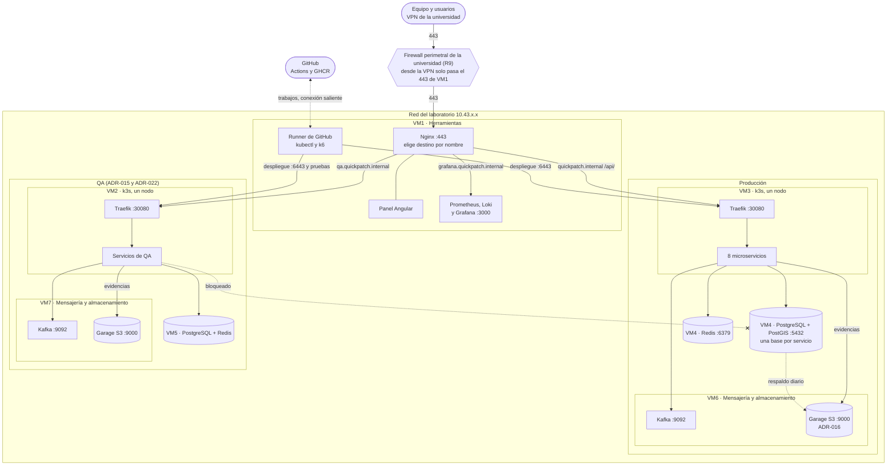
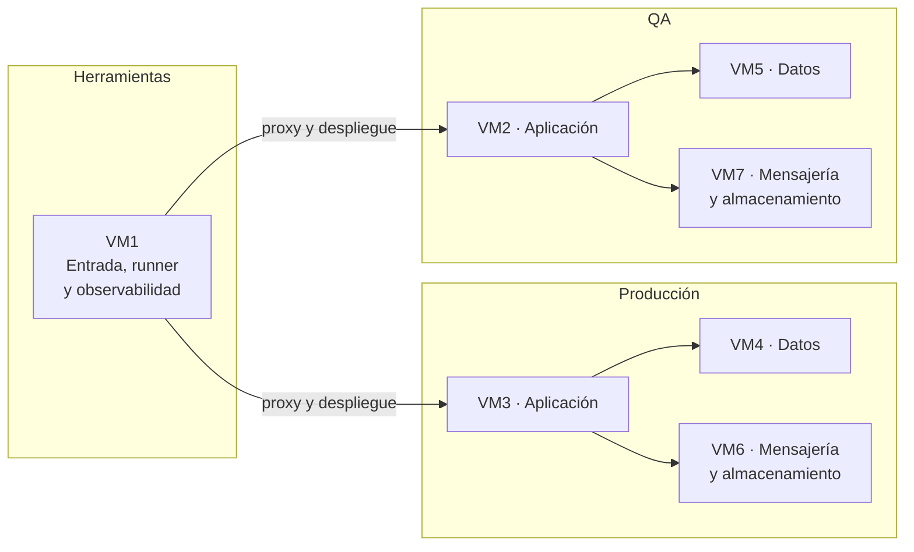
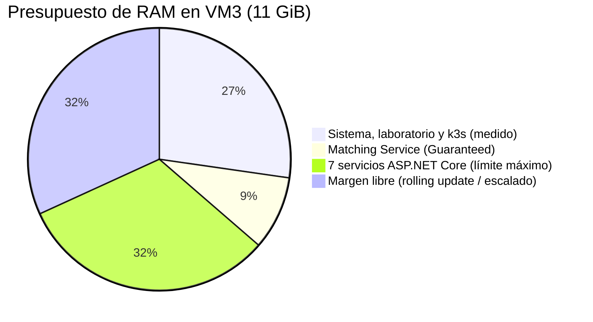
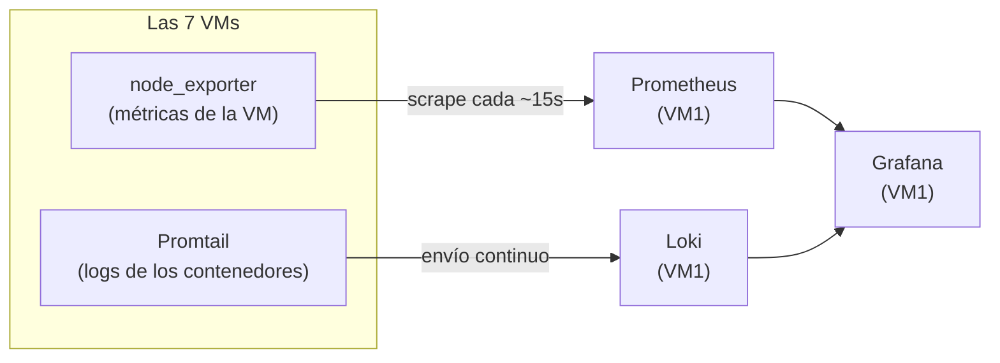

# Documento de Infraestructura V2 — QUICKPATCH

| | |
|---|---|
| **Tipo de documento** | Manual operativo de infraestructura |
| **Versión** | 2.6 |
| **Curso** | Arquitectura de Software |
| **Proyecto** | QUICKPATCH |

---

## 1. Introducción y alcance

### 1.1 Propósito

Este documento describe cómo se construye, despliega y opera la infraestructura de QUICKPATCH sobre las 7 máquinas virtuales propias del proyecto. Es el manual operativo: el "cómo" concreto de llevar a producción lo que el SAD ya decidió a nivel de arquitectura. Desde la versión 2.0 describe la infraestructura **implementada** en las 7 VMs, no un plan.

### 1.2 Qué cubre

- Arquitectura de despliegue: qué corre en cada VM, cómo se conectan los componentes, balanceo de carga y alta disponibilidad.
- Inventario detallado de las 7 VMs, con su consumo medido.
- Configuración de los ambientes Local, Dev, QA y Producción, y requisitos del ambiente local del equipo.
- Provisionamiento con Ansible, orquestación y despliegue (Docker Compose + k3s).
- Pipeline de CI/CD.
- Observabilidad (métricas y logs).
- Gestión de secretos.
- Backup y recuperación ante desastres.
- Seguridad de infraestructura (TLS, puertos entre VMs, acceso administrativo).
- Dominio y DNS (y por qué el proyecto no usa un dominio público).
- Presupuesto.
- Manual de despliegue de la infraestructura (Anexo A).

### 1.3 Qué no cubre

- Decisiones de arquitectura de software y sus trade-offs (ver SAD).
- Modelo de datos y contratos de API/eventos (ver DD).
- Políticas de equipo, GitFlow y estilo de código (ver Políticas y Herramientas).
- La vista física conceptual (SAD, sección 5): este documento cubre su despliegue operativo (sección 2).
- El benchmarking de infraestructura (entregable "PoC + ADR").

---

## 2. Arquitectura de despliegue

### 2.1 Vista general

Qué corre en cada VM, cómo se conectan y por dónde entra el tráfico. El inventario está en la sección 3 y las reglas exactas de firewall en la sección 10.

> **Reparto del ADR-022, aplicado el 7 de octubre de 2026.** Producción son VM3, VM4 y VM6; QA son VM2, VM5 y VM7; VM1 es de herramientas. El API Gateway y el panel todavía los sirve VM1, hasta que tengan imagen para correr en el k3s (sección 3.2).



- **Una sola entrada.** Desde la VPN, el firewall de la universidad solo deja pasar el 443 de VM1 (sección 10.2). El Nginx de VM1 reenvía según el nombre: `quickpatch.internal` a producción (el panel, servido en la misma VM1, y `/api/` al Traefik de VM3), `qa.quickpatch.internal` al Traefik de VM2 y `grafana.quickpatch.internal` a Grafana, en VM1.
- **Producción** son VM3, VM4 y VM6. Los 8 microservicios corren en el k3s de VM3 y usan PostgreSQL y Redis (VM4), y Kafka y Garage (VM6).
- **QA** son VM2, VM5 y VM7, con la misma forma que producción y datos y secretos propios. No puede conectarse a los servicios de producción.
- **El runner de VM1** despliega en los dos k3s y corre las pruebas de sistema contra QA. Se conecta hacia GitHub para recibir trabajos; GitHub nunca entra a la red del laboratorio.
- **Monitoreo:** las 7 VMs envían métricas (`node_exporter`, 9100) y logs (Promtail, 3100) a VM1 (sección 7). No se dibuja para no cruzar todas las flechas.

### 2.2 Principios de la arquitectura de despliegue

- **Sin servicios administrados en la nube (R5, R10):** todo el sistema corre en las 7 VMs propias asignadas por el laboratorio de la Javeriana; no hay bases de datos, colas ni cómputo administrado por un proveedor cloud.
- **Cada VM tiene un rol (ADR-022):** VM1 es de herramientas y combina el gateway, el panel Angular, el runner de despliegue y la observabilidad de los dos ambientes; cada ambiente tiene una VM de aplicación en k3s (VM3 en producción, VM2 en QA, ADR-011), una de datos con PostgreSQL y Redis (VM4 y VM5) y una de mensajería y almacenamiento con Kafka y Garage (VM6 y VM7, ADR-016).
- **Kubernetes solo donde corren los microservicios:** VM3 (producción) y VM2 (QA) usan k3s, porque los servicios necesitan rolling updates y auto-healing independientes. El resto de componentes usa Docker Compose por simplicidad operativa (sección 5).
- **Automatizado, no manual:** el aprovisionamiento de las 7 VMs y el despliegue de cada componente se hacen con Ansible (sección 5), no a mano, dado que una sola persona (DevOps) administra las 7 máquinas (SAD, sección 5.3).
- **Red cerrada por defecto:** ninguna VM acepta tráfico entrante salvo las rutas explícitas de la sección 10.3; el único punto de entrada desde fuera de la red del laboratorio es VM1.


### 2.3 Balanceo de carga y alta disponibilidad

**Resumen:** el sistema balancea carga **dentro de VM3**, entre réplicas de un mismo servicio, pero **no tiene alta disponibilidad entre máquinas**. Con 7 VMs fijas (R10) y sin operación 24/7 (R7), cada componente corre en una sola VM; lo que se protege es la recuperación rápida dentro de cada máquina y la reconstrucción completa con Ansible.

#### Dónde hay balanceo de carga

| Punto | Mecanismo | Alcance |
|---|---|---|
| Entrada (VM1) | Nginx enruta por nombre (producción, QA, Grafana) y por ruta (`/api/` hacia VM3) | Una sola instancia: enruta, pero no reparte entre varios servidores |
| VM1 → VM3 y VM2 | Nginx envía la API al Traefik de k3s, que escucha en la red del host (puerto 30080) | Un solo nodo por ambiente |
| Dentro de k3s | Cada servicio de Kubernetes reparte las peticiones entre las réplicas (pods) de su Deployment | **Escalado horizontal real**, limitado por la RAM de VM3 (sección 5.6) |
| Eventos (Kafka) | Las réplicas de un consumidor comparten las particiones de un tópico (grupo de consumidores) | Reparte el procesamiento de eventos, por ejemplo del Matching bajo pico (AC2-E4) |

k3s trae `metrics-server`, así que un servicio puede escalar sus réplicas automáticamente con un HorizontalPodAutoscaler según su CPU. No se configura todavía: el número máximo de réplicas depende del presupuesto de memoria de VM3, que se fija cuando se midan los servicios (sección 5.6).

#### Puntos únicos de falla

| Componente | Si falla | Mitigación |
|---|---|---|
| VM1 (entrada y herramientas) | Nadie entra desde la VPN (producción, QA y Grafana) y se pierden las métricas, los logs y el runner de los dos ambientes | Entrar por SSH a cada VM para diagnosticar; reconstrucción con `deploy-gateway.yml`, `deploy-observabilidad.yml` y `deploy-runner.yml` (SAD, ADR-015) |
| VM3 (k3s) | Se caen los 8 microservicios a la vez | k3s reinicia los pods que fallan; si cae la VM completa, reconstrucción (SAD, sección 5.2) |
| VM4 (PostgreSQL y Redis) | El sistema deja de atender: PostgreSQL es la fuente de verdad | Respaldo diario en Garage (VM6); restauración por base (sección 9.3). Redis, que guarda cache y colas cortas, se reconstruye sola con el uso |
| VM6 (Kafka y Garage) | Se detiene la comunicación asíncrona entre servicios y no se suben evidencias ni respaldos | Patrón Outbox para Kafka: los eventos esperan en cada base y se publican cuando vuelve (ADR-007, AC5-E4). Las evidencias no tienen copia (sección 9.5) |

#### Lo que sí protege la disponibilidad

- **Auto-healing en k3s:** si un pod falla, Kubernetes lo reinicia sin afectar a los demás servicios (AC5-E3).
- **Rolling updates sin downtime:** un despliegue crea el pod nuevo y solo retira el anterior cuando el nuevo está listo; si no termina, el pipeline revierte (secciones 5.8 y 6.2).
- **Reinicio automático de contenedores:** los servicios en Docker Compose (PostgreSQL, Redis, Kafka, Garage, observabilidad y Nginx) usan `restart: unless-stopped`, así que vuelven solos después de una caída o de un reinicio de la VM. El runner de VM1 también corre como servicio del sistema.
- **Recuperación por código:** cualquier VM se reconstruye con sus playbooks de Ansible, en la ventana de 12 a 24 horas aceptada (R7, sección 9.4).

**Por qué no hay alta disponibilidad entre máquinas:** exigiría duplicar cada componente en otra VM (dos gateways, un clúster de k3s de varios nodos, réplicas de PostgreSQL y Kafka), y el laboratorio solo asigna 7 VMs, que ya están ocupadas (R10). Sin operación 24/7 (R7), una caída se atiende en horario del equipo, lo que el SAD acepta en el escenario AC5-E1.

---

## 3. Inventario de infraestructura (VMs)

### 3.1 Especificación base

Las 7 VMs las asigna el laboratorio de virtualización de la Pontificia Universidad Javeriana para el curso, sobre VMware. Todas tienen los mismos recursos sin importar su rol; difieren en la IP, el sistema operativo y el software que alojan.

| Ítem | Valor |
|---|---|
| Proveedor | Laboratorio de virtualización, Pontificia Universidad Javeriana |
| Hipervisor | VMware |
| Sistema operativo | Ubuntu 22.04.5 LTS en VM1, VM3, VM4, VM6 y VM7; Rocky Linux 9.8 en VM2 y VM5 |
| Kernel | 6.8.0-90 (Ubuntu); 5.14.0-687 (Rocky) |
| vCPU | 4 (Intel Xeon Gold 5520) |
| RAM | 11 GiB (el sistema reporta 11,6 GiB en Ubuntu y 11,4 GiB en Rocky) |
| Disco | 68 GB (Ubuntu); 70 GB (Rocky) |

Ansible maneja las dos familias de sistema operativo (`tasks/base-debian.yml` y `tasks/base-redhat.yml`): en Rocky cambian el gestor de paquetes, el firewall (`firewalld` en lugar de `ufw`, sección 10.2) y SELinux, que está activo.

**Consumo base del laboratorio.** Antes de instalar nada del proyecto, cada VM ya usa unos 2,3 GiB de RAM y, en las Ubuntu, unos 18 GB de disco, por el software que instala el laboratorio (agente de Zabbix, antivirus y escritorio remoto, entre otros). Ese consumo no se puede quitar y hay que descontarlo de lo disponible para el proyecto (sección 5.6).

### 3.2 Detalle por VM

Reparto del ADR-022, aprobado el 6 de octubre de 2026 por la revisión del profesor y aplicado el 7 de octubre: 1 VM de herramientas, 3 de producción y 3 de QA. Las IPs y el hardware no cambiaron.



| VM | Ambiente | Rol | IP | Software del proyecto |
|---|---|---|---|---|
| VM1 | Herramientas | Entrada y herramientas | `10.43.100.168` | Nginx :443 por nombre (`quickpatch.internal`, `qa.quickpatch.internal`, `grafana.quickpatch.internal`) y el panel Angular; runner de GitHub, kubectl y k6; Prometheus, Loki y Grafana de los dos ambientes |
| VM3 | Producción | Aplicación | `10.43.98.205` | k3s de un nodo: los 8 microservicios (el API Gateway y el panel pasarán aquí al tener imagen) |
| VM4 | Producción | Datos | `10.43.98.209` | PostgreSQL + PostGIS (una base por servicio), respaldo diario y Redis |
| VM6 | Producción | Mensajería y almacenamiento | `10.43.99.12` | Kafka y Kafka UI (`quickpatch-kafka`); Garage (evidencias y respaldos) |
| VM2 | QA | Aplicación | `10.43.98.15` | k3s de un nodo, igual que VM3 |
| VM5 | QA | Datos | `10.43.98.29` | PostgreSQL + PostGIS y Redis, igual que VM4, sin respaldo |
| VM7 | QA | Mensajería y almacenamiento | `10.43.99.8` | Kafka y Garage, igual que VM6, sin Kafka UI |

Las 7 VMs corren `node_exporter` y Promtail (unos 40 MiB entre los dos). **Consumo medido:** el 3 de octubre, con el reparto anterior y todavía sin microservicios, ninguna VM pasaba del 32% de la RAM ni del 34% del disco. Con el reparto nuevo la medición está pendiente y se repite con los servicios desplegados (SCRUM-347); hasta entonces vale la sección 5.6 para VM3.

**Pendiente del reparto:** el API Gateway y el panel todavía no corren en el k3s porque aún no tienen imagen. Mientras tanto los sirve el Nginx de VM1; cuando existan, pasan a VM3 (producción) y VM2 (QA) y el proxy de VM1 cambia (paso 4 del ADR-022).

### 3.3 Conexiones permitidas

Las reglas exactas están en `firewall.yml` (sección 10.3). Ninguna VM de QA acepta conexiones de una VM de producción ni al revés.

| Origen | Destino | Puertos | Para qué |
|---|---|---|---|
| VPN de la universidad | VM1 | 443 | Única entrada (R9) |
| VM1 | VM3 y VM2 | 30080, 6443 | Proxy hacia el Traefik de cada ambiente; despliegue con kubectl |
| VM3 | VM4 | 5432, 6379 | Servicios de producción → PostgreSQL y Redis |
| VM3 | VM6 | 9092, 9000 | Servicios de producción → Kafka y Garage (evidencias) |
| VM4 | VM6 | 9000 | Respaldo diario de PostgreSQL a Garage |
| VM2 | VM5 | 5432, 6379 | Servicios de QA → PostgreSQL y Redis |
| VM2 | VM7 | 9092, 9000 | Servicios de QA → Kafka y Garage |
| Las demás VMs | VM1 | 3100 | Logs (Promtail → Loki) |
| VM1 | Las 7 VMs | 9100 | Métricas (Prometheus → `node_exporter`) |

**Cómo se hizo la migración** (DevOps, SCRUM-343 a SCRUM-347; el orden evitó dejar producción sin observabilidad ni respaldo): observabilidad a VM1; Garage a VM6 con sus buckets y el destino del respaldo cambiado; Redis a VM4 con un usuario por servicio; QA reconstruido en VM5 y VM7 con los mismos playbooks y el grupo `qa`; limpieza de lo viejo y firewall por VM. Quedan el API Gateway y el panel en k3s, y la medición de recursos.

### 3.4 Recursos por servicio

Cada servicio tiene sus propios recursos de datos y no puede leer los de otro (ADR-003, ADR-014, ADR-021). Así lo muestra el diagrama de alto nivel (vista lógica): cada servicio con su base PostgreSQL, su caché Redis y su almacenamiento en Garage según corresponda. En la vista física comparten la instancia de cada motor por ambiente, con el aislamiento dentro del motor. Esta tabla es la fuente para Ansible y para los secretos de Kubernetes.

| Servicio | PostgreSQL (prod VM4; QA VM5) | Redis (prod VM4; QA VM5) | Garage (prod VM6; QA VM7) |
|---|---|---|---|
| Identity | `db_identity` | Usuario `identity`, claves `identity:*` | — |
| Actors | `db_actors` | Usuario `actors`, claves `actors:*` | Bucket `actors-archivos` (reservado) |
| Catalog | `db_catalog` | Usuario `catalog`, claves `catalog:*` | Bucket `catalog-archivos` (reservado) |
| ServiceRequest | `db_service_request` (con PostGIS) | Usuario `service-request`, claves `service-request:*` (en uso: coordinación de tareas programadas, RN-Q6) | Llave `service-request` solo en `service-request-evidencias` (en uso: evidencias, D7) |
| Matching | `db_matching` (con PostGIS) | Usuario `matching`, claves `matching:*` | Bucket `matching-archivos` (reservado) |
| Ranking | `db_ranking` | Usuario `ranking`, claves `ranking:*` | Bucket `ranking-archivos` (reservado) |
| Payments | `db_payments` | Usuario `payments`, claves `payments:*` | Bucket `payments-archivos` (reservado) |
| Communication | `db_communication` | Usuario `communication`, claves `communication:*` | Bucket `communication-archivos` (reservado) |
| Respaldo (VM4) | Lectura de todas las bases (`pg_dump`) | — | Llave `backups` solo en `backups-postgres` |

Ansible ya crea un usuario de Redis por servicio y las llaves de Garage en uso (`quickpatch-infrastructure`, PRs #21 a #23). Los buckets marcados como reservados se crean, con su propia llave, cuando el servicio los necesite.

Reglas:

- **PostgreSQL:** una base por servicio con los roles del DD 10.2 (ADR-019). Ansible crea, por base, `<servicio>_migrator` (dueño de la base y de las tablas, `BYPASSRLS`, solo para las migraciones del despliegue) y `<servicio>_app` (el servicio, `NOBYPASSRLS`, sujeto a las políticas de aislamiento por tenant); los dos inician sesión y tienen su contraseña en Ansible Vault. `<servicio>_outbox` e `identity_platform` son roles `NOLOGIN` (no inician sesión y no tienen contraseña): el servicio los adopta con `SET LOCAL ROLE` dentro de su transacción. Esos dos roles y los permisos sobre cada tabla los pone el `db/roles.sql` de cada servicio, con `aplicar-roles-db.yml`, después de sus migraciones. Hoy tienen `db/roles.sql` Identity, Catalog, ServiceRequest y Matching; Actors, Ranking, Payments y Communication lo traerán con su código, y mientras tanto sus bases solo tienen los roles `_migrator` y `_app`, sin permisos sobre tablas. Cada rol entra solo a su base y solo desde el k3s de su ambiente. Aplicado el 7 de octubre en QA y producción.
- **Redis:** un usuario ACL por servicio, restringido a su prefijo de claves (`~<servicio>:*`) y sin comandos administrativos (`-@dangerous`), más un usuario de administración; el usuario `default` está desactivado. Reemplaza la contraseña única compartida (`requirepass`).
- **Garage:** una llave por uso, con permiso solo sobre su bucket: `service-request` para `service-request-evidencias` y `backups` para `backups-postgres`. Reemplaza la llave `servicios` compartida del reparto anterior.
- **PostGIS:** se habilita en `db_matching` y en `db_service_request` (la ubicación de la solicitud es `geometry(Point, 4326)`). Ansible lo hace al crear esas bases.
- **Credenciales:** en Ansible Vault, y cada servicio las recibe en su propio `Secret` de Kubernetes (namespace `quickpatch`). QA usa credenciales distintas de producción.

---

## 4. Ambientes Dev/QA/Prod

### 4.1 Resumen

| Ambiente | Dónde vive | Persistencia | Qué corre ahí |
|---|---|---|---|
| Local | Computador de cada integrante | Mientras se desarrolla, no compartido | Desarrollo, lint y pruebas unitarias (hook pre-push opcional) |
| Dev | Runners de GitHub Actions | Efímero: se crea y se destruye en cada ejecución | Lint, pruebas unitarias y de integración (Testcontainers) y cobertura, en cada PR y push a `develop` |
| QA | **VM2, VM5 y VM7**, permanentes (SAD, ADR-015 y ADR-022) | Siempre encendido, con datos y secretos propios | Despliegue de cada versión (`release/*`) y pruebas de sistema: E2E, OWASP ZAP, escáner PCI-DSS y carga con k6 |
| Producción | VM3, VM4 y VM6 (más VM1, de herramientas, para la entrada y la observabilidad) | Siempre encendido | El sistema completo; se despliega al fusionar en `main` |

QA replica la forma de producción en tres VMs: k3s con la misma versión (VM2), PostgreSQL + PostGIS y Redis (VM5), y Kafka y Garage (VM7). No puede conectarse a los servicios de producción (sección 10.3) y se entra por `https://qa.quickpatch.internal`, a través de VM1 (sección 11).

### 4.2 Requisitos del ambiente local

El toolchain está fijado por `docs/governance/TOOLCHAIN.md`: .NET SDK 10.0.401, Java 25 LTS + Spring Boot 4.1.1, Node.js 24.21.0 LTS + Angular 22.1.x y Flutter 3.47.5 + Dart 3.13.4. Cada repositorio mantiene además su pin reproducible (`global.json`, `.java-version`/wrapper, `.nvmrc`, `.flutter-version` y lockfiles según corresponda).

---

## 5. Contenedores y orquestación

La infraestructura está implementada con Ansible en la carpeta `infrastructure/ansible/` del repositorio principal (antes el repositorio `quickpatch-infrastructure`, archivado en SCRUM-338) y aplicada en las 7 VMs. Ansible corre dentro de un contenedor de Docker (`ansible/Dockerfile` y el wrapper `ap`), así que todo el equipo usa la misma versión (ansible-core 2.18). Los playbooks pasan `ansible-lint` con el perfil `production` en el CI del repositorio principal (sección 6.1).

### 5.1 Inventario de Ansible

`ansible/inventory/hosts.yml`:

| Grupo | VM | IP | Ambiente |
|---|---|---|---|
| `gateway` y `observabilidad` | VM1 | `10.43.100.168` | Herramientas |
| `backend` | VM3 | `10.43.98.205` | Producción |
| `database` y `cache` | VM4 | `10.43.98.209` | Producción |
| `messaging` y `storage` | VM6 | `10.43.99.12` | Producción |
| `qa_app` | VM2 | `10.43.98.15` | QA |
| `qa_datos` | VM5 | `10.43.98.29` | QA |
| `qa_mensajeria` | VM7 | `10.43.99.8` | QA |

Los grupos `produccion` (VM3, VM4 y VM6) y `qa` (VM2, VM5 y VM7) reúnen los de cada ambiente. Las variables están en `inventory/group_vars/`: `all/main.yml` (IPs, versiones fijadas de cada imagen, rangos de k3s, nombres del gateway y bases de datos), `all/firewall.yml` (reglas de la sección 10.3), `all/vault.yml` (secretos cifrados con Ansible Vault, sección 8) y los valores propios de cada ambiente en `produccion.yml` y `qa.yml` (memoria de Redis, retención de Kafka, capacidad de Garage, contraseñas y respaldo).

### 5.2 Playbooks

| Playbook | Alcance | Qué instala y configura |
|---|---|---|
| `diagnostico.yml` | Las 7 VMs | Solo lectura: sistema, recursos, Docker y firewall |
| `setup-base.yml` | Las 7 VMs | Paquetes base, usuario de despliegue, SSH sin `root`, Docker, firewall (`ufw` o `firewalld`), `node_exporter` y Promtail |
| `deploy-observabilidad.yml` | VM1 | Prometheus, Loki y Grafana de los dos ambientes, con las alertas por correo |
| `deploy-garage.yml` | VM6 y VM7 | Garage, sus buckets y una llave por uso |
| `deploy-db.yml` | VM4 y VM5 | PostgreSQL + PostGIS, una base por servicio con sus roles `_migrator` y `_app` (DD 10.2); en VM4, el respaldo diario a Garage |
| `aplicar-roles-db.yml` | VM4 y VM5 | Aplica el `db/roles.sql` de cada servicio (permisos de `_app`, `_outbox`, `identity_platform`); va después de las migraciones del servicio |
| `deploy-cache.yml` | VM4 y VM5 | Redis con un usuario ACL por servicio, restringido a su prefijo |
| `deploy-kafka.yml` | VM6 y VM7 | Kafka en modo KRaft; en VM6, también Kafka UI |
| `deploy-k3s.yml` | VM3 y VM2 | k3s de un nodo con los rangos de red de abajo, Traefik en la red del host (puertos 30080 y 30443), namespace `quickpatch` y kubeconfig para el runner |
| `deploy-gateway.yml` | VM1 | Nginx con los tres nombres (sección 11), el panel Angular y el certificado |
| `deploy-runner.yml` | VM1 | kubectl, k6, kubeconfig de QA y producción, llave SSH hacia VM2 y el runner de GitHub como servicio |
| `migrar-adr-022.yml` | VM1 a VM7 | Pasa un ambiente del reparto anterior al del ADR-022, por fases con etiquetas; solo borra lo viejo con `-e confirmar_borrado=true` |
| `site.yml` | Todas | Aplica los de despliegue en orden (Anexo A) |

Las tareas compartidas están en `ansible/tasks/`: la base de cada familia de sistema operativo (`base-debian.yml` y `base-redhat.yml`), la instalación de k3s (`k3s.yml`, usada por VM3 y VM2) y la configuración de Garage (`garage.yml`, usada por VM6 y VM7). El antiguo `deploy-frontend.yml` desapareció: el panel ahora lo sirve el gateway. Con el ADR-022 desaparecieron también `deploy-qa.yml` y `deploy-storage-observability.yml`: QA usa los mismos playbooks que producción, y la observabilidad tiene el suyo.

> **Nota crítica sobre el rango de red de k3s:** el `--service-cidr` por defecto de k3s es `10.43.0.0/16` — exactamente el rango en el que viven las 7 VMs del laboratorio (`10.43.98.x`, `10.43.99.x`, `10.43.100.x`). Sin cambiarlo, un `ClusterIP` que k3s asigne a un `Service` puede coincidir con la IP real de otra VM (por ejemplo, `10.43.98.209`, la IP de VM4): el tráfico de un pod hacia esa IP se enrutaría al Service en vez de a PostgreSQL, un fallo intermitente y dependiente del orden de asignación de IPs, no reproducible de forma confiable. Por eso `deploy-k3s.yml` instala k3s con `--service-cidr` y `--cluster-cidr` fijados fuera de `10.43.0.0/16` (ver tabla arriba) — este flag se fija en el momento de instalación y no se puede cambiar después sin reinstalar el clúster.


> **Nota sobre logging de aplicación:** los siete servicios ASP.NET Core deben emitir logging estructurado mediante `Microsoft.Extensions.Logging` (con un proveedor estructurado como Serilog si el equipo lo adopta); Matching usa logging estructurado de Spring/SLF4J. Los logs se escriben a la salida estándar de los contenedores; Promtail los recolecta y Loki los almacena en VM1. El contrato operativo no depende del proveedor: salida estructurada, correlation ID y ausencia de secretos, PAN y CVV.

### 5.3 Primer despliegue de los microservicios

`deploy-k3s.yml` deja k3s instalado y el namespace `quickpatch` creado, pero ningún microservicio corriendo. Para el primer despliegue de cada servicio falta, **pendiente**:

1. Los `Secret` de Kubernetes con sus credenciales (contraseña de su base, llave de Garage, llaves de firma JWT, credenciales de la pasarela de pagos), nunca en texto plano en los manifiestos.
2. Los `ConfigMap` con la configuración no sensible (direcciones de PostgreSQL, Kafka, Redis y Garage).
3. Si las imágenes de GHCR quedan privadas, un `imagePullSecret` para que k3s las pueda descargar.
4. El `Deployment` y el `Service` de cada servicio, con los recursos de la sección 5.6 y sus probes (sección 5.8).

Después del primer despliegue, las actualizaciones las hace el pipeline (sección 6.2) con `kubectl set image`, sin repetir estos pasos.

### 5.4 Ejecución

Todo se aplica con `./ap playbooks/site.yml -k -K`, o playbook por playbook. El orden, la preparación del computador y la reconstrucción de una sola VM están en el Anexo A. El orden respeta las dependencias del SAD (sección 5.3): Garage antes que el respaldo de la base, y los dos k3s antes que el runner, que necesita sus kubeconfig.

### 5.5 Estructura de la infraestructura en el repositorio

```
quickpatch/
├── infrastructure/
│   ├── ansible/
│   │   ├── Dockerfile, ap, ansible.cfg, requirements.yml, .ansible-lint
│   │   ├── inventory/   hosts.yml y group_vars/ (all/, produccion.yml y qa.yml)
│   │   ├── playbooks/   los de la sección 5.2
│   │   ├── tasks/       base-debian, base-redhat, k3s, garage
│   │   ├── templates/   compose, PostgreSQL, Prometheus, Loki, Grafana, Garage, respaldo y Secrets de los servicios
│   │   └── files/       aprovisionamiento de Grafana (tableros y alertas)
│   ├── plantillas/hooks/pre-push
│   ├── CI-CD.md
│   └── README.md
├── apps/api-gateway/nginx/   gateway-nginx.conf.j2 (submódulo quickpatch-api-gateway)
└── apps/kafka/deploy/        deploy-kafka.yml y compose.yml.j2 (submódulo quickpatch-kafka)
```

Cada componente es dueño de su despliegue (ADR-021, SCRUM-338): la configuración del gateway está en `quickpatch-api-gateway`, el despliegue de Kafka y la creación de los topics de `topics/topics.yaml` en `quickpatch-kafka`, y los manifiestos de k3s de cada servicio en `deploy/k8s/` de su repositorio. `deploy-gateway.yml` y `deploy-kafka.yml` usan esos archivos desde los submódulos, así que Ansible aplica la versión que fija cada submódulo. `./ap` monta el repositorio completo para alcanzarlos.

### 5.6 Presupuesto de recursos en VM3

VM3 tiene 4 vCPU y 11 GiB de RAM fijos (sección 3.1), compartidos entre el control plane de k3s y los 8 microservicios. Sin límites explícitos, .NET runtime/GC y el JVM asumen que tienen toda la máquina disponible, lo que puede llevar a que el sistema operativo mate procesos por falta de memoria durante un pico de carga — y que la primera víctima sea, por cómo Kubernetes decide a quién desalojar, el propio Matching Service. Para evitarlo, cada microservicio declara `resources.requests` y `resources.limits` explícitos:

| Componente | CPU (request/limit) | RAM (request/limit) | Clase de QoS |
|---|---|---|---|
| Sistema operativo, software del laboratorio y k3s (containerd, Traefik, CoreDNS) | — | — | 3,0 GiB medidos sin microservicios (sección 3.2): 2,5 del sistema y el laboratorio, 0,5 de k3s |
| Matching Service (Spring Boot) | 1 / 1 vCPU | 1 / 1 GiB | Guaranteed |
| Identity, Actors, Catalog, ServiceRequest, Ranking, Payments, Communication (ASP.NET Core, c/u) | Pendiente de medición | Pendiente de medición | Burstable inicialmente |

Los límites históricos calculados para NestJS no se reutilizan automáticamente para ASP.NET Core. El presupuesto total de VM3 continúa sujeto a los atributos de calidad vigentes, pero `requests` y `limits` por servicio se fijarán con mediciones de los contenedores .NET y Java. Antes de producción se debe demostrar que el conjunto de los 8 microservicios, k3s y el margen requerido para rolling updates cabe dentro de los 4 vCPU y 11 GiB disponibles sin `OOMKilled`.



> **Pendiente: el umbral de 6,5 GiB no alcanza con estos límites.** El escenario AC2-E5 del SAD y el caso PRF-005 del Documento de Pruebas fijan un máximo de 6,5 GiB de RAM en VM3, calculado con 2 GiB para el sistema. Medido, el sistema usa 3,0 GiB (el software del laboratorio no estaba en la estimación), así que el sistema, Matching y los siete servicios .NET con estos límites sumarían 7,5 GiB. Las salidas son bajar el límite de los servicios .NET a unos 360 MiB cada uno, o subir el umbral a 7,5 GiB (VM3 tiene 11,6 GiB). Se decide cuando se midan los servicios reales.

**Por qué el Matching queda en "Guaranteed":** cuando VM3 entra en presión de memoria, Kubernetes desaloja primero los pods en QoS "BestEffort" (sin límites) y luego los "Burstable" que más exceden su *request*; un pod "Guaranteed" (request = limit) es el último candidato a desalojo. AC2-E4 exige que el Matching siga respondiendo bajo pico de carga — dejarlo en la clase de QoS más protegida es lo que hace esa exigencia verificable, no solo declarada.

### 5.7 Límite de conexiones a PostgreSQL

VM4 mantiene PostgreSQL como almacén común de infraestructura con ownership lógico por servicio. Los siete servicios ASP.NET Core utilizan EF Core + Npgsql, cuyo pool de conexiones debe configurarse explícitamente; Matching utiliza el pool HikariCP de Spring. Los tamaños definitivos de ambos pools se establecerán mediante pruebas de integración/carga y deberán mantener margen sobre `max_connections`, incluyendo escenarios de rolling update y escalado del Matching. No se conserva como supuesto el cálculo previo basado en Prisma porque corresponde al stack descartado.

### 5.8 Cómo se despliega o actualiza un microservicio

1. Se construye la imagen Docker del servicio modificado y se sube a **GitHub Container Registry (`ghcr.io`)** — gratuito e integrado con el repositorio del proyecto, sin credenciales adicionales que gestionar.
2. Se actualiza el `deployment.yaml` correspondiente (o se ejecuta `kubectl set image deployment/<servicio> <contenedor>=<nueva-imagen>`).
3. Kubernetes aplica un *rolling update*: crea el pod nuevo, espera a que pase el `readinessProbe`, y solo entonces retira el pod anterior — sin downtime para ese servicio ni para los demás 7.
4. El margen de RAM definido en la sección 5.6 es lo que permite que el pod adicional del rolling update quepa sin desalojar a otros servicios.
5. **Migraciones y permisos.** Las migraciones corren solas con cada despliegue, con el rol `<servicio>_migrator`: los servicios .NET (Identity, Catalog, ServiceRequest) las ejecutan en un init container con el *migration bundle* de EF Core, y a ese contenedor solo llega la contraseña del migrator (Secret `migrator-connection`); el contenedor del servicio recibe únicamente la del `_app`. Matching lo hace distinto: corre Flyway al arrancar, con `matching_migrator`, así que allí la contraseña del migrator también llega al contenedor del servicio. Los permisos sobre cada tabla **no** se dan solos: los concede `aplicar-roles-db.yml` a mano, con el `db/roles.sql` del servicio. Una migración que agrega una tabla deja al `_app` sin permisos sobre ella hasta que alguien corra ese playbook; por eso un despliegue que agregue tablas incluye ese paso (`aplicar-roles-db.yml --limit <ambiente> -e servicio=<servicio>`) y el servicio se reinicia después. No se usa `ALTER DEFAULT PRIVILEGES`: daría a `_app` el mismo permiso sobre toda tabla nueva y rompería el mínimo privilegio del DD 10.2 (por ejemplo, `audit_logs` solo admite `INSERT` y `SELECT`).

**Migraciones de base de datos — por qué deben ser *expand-contract*:** `kubectl rollout undo` (sección 6.2) revierte únicamente la imagen del contenedor a la versión anterior; **nunca revierte una migración de esquema** (EF Core/Flyway). Si un release incluye una migración que rompe compatibilidad hacia atrás (por ejemplo, elimina o renombra una columna que la versión anterior todavía usa), un rollback de imagen deja código viejo corriendo contra un esquema nuevo — el sistema queda roto, no recuperado. Por eso toda migración de esquema debe seguir el patrón **expand-contract**: agregar lo nuevo (columna, tabla) sin tocar ni eliminar lo que la versión anterior todavía necesita; solo se retira lo viejo en un release posterior, una vez que ningún código en producción depende de ello. Bajo esta regla, un `kubectl rollout undo` sí es seguro: la versión anterior del código sigue siendo compatible con el esquema, ya ampliado, de la base de datos. Si una migración no puede expresarse de forma expand-contract dentro del alcance de un sprint, no se despliega junto con el resto del release — se separa en su propio cambio, con downtime planeado y comunicado (escenario de mantenimiento planeado del SAD).

**Pendiente de definir con datos reales:** los parámetros de `readinessProbe`/`livenessProbe` (tiempos de espera, número de reintentos) y si se necesita un `startupProbe` separado para el arranque. No se fijan valores en esta versión del documento porque dependen del comportamiento real de cada servicio bajo carga, algo que todavía no se ha medido — fijar un número ahora sería una estimación sin sustento, el mismo problema señalado en la sección 3.1.

---

## 6. CI/CD

### 6.1 Estructura del pipeline

El pipeline está en GitHub Actions y sigue el multirepo (SAD, ADR-013 y ADR-021): cada uno de los 12 repositorios de componentes tiene su propio pipeline, así que un cambio en un servicio solo dispara el de ese servicio (AC7-E1).

**El CI vive en cada repositorio** (ADR-021, SCRUM-337): `.github/workflows/ci-cd.yml` contiene el job de CI completo de su stack, sin llamar a workflows de otro repositorio, y `.github/scripts/cobertura.py` mide la cobertura. Así, un cambio en un repositorio no altera el pipeline de los demás. El costo es que una mejora del CI se aplica repositorio por repositorio.

| CI (en cada repositorio) | Qué hace | Repositorios |
|---|---|---|
| .NET | Formato, compilación, pruebas de `tests/unit` y `tests/integration` (Testcontainers) y cobertura | 7 servicios ASP.NET Core |
| Java | Pruebas unitarias e integración (`*IT`, Testcontainers) con Maven y cobertura con JaCoCo | `quickpatch-matching` |
| Angular | Lint, pruebas, cobertura y build; guarda el build para publicarlo | `quickpatch-web` |
| Flutter | Formato, análisis, pruebas y cobertura; APK en `release/*` y `main` | `quickpatch-mobile` |
| Contratos REST | Spectral, compatibilidad con `oasdiff` contra la rama base, `nginx -t` y tags `vX.Y.Z` | `quickpatch-api-gateway` |
| Eventos | AJV, alineación de topics y esquemas, compatibilidad contra la rama base y tags `vX.Y.Z` | `quickpatch-kafka` |
| Composición y documentación | Submódulos y contratos en versiones etiquetadas; referencias obsoletas en la documentación | Repositorio principal |

**El despliegue (CD) también vive en cada repositorio** (SCRUM-338): el mismo `ci-cd.yml` construye la imagen y la despliega, sin workflows de otros repositorios.

| Job | Qué hace | Repositorios |
|---|---|---|
| `imagen` | Construye y publica la imagen en GitHub Container Registry, etiquetada por contenido | Servicios |
| `desplegar` | Actualiza la imagen en k3s de QA (`release/*`) o producción (`main`) y espera el rolling update; si falla, lo revierte | Servicios |
| `desplegar` | Publica el build del panel en QA o en producción | `quickpatch-web` |
| `pruebas-sistema.yml` | E2E, OWASP ZAP, escáner PCI-DSS y k6 contra QA | Repositorio principal |

El repositorio principal revisa además la infraestructura en cada PR (`pr-quality.yml`): actionlint, sintaxis y `ansible-lint` de los playbooks y gitleaks sobre `infrastructure/`. El detalle está en `infrastructure/CI-CD.md`.

Las pruebas siguen el Documento de Pruebas: estructura de carpetas, herramientas y **cobertura mínima de 80%**, que hace fallar el pipeline. El detalle de convenciones por stack está en el README de cada repositorio.

### 6.2 Qué corre en cada rama

| Rama | Dónde corre | Qué corre | Compuerta del Documento de Pruebas |
|---|---|---|---|
| Push a cualquier rama | Computador de cada persona | Pruebas unitarias (hook pre-push opcional) | 0 |
| PR a `develop` | Runner de GitHub | Lint, pruebas unitarias y cobertura | 1 |
| Push a `develop` | Runner de GitHub | Además, pruebas de integración con Testcontainers | 1 |
| Push a `release/*` | Runner de GitHub y runner de VM1 | Imagen en GHCR y despliegue en **QA** (VM2). En el repositorio principal, E2E, ZAP, escáner PCI y k6 contra QA | 2 |
| Push a `main` | Runner de VM1 | Despliegue en **producción** (VM3) con la misma imagen que se probó en QA | 3 |

```mermaid
flowchart LR
    F["feature/*"] -->|"PR"| G1{{"Lint, unitarias<br/>y cobertura ≥ 80%"}}
    G1 --> D["develop"]
    D --> G2{{"Integración<br/>(Testcontainers)"}}
    G2 --> R["release/x.y.z"]
    R --> IMG{{"Imagen en GHCR<br/>(etiqueta por contenido)"}}
    IMG --> QA["QA en VM2<br/>rolling update"]
    QA --> G3{{"E2E, ZAP, PCI-DSS<br/>y k6 contra QA"}}
    G3 -->|"aprobado"| M["main"]
    M --> P["Producción en VM3<br/>misma imagen de QA"]
    P -->|"no termina"| RB{{"kubectl rollout undo"}}
```



QA solo cambia cuando se prepara una versión (`release/*`), no con cada push a `develop`, para que se mantenga estable mientras se prueba.

**Producción despliega exactamente la imagen probada en QA.** El job `imagen` de cada repositorio etiqueta cada imagen con el hash del contenido del repositorio, no con el del commit. Al fusionar `release/x.y.z` en `main` sin otros cambios, el contenido es el mismo, la imagen ya existe y no se vuelve a construir. Si `main` trae algo que no pasó por `release/*`, el workflow construye una imagen nueva y deja un aviso.

**Alcance de la reversión.** Si el rolling update no termina (por ejemplo, pods que no arrancan o se caen por falta de memoria), el pipeline ejecuta `kubectl rollout undo`, que vuelve a la imagen anterior. Eso no revierte migraciones de esquema de la base de datos: solo es seguro si el cambio siguió el patrón expand-contract (sección 5.8). Si no, la recuperación real es restaurar el respaldo de la base (sección 9.3), con hasta 24 horas de pérdida de datos.

**Prueba de carga.** k6 corre contra QA (SAD, ADR-015), así que una versión que no cumple los umbrales se detecta antes de llegar a producción. QA tiene la misma forma que producción, con VMs de la misma especificación, pero con datos de prueba, por lo que el resultado es una aproximación: un mal resultado indica un problema, y la validación final son las métricas de producción en Grafana.

### 6.3 Runner self-hosted en VM1

Los runners de GitHub corren en la nube y no llegan a la red del laboratorio (`10.43.x.x`). Los despliegues y las pruebas de sistema corren en un **runner self-hosted en VM1**: `vm1-despliegue`, versión 2.337.0, registrado en la organización con las etiquetas `self-hosted`, `vm1` y `red-laboratorio`. Corre como servicio del sistema con el usuario `quickpatch` y arranca solo si VM1 se reinicia (`deploy-runner.yml`).

- **Credenciales:** el runner usa los kubeconfig de QA y producción que deja `deploy-runner.yml` en el propio VM1, así que no hay credenciales de Kubernetes guardadas en GitHub. Para publicar el panel de QA usa una llave SSH de VM1 a VM2.
- **Por qué en VM1:** está dentro de la red del laboratorio y llega a VM2 y VM3 sin túneles; no compite con los microservicios por los recursos de VM3, y está siempre encendido, a diferencia del computador de una persona.
- **Seguridad:** los repositorios son públicos, y GitHub advierte que un PR desde un fork podría ejecutar código ajeno en un runner self-hosted. Por eso los workflows que usan el runner solo se disparan con `push` o a mano, nunca con `pull_request`. Además, en la organización se exige aprobación para los workflows de colaboradores externos, y el grupo del runner tiene permitidos los repositorios públicos para que los componentes lo puedan usar.
- **Costo:** mientras corre una prueba de carga, k6 comparte la CPU de VM1 con el gateway de producción (riesgo aceptado en el SAD, ADR-015).

---

## 7. Monitoreo y observabilidad

Dos tipos de información, cada uno con su propia cadena de recolección y almacenamiento, unificados en un solo panel:

- **Métricas** (números que cambian en el tiempo: CPU, RAM, peticiones por segundo, errores por minuto) — recolectadas por `node_exporter` en cada VM, almacenadas por Prometheus en VM1.
- **Logs** (mensajes de texto que describen eventos: "pago rechazado", "acceso denegado") — recolectados por Promtail en cada VM, almacenados por Loki en VM1.

Ninguno de los dos sustituye al otro: las métricas dicen *qué tan rápido u ocupado* está el sistema; los logs dicen *qué pasó exactamente*. Grafana consulta ambas fuentes desde el mismo panel, lo que permite cruzarlos — por ejemplo, ver qué decían los logs justo cuando una métrica de CPU se disparó.



### 7.1 Qué se instala y dónde

| Componente | Dónde | Rol |
|---|---|---|
| `node_exporter` | Las 7 VMs (`setup-base.yml`) | Expone las métricas de esa VM para que Prometheus las recolecte |
| Promtail | Las 7 VMs (`setup-base.yml`) | Recolecta los logs de los contenedores de esa VM y los envía a Loki |
| Prometheus | VM1 (`deploy-observabilidad.yml`) | Almacena el historial de métricas de las 7 VMs, de producción y de QA |
| Loki | VM1 (`deploy-observabilidad.yml`) | Almacena el historial de logs de las 7 VMs, de producción y de QA |
| Grafana | VM1 (`deploy-observabilidad.yml`) | Panel único para consultar Prometheus y Loki, con las dos fuentes de datos ya configuradas |

- **Acceso:** Grafana corre en la propia VM1 (ADR-022) y se abre en `https://grafana.quickpatch.internal` por el proxy Nginx de esa misma VM (sección 11), con el usuario `admin` y la contraseña del vault. Prometheus (9090) y Grafana (3000) no tienen puerto abierto en el firewall: solo el 3100 de Loki, para los logs de las 7 VMs. Prometheus no se publica: se consulta desde Grafana.
- **Etiquetas de los logs:** Loki etiqueta cada línea con la VM (`vm`, de `vm1` a `vm7`), el `job`, el `entorno` (`qa` en VM2, `prod` en el resto) y, en los pods de k3s (VM2 y VM3), el `namespace` y el `service` (el contenedor, que se llama como el microservicio), sacados de la ruta del log. Las pruebas de sistema usan esas etiquetas para revisar los logs de QA en busca de datos de tarjetas (sección 6.2).
- **Reloj:** las 7 VMs se sincronizan con servidores NTP públicos mediante `chrony`, que `setup-base.yml` deja activo. Importa para cruzar logs entre VMs y para validar certificados y firmas de token: en Rocky Linux (VM2 y VM5) el servicio no arrancaba solo y VM2 llegó a ir unos 54 s atrasada.
- **Retención:** 15 días de métricas en Prometheus; los datos de diagnóstico no se respaldan (sección 9.1).
- **Pendiente:** un dashboard de métricas de las 7 VMs y que los servicios escriban sus logs en JSON con `level` y `correlationId` (SCRUM-323). Además, Promtail está en fin de vida y su reemplazo es Grafana Alloy.

### 7.2 Qué cubre esto en el SRS y el SAD

- **RNF-04** (todo 403 queda en log): el 403 se escribe con el logger estructurado del servicio ASP.NET Core o Spring Boot, Promtail lo recolecta, Loki lo guarda permanentemente — sin esta cadena, el log existiría solo mientras el contenedor no se reinicie, lo cual pasa en cada despliegue.
- **AC6-E5/E6** (reconstruir una disputa, trazabilidad de pagos): requieren historial persistente de eventos — Loki es lo que hace posible que ese historial sobreviva más allá de la vida de un contenedor.
- **AC5-E1/E3 y AC2-E5** (disponibilidad y uso de recursos, "límite de capacidad a vigilar" de la sección 3.1): Prometheus + `node_exporter` son el instrumento real para vigilar esa capacidad — sin ellos, "vigilar" no tenía con qué hacerse.

### 7.3 Dashboard de logs y alertas

Ambos se aprovisionan desde `infrastructure/ansible/files/grafana/` al correr `deploy-observabilidad.yml`, así que no se editan a mano en Grafana.

**Dashboard "QUICKPATCH — Logs y errores"** (carpeta QUICKPATCH). Filtros por entorno y servicio, y seis paneles:

| Panel | Qué responde |
|---|---|
| Errores por servicio | Cuántas líneas con `level` error, fatal o critical hay por servicio |
| Errores recientes | Las últimas líneas de error de los servicios elegidos |
| Trazar un correlationId | Todas las líneas de todos los servicios que contienen el identificador escrito en la variable |
| Accesos 403 por servicio | Líneas de los servicios con `403` (RNF-04) |
| 403 en el gateway | Accesos rechazados en el registro de Nginx de VM1 |
| Logs recibidos por VM | Cuántas líneas llegan de cada VM: una VM sin barras no está enviando logs |

Los paneles de errores suponen logs en JSON con los campos `level` y `correlationId`; el formato lo fija SCRUM-323. Los paneles de 403, de correlationId y de logs por VM no dependen del formato. Hasta que haya servicios corriendo en k3s, los paneles por servicio aparecen vacíos.

**Alertas de infraestructura** (carpeta QUICKPATCH, evaluadas cada minuto sobre las métricas de `node_exporter`):

| Alerta | Condición | Severidad |
|---|---|---|
| RAM alta | Más del 85% de la memoria de una VM durante 5 minutos (escenario AC9-E6 del SAD) | Alta |
| Disco casi lleno | Más del 85% de la partición raíz durante 10 minutos | Alta |
| VM sin métricas | Prometheus no lee `node_exporter` de una VM durante 2 minutos, o no devuelve datos | Crítica |

Las notificaciones salen por correo a `sanchezse@javeriana.edu.co`, agrupadas por alerta y VM, con repetición cada 4 horas. Grafana envía el correo por el SMTP de una cuenta de Gmail con contraseña de aplicación (`vault_smtp_password` en el vault de Ansible); si esa contraseña no existe, el correo queda desactivado y las reglas se ven igual en el panel.

**Limitación:** las alertas viven en VM1, junto a Grafana, Prometheus y Loki, y VM1 también es la entrada desde la VPN y el runner (riesgo aceptado en el ADR-022). Si VM1 cae, no hay acceso ni monitoreo, y no hay quien avise de que VM1 cayó. Un monitor externo lo resolvería y queda fuera del alcance (R10: sin VM adicional).

---

## 8. Gestión de secretos

### 8.1 Principio general

Ningún secreto (contraseñas, llaves de Garage, tokens de la pasarela de pagos, llaves de firma JWT) se guarda en texto plano en un repositorio ni en una imagen de Docker, consistente con la política del equipo de no compartir credenciales reales, tampoco con la IA (Políticas y Herramientas, uso de IA).

### 8.2 Mecanismo por tipo de componente

- **Infraestructura (las 7 VMs):** Ansible Vault. Los secretos están en `inventory/group_vars/all/vault.yml`, cifrado con AES-256, y se descifran solo al ejecutar un playbook. Ese archivo **no se sube a Git** y su contraseña vive fuera del repositorio (`~/.config/quickpatch/vault-pass`); la plantilla sin valores reales es `vault.example.yml` (sección 9.4 sobre cómo respaldarlos). QA tiene secretos propios, distintos a los de producción.
- **Microservicios (k3s en VM3 y VM2):** objetos `Secret` de Kubernetes, referenciados desde cada Deployment como variables de entorno, nunca en texto plano en el manifiesto (pendiente con los manifiestos, sección 5.3).
- **CI/CD:** no guarda credenciales de Kubernetes. El runner de VM1 usa los kubeconfig que deja `deploy-runner.yml` en la propia VM, y la publicación de imágenes usa el token temporal que GitHub entrega a cada ejecución (`GITHUB_TOKEN`).

### 8.3 Inventario de secretos

| Secreto | Usado por | Dónde se gestiona |
|---|---|---|
| Superusuario de PostgreSQL y contraseñas de `<servicio>_migrator` y `<servicio>_app` de cada servicio | PostgreSQL (VM4 y VM5) y cada microservicio con su propia base | Ansible Vault; `Secret` de Kubernetes para los servicios |
| Contraseña de administrador de Redis y contraseña de cada usuario de servicio | Redis (VM4 y VM5) y los servicios | Ansible Vault; `Secret` de Kubernetes |
| Llaves de Garage, una por uso (`service-request` para evidencias y `backups` para el respaldo diario de VM4) | El servicio que sube evidencias y el respaldo | Ansible Vault; `Secret` de Kubernetes |
| Secreto RPC y token de administración de Garage | Garage (VM6 y VM7) | Ansible Vault |
| Contraseña de administrador de Grafana y contraseña de aplicación del correo de las alertas | Grafana (VM1) | Ansible Vault |
| Secretos de QA (bases, Redis y Garage) | Ambiente de QA (VM2, VM5 y VM7) | Ansible Vault, separados de los de producción |
| Kubeconfig de QA y producción | Runner de VM1 | Copiados a VM1 por `deploy-runner.yml`; no están en GitHub |
| Llaves de firma JWT y credenciales de la pasarela de pagos | Identity, el resto de servicios y Payments | `Secret` de Kubernetes (pendiente, sección 5.3) |
| Token de registro del runner | Solo al registrar el runner | Se pasa una vez al playbook y no se guarda (Anexo A.5) |

---

## 9. Backup y recuperación ante desastres

### 9.1 Qué se respalda y qué no

| Dato | ¿Se respalda? | Por qué |
|---|---|---|
| PostgreSQL (VM4) | **Sí**, a diario en Garage (VM6) | Es la fuente de verdad del negocio: tenants, usuarios, solicitudes, pagos, calificaciones y referencias a las evidencias. Perderla es perder la plataforma. |
| Evidencias en Garage (VM6) | No | Son archivos, no filas, y no hay otra VM dedicada donde duplicarlos. Limitación aceptada, ver 9.5. |
| Kafka (VM6) | No | Es un bus de mensajes en tránsito, no un sistema de registro. El patrón Outbox (ADR-007) garantiza que un evento no se pierde entre que se genera y se publica. |
| Redis (VM4) | No | Cache y colas cortas: se reconstruye con el uso normal y no guarda nada que no exista en otro lado. |
| Métricas y logs (Prometheus y Loki, VM1) | No | Datos de diagnóstico con retención de 14 a 15 días; si se pierden, se vuelven a acumular. Los dashboards y fuentes de datos de Grafana son código de Ansible. |
| Ambiente de QA (VM2, VM5 y VM7) | No | Solo tiene datos de prueba; se reconstruye con los mismos playbooks y el grupo `qa`. |
| Configuración de infraestructura (Ansible, workflows de CI/CD) | No hace falta | Vive versionada en `infrastructure/` del repositorio principal y en el `ci-cd.yml` de cada repositorio: GitHub es su respaldo. |
| Secretos (Ansible Vault) | **Ver 9.4** | `vault.yml` está cifrado pero no se sube a Git; sin él y sin su contraseña no se pueden reconstruir las VMs con las mismas credenciales. |

### 9.2 Respaldo de PostgreSQL

| Aspecto | Implementación |
|---|---|
| Programación | Cron en VM4 a las 2:00, script `/usr/local/bin/quickpatch-pg-backup` (plantilla `pg-backup.sh.j2`) |
| Alcance | Solo producción. QA no tiene respaldo: sus datos son de prueba |
| Contenido | Roles y permisos (`pg_dumpall --globals-only`) y un `pg_dump -Fc` por cada una de las 8 bases de servicio |
| Destino | Bucket `backups-postgres` de Garage en VM6 (ADR-016), una carpeta por día. VM distinta de VM4: una falla de VM4 no se lleva su propio respaldo |
| Credenciales | Llave `backups` de Garage, que solo tiene acceso a ese bucket |
| Retención | 7 días en Garage y 2 días en el disco de VM4 (copia local para restaurar sin depender de VM6) |
| Registro | `/var/log/quickpatch-pg-backup.log` en VM4 |

### 9.3 Cómo restaurar una base

La restauración es **manual**, por R7 (sin operación 24/7), dentro de la ventana de 12 a 24 horas aceptada para fallas de infraestructura (SAD, escenario AC5-E1). Con un respaldo diario, la pérdida máxima de datos (RPO) es de 24 horas.

1. Elegir el día en Garage. Desde VM4, con las credenciales de la llave `backups`:
   ```
   aws --endpoint-url http://10.43.99.12:9000 s3 ls s3://backups-postgres/
   ```
2. Detener el servicio dueño de la base en k3s (`kubectl scale deployment/<servicio> --replicas=0`), para que no escriba durante la restauración.
3. Restaurar: bajar el `.dump` y pasarlo a `pg_restore --clean --if-exists -d db_<servicio>` dentro del contenedor de PostgreSQL. Si el respaldo de Garage no está disponible, usar la copia local en `/opt/quickpatch/postgres/backups/<fecha>/`.
4. Volver a levantar el servicio (`--replicas` al valor anterior) y revisar sus logs en Grafana.

Cada base se restaura por separado, porque cada servicio tiene la suya: un problema en una base no obliga a restaurar las demás.

### 9.4 Recuperación ante desastres

Como toda la configuración es código de Ansible, la recuperación de una VM es volver a aplicar sus playbooks; lo único que no se reconstruye solo son los datos.

| Escenario | Qué pasa | Cómo se recupera | Tiempo esperado |
|---|---|---|---|
| Se cae un microservicio | k3s reinicia el pod (AC5-E3) | Automático | Segundos a minutos |
| Un despliegue sale mal | El pipeline detecta que el rolling update no termina | Automático: `kubectl rollout undo` | Minutos |
| Datos dañados o borrados en una base | El servicio funciona con datos incorrectos | Restaurar el respaldo de esa base (9.3) | Menos de una hora; se pierden hasta 24 horas de datos |
| Se pierde una VM completa | El laboratorio la reaprovisiona | `setup-base.yml` y el playbook de su rol, con `--limit`. VM4: restaurar el último respaldo. VM6: las evidencias se pierden (9.5). VM1: volver a registrar el runner; el historial de métricas y logs se pierde | 12 a 24 horas (R7, AC5-E1) |
| Se pierden todas las VMs | — | `site.yml`, que aplica todo en orden, y restaurar las bases | 12 a 24 horas |

**Lo que hace falta para reconstruir:**

- El repositorio `quickpatch` (carpeta `infrastructure/` y submódulos `apps/api-gateway` y `apps/kafka`).
- El archivo cifrado `vault.yml` y su contraseña. **Hoy existen en un solo computador, el del responsable de DevOps (R11):** si ese equipo se pierde, se pierden las contraseñas de las bases, de Redis y de Garage. Se pueden regenerar, pero las bases restauradas necesitarían que se les cambien las credenciales. Pendiente: guardar una copia del vault y de su contraseña fuera de ese computador, por ejemplo en el gestor de contraseñas del equipo.
- Las credenciales de las VMs que entrega el laboratorio.
- Un token nuevo de la organización en GitHub para registrar el runner de VM1.

### 9.5 Evidencias en Garage: sin respaldo, limitación aceptada

Garage de producción, en VM6, es el almacenamiento principal de las evidencias fotográficas y, si algo le pasa a esa VM, el único lugar donde existen: no hay una octava VM para duplicarlas (R10).

**Se documenta como limitación aceptada**, con el mismo tratamiento que el punto único de falla de VM3 (SAD, sección 5.2). Si VM6 falla por completo, se pierden las evidencias de los servicios ya completados, pero no la plataforma: el ciclo de negocio (RF-15, pagos y calificaciones) no depende de que la evidencia siga disponible después de completado el servicio. El Garage de QA (VM7) solo tiene archivos de prueba.

---

## 10. Seguridad de infraestructura

### 10.1 TLS / HTTPS

RNF-02 exige que toda comunicación cliente-servidor use HTTPS/TLS. El sistema no tiene un dominio público (sección 11), así que **no es posible obtener un certificado de Let's Encrypt**: su validación exige que el dominio resuelva públicamente hacia el servidor, y las 7 VMs solo son alcanzables dentro de la red privada del laboratorio (`10.43.x.x`).

En su lugar, se usan **certificados autofirmados** con vigencia de 10 años:

| Dónde | Nombres que cubre | Lo genera |
|---|---|---|
| VM1 (gateway) | `quickpatch.internal`, `qa.quickpatch.internal`, `grafana.quickpatch.internal` y la IP de VM1 | `deploy-gateway.yml`, que lo regenera si a la lista de nombres le falta alguno |

El TLS de QA termina también en VM1, así que QA no tiene certificado propio.

Esto cumple RNF-02 (el tráfico va cifrado), aunque el navegador muestre una advertencia la primera vez porque el certificado no viene de una CA reconocida. Es una limitación aceptada (sección 13): no hay CA pública sin dominio público (R9) ni presupuesto para una comercial (R5).

El tráfico entre VMs, dentro de la red privada del laboratorio, no usa TLS: nunca sale a Internet, y cifrarlo exigiría gestionar certificados internos sin un beneficio real.

### 10.2 Dos capas de firewall

El tráfico pasa por dos filtros antes de llegar a un servicio:

1. **El firewall perimetral de la universidad**, que el equipo no controla (R9). Desde la VPN solo deja pasar algunos puertos: se comprobó que pasan el 443 de VM1 y el 22 de todas las VMs, y que no pasan los puertos de Grafana y Prometheus (3000 y 9090) ni el 443 de VM2. Por eso VM1 es la única entrada a producción, QA y Grafana (SAD, ADR-015).
2. **El firewall de cada VM**, configurado por `setup-base.yml` con política de denegar todo lo entrante y abrir solo los pares origen-puerto de la sección 10.3:
   - **Ubuntu** (VM1, VM3, VM4, VM6, VM7): `ufw`. Abre el 22 antes de activarse, para no perder la conexión.
   - **Rocky Linux** (VM2, VM5): `firewalld`, con una zona propia `quickpatch` en modo DROP. La interfaz se asigna a esa zona desde NetworkManager, porque si no vuelve a la zona `public` al reiniciar.

Decisiones que afectan al firewall:

- **Los contenedores usan la red del host.** Con puertos publicados, Docker se salta las reglas de `ufw`; con red de host, el firewall sí aplica a cada servicio.
- **En VM2 y VM3, el firewall confía en los rangos internos de k3s** (pods `10.42.0.0/16`, servicios `10.44.0.0/16`). Sin eso, los pods no se comunican entre sí ni con las VMs. Los rangos se fijaron fuera de la red del laboratorio (`10.43.0.0/16`), que es el valor por defecto de k3s y habría chocado con ella.
- **Se permite el ping desde la red del laboratorio**, para diagnosticar conectividad entre VMs. `ufw` lo acepta por defecto; en `firewalld` se agrega una regla, porque el modo DROP también lo descartaba.

### 10.3 Reglas por VM

Las reglas están en `ansible/inventory/group_vars/all/firewall.yml`. "Equipo" es la red `10.0.0.0/8`, que incluye la VPN de la universidad (`10.101.x.x`).

**En todas las VMs:**

| Puerto | Desde | Para qué |
|---|---|---|
| 22 | Cualquiera (el perímetro lo limita a la red de la universidad) | Administración por SSH (10.4) |
| 9100 | VM1 | Prometheus lee las métricas de `node_exporter` |
| 3389 | Equipo | Escritorio remoto del laboratorio |
| 10050 | Red del laboratorio | Agente de Zabbix del laboratorio |
| Ping | Red del laboratorio | Diagnóstico |

**Por VM:**

| VM | Puerto | Desde | Para qué |
|---|---|---|---|
| VM1 | 443 | Cualquiera | Gateway: producción, QA y Grafana por nombre |
| VM1 | 3100 | Las demás VMs | Promtail envía los logs a Loki |
| VM2 | 30080 | VM1 | Traefik de QA: proxy por nombre y pruebas de sistema |
| VM2 | 6443 | VM1 | API de k3s de QA, para los despliegues del runner |
| VM3 | 30080 y 30443 | VM1 | Traefik de producción (entrada a los servicios) |
| VM3 | 6443 | VM1 | API de k3s de producción, para los despliegues del runner |
| VM4 | 5432 y 6379 | VM3 | PostgreSQL y Redis de producción |
| VM5 | 5432 y 6379 | VM2 | PostgreSQL y Redis de QA |
| VM6 | 9092 | VM3 | Kafka de producción |
| VM6 | 9000 | VM3 y VM4 | Garage de producción (S3): evidencias de los servicios y respaldo de PostgreSQL |
| VM7 | 9092 y 9000 | VM2 | Kafka y Garage de QA |

Grafana (3000) y Prometheus (9090) no tienen puerto abierto hacia la red: Grafana se usa por el gateway de VM1, que habla con ellos dentro de la misma VM.

QA no puede llegar a producción ni al revés: los servicios de datos de cada ambiente solo aceptan conexiones del k3s de su propio ambiente (y Garage de producción, también de VM4). El 7 de octubre se comprobó con una matriz de conexiones entre las 7 VMs.

**Kafka UI** (VM6, puerto 8080) no tiene login y por eso no tiene regla de firewall: se entra por un túnel SSH, `ssh -L 8080:10.43.99.12:8080 estudiante@10.43.99.12`, y después `http://localhost:8080`.

### 10.4 Acceso administrativo (SSH)

El acceso es **con contraseña**, con la cuenta que entrega el laboratorio (`estudiante`). Se decidió no exigir llaves públicas (3 de octubre de 2026) porque:

- las VMs solo son alcanzables desde la red de la universidad y su VPN (R9);
- solo el responsable de DevOps administra las VMs (R11): el resto del equipo no entra por SSH, sino que despliega por el pipeline de CI/CD;
- desactivar la contraseña en todas las cuentas podría dejar sin acceso al laboratorio, que administra sus propias cuentas en las VMs.

Lo que sí está configurado:

- **El login como `root` por SSH está desactivado** en las 7 VMs (`PermitRootLogin no`).
- **Usuario de despliegue `quickpatch`**, sin contraseña y en el grupo de Docker. Lo usa el runner de VM1, que además tiene una llave SSH hacia VM2 para publicar el panel de QA mientras el panel no pase al k3s (SCRUM-338).
- `setup-base.yml` ya permite agregar llaves públicas del equipo (`deploy_user_pubkeys`) y desactivar la contraseña (`ssh_disable_password_auth`) si en el futuro se decide hacerlo.

**Riesgo aceptado:** la contraseña es la misma en las 7 VMs. Cualquiera dentro de la red de la universidad que la conozca puede entrar a todas.

---

## 11. Dominio y DNS

### 11.1 Alcance: sin dominio público

Las 7 VMs del proyecto viven en el rango privado `10.43.x.x` del laboratorio de virtualización de la Javeriana (sección 3), no enrutable desde Internet. No hay NAT, port-forwarding ni un gateway público administrado por el equipo que exponga VM1 hacia afuera de la red del laboratorio — eso está fuera del control del equipo y del alcance de este proyecto académico. Esta es la restricción R9 del SAD (red privada del laboratorio, sin dominio público). En consecuencia, **el proyecto no usa un dominio público real ni un proveedor de DNS público** (Cloudflare, Route 53, GoDaddy, etc.).

### 11.2 Nombres lógicos y resolución interna

Para no escribir IPs en todos lados, el sistema usa tres nombres lógicos. Los tres apuntan a VM1, y el Nginx de VM1 elige el destino según el nombre pedido (SAD, ADR-015):

| Nombre | Destino |
|---|---|
| `quickpatch.internal` (o la IP de VM1) | Producción: el panel (servido en VM1 hasta que pase al k3s) y `/api/` hacia el Traefik de VM3 |
| `qa.quickpatch.internal` | Ambiente de QA: el Traefik de VM2 |
| `grafana.quickpatch.internal` | Grafana en VM1 |

- **No hay DNS:** cada persona agrega una vez esta línea a su archivo `hosts` (`/etc/hosts`, o `C:\Windows\System32\drivers\etc\hosts` en Windows, editado como administrador):
  ```
  10.43.100.168  quickpatch.internal  qa.quickpatch.internal  grafana.quickpatch.internal
  ```
- El runner de VM1 tiene en su propio `/etc/hosts` el nombre de QA apuntando a VM1, el proxy, para que las pruebas de sistema entren por el nombre y por el mismo camino que un usuario (`deploy-runner.yml`).
- **No son registros DNS públicos:** nadie fuera de esos computadores puede resolverlos.

### 11.3 Consecuencia sobre TLS

Sin dominio público no es posible obtener un certificado de una CA reconocida (sección 10.1). El certificado autofirmado de VM1 cubre los tres nombres y la IP `10.43.100.168`. QA ya no tiene certificado propio: el TLS termina en VM1 y de ahí el proxy habla con el Traefik de VM2.

### 11.4 Fuera de alcance: dominio real en un despliegue de producción

Si el proyecto pasara de entorno académico a un despliegue real de producción, se necesitaría: (1) un dominio público comprado a un registrador, (2) un proveedor de DNS público, y (3) salir de la red privada del laboratorio hacia infraestructura con IP pública o un túnel administrado — momento en el cual sí sería viable tramitar un certificado real de Let's Encrypt. Esta migración está fuera del alcance de este documento y de las restricciones académicas R3/R5.

---

## 12. Presupuesto

### 12.1 Nota metodológica

**Los valores monetarios de esta sección son estimaciones ilustrativas**, construidas por el equipo para efectos de este documento académico — no son cotizaciones reales solicitadas a ningún proveedor. Cada cifra estimada se marca explícitamente como **(estimado)**; las cifras sin esa marca son costos reales verificables (por ejemplo, "$0, plan gratuito").

### 12.2 Costo real del proyecto (académico)

| Rubro | Costo real | Detalle |
|---|---|---|
| 7 VMs (cómputo, red, almacenamiento) | $0 | Asignadas por el laboratorio de virtualización de la Pontificia Universidad Javeriana para el curso (sección 3.1) |
| Herramientas de colaboración (Jira, Figma, Miro) | $0 | Planes Free — ver Políticas y Herramientas, tabla de planes gratuitos |
| GitHub + GitHub Actions | $0 | Repositorio público; minutos de Actions ilimitados en repos públicos |
| Software de infraestructura (Docker, PostgreSQL, PostGIS, Redis, Kafka, Garage, Prometheus, Loki, Grafana, Nginx, k3s, Ansible) | $0 | Todo open source, self-hosted |
| Registro de imágenes (GitHub Container Registry) | $0 | Incluido con el repositorio de GitHub |
| Dominio y DNS público | $0 | No aplica — el proyecto no usa dominio público (sección 11) |
| Certificado TLS | $0 | Autofirmado (sección 10.1) |
| **Total real** | **$0** | Todo el costo de infraestructura y herramientas queda cubierto por recursos gratuitos o asignados por la universidad, consistente con R5 |

### 12.3 Costo estimado si se contratara en la nube (referencia, no aplica al proyecto)

Solo para dimensionar qué costaría este mismo diseño fuera del contexto académico, si las 7 VMs se reemplazaran por instancias equivalentes en un proveedor cloud comercial (especificación aproximada por VM: 4 vCPU / 11 GiB):

| Rubro | Costo estimado (USD/mes) | Nota |
|---|---|---|
| 7 VMs equivalentes (~4 vCPU / 11 GiB c/u) | **(estimado)** ~$110 c/u → ~$770/mes | Tarifa aproximada de instancia de propósito general de gama media, on-demand, sin descuento por reserva |
| IP pública / balanceador en VM1 | **(estimado)** ~$20/mes | Necesario para exponer el sistema a Internet real |
| Dominio público (.com) | **(estimado)** ~$1/mes (~$12/año) | Registro anual con un registrador estándar |
| Certificado TLS (Let's Encrypt) | $0 | Gratuito una vez existe un dominio público válido |
| Almacenamiento de respaldo adicional (redundancia geográfica) | **(estimado)** ~$15/mes | Redundancia que hoy no existe (sección 9.5) |
| **Total estimado** | **(estimado) ~$816/mes** (~$9,800/año) | Cifra ilustrativa de orden de magnitud, no una cotización — sirve para contrastar contra el costo real de $0 del proyecto académico |

### 12.4 Resumen

El proyecto, dadas sus restricciones académicas (R3, R5), opera con **costo real de $0**: las 7 VMs las asigna la universidad y todo el software usado es open source o de plan gratuito. La comparación de la sección 12.3 es puramente ilustrativa, para dimensionar la diferencia frente a una operación comercial real, y no representa una decisión de presupuesto tomada por el equipo.

---

## 13. Limitaciones reconocidas

Índice de las limitaciones ya aceptadas a lo largo de este documento y del SAD — no se repiten aquí las justificaciones completas, solo dónde encontrarlas.

| Limitación | Origen | Detalle en |
|---|---|---|
| VM3 es punto único de falla: los 8 microservicios caen juntos si cae la VM | R10 | SAD, sección 5.2; sección 2.3 |
| Sin alta disponibilidad entre máquinas: cada componente corre en una sola VM | R7, R10 | Sección 2.3 |
| VM1 es la única entrada desde la VPN a producción, QA y Grafana | R9 | SAD, ADR-015; sección 2.3 |
| Las 7 VMs tienen la misma especificación sin importar el rol, y el software del laboratorio ya usa unos 2,3 GiB de RAM en cada una | Laboratorio de la Javeriana | Sección 3.1 |
| La prueba de carga en QA es una aproximación: sus VMs tienen la misma especificación que las de producción, pero con datos de prueba y sin tráfico real | R10 | SAD, ADR-015; sección 6.2 |
| El umbral de 6,5 GiB de RAM en VM3 no alcanza con los límites actuales; se decide al medir los servicios | Medición del 3 de octubre | Sección 5.6 |
| `kubectl rollout undo` solo revierte la imagen del contenedor, no las migraciones de esquema: exige expand-contract | Diseño de Kubernetes | Secciones 5.8 y 6.2 |
| Evidencias en Garage sin copia en otra VM | R10 | Sección 9.5 |
| El vault y su contraseña existen en un solo computador | R11 | Sección 9.4 |
| Recuperación manual entre 12 y 24 horas ante una falla de infraestructura | R7 | SAD, escenario AC5-E1; sección 9.4 |
| QoS "Guaranteed" del Matching protege contra desalojo, pero le quita capacidad de ráfaga | Trade-off de diseño | Sección 5.6 |
| Parámetros de `readinessProbe` y `livenessProbe` sin definir | Falta de datos medidos | Sección 5.8 |
| Certificados TLS autofirmados, sin CA reconocida | R9 | Secciones 10.1 y 11 |
| SSH con contraseña, la misma en las 7 VMs | Decisión del equipo | Sección 10.4 |
| Kafka UI sin login: solo se usa por túnel SSH desde el equipo de DevOps | Decisión de DevOps | Sección 10.3 |

Ninguna de estas limitaciones se considera un defecto a corregir dentro del alcance de este documento — son restricciones aceptadas conscientemente, consistentes con las restricciones R3, R5, R7, R9, R10 y R11 del SAD (sección 1.2.2).

---

## Anexo A. Manual de despliegue de la infraestructura

Pasos para dejar las 7 VMs funcionando desde cero, o para reconstruir una sola (sección 9.4). Todo se hace desde el computador del responsable de DevOps, con Ansible dentro de un contenedor: no hace falta instalar Ansible.

### A.1 Qué se necesita

| Requisito | Para qué |
|---|---|
| Linux o WSL con Docker | Correr Ansible en un contenedor |
| VPN de la universidad conectada | Llegar a las VMs (`10.43.x.x`) |
| Repositorio `quickpatch` con los submódulos `apps/api-gateway` y `apps/kafka` | Playbooks, plantillas e inventario |
| `vault.yml` (cifrado) y su contraseña | Secretos de las bases, Redis, Garage y Grafana (sección 9.4) |
| Usuario y contraseña de las VMs | Los entrega el laboratorio |
| Un token de registro de la organización en GitHub | Registrar el runner de VM1 (solo en el paso A.5) |

### A.2 Preparar el computador

1. Clonar el repositorio y construir la imagen de Ansible:
   ```
   git clone https://github.com/ARQUI-202630/quickpatch.git
   cd quickpatch
   git submodule update --init apps/api-gateway apps/kafka
   cd infrastructure/ansible
   docker build -t quickpatch-ansible .
   ```
2. Poner los secretos:
   - copiar el `vault.yml` cifrado en `inventory/group_vars/all/vault.yml` (Git lo ignora);
   - guardar la contraseña del vault en `~/.config/quickpatch/vault-pass`, fuera del repositorio. El wrapper `./ap` la usa sola si existe.

   Si no hay un vault, se crea desde la plantilla: `cp vault.example.yml vault.yml`, se llenan los valores y se cifra con `ansible-vault encrypt`.

### A.3 Comprobar la conexión

```
./ap playbooks/diagnostico.yml -k -K
```

Solo lee: muestra sistema operativo, recursos, Docker y firewall de cada VM. `-k` pide la contraseña SSH y `-K` la de sudo.

### A.4 Aplicar la configuración

La primera vez conviene simular la base en una VM, aplicarla ahí, comprobar que SSH sigue funcionando y después seguir con el resto:

```
./ap playbooks/setup-base.yml --limit vm5 --check --diff -k -K
./ap playbooks/setup-base.yml --limit vm5 -k -K
./ap playbooks/site.yml -k -K
```

`site.yml` aplica todos los playbooks en este orden:

| Orden | Playbook | VM | Qué deja | Por qué en este orden |
|---|---|---|---|---|
| 1 | `setup-base.yml` | Las 7 | Paquetes, usuario de despliegue, Docker, firewall, `node_exporter` y Promtail | Todo lo demás depende de Docker y del firewall |
| 2 | `deploy-observabilidad.yml` | VM1 | Prometheus, Loki y Grafana de los dos ambientes | Las demás VMs envían sus logs a Loki |
| 3 | `deploy-garage.yml` | VM6 y VM7 | Garage, buckets y llaves de cada ambiente | El respaldo de VM4 escribe en Garage |
| 4 | `deploy-db.yml` | VM4 y VM5 | PostgreSQL + PostGIS y una base por servicio; el respaldo diario solo en producción | |
| 5 | `deploy-cache.yml` | VM4 y VM5 | Redis con un usuario por servicio | |
| 6 | `deploy-kafka.yml` | VM6 y VM7 | Kafka (en VM6, también Kafka UI) | |
| 7 | `deploy-k3s.yml` | VM3 y VM2 | k3s de producción y de QA, y sus kubeconfig | El runner los necesita |
| 8 | `deploy-gateway.yml` | VM1 | Nginx con los tres nombres, el panel y el certificado | |
| 9 | `deploy-runner.yml` | VM1 | kubectl, k6, llave SSH hacia VM2 y el runner | Va al final porque usa los kubeconfig del paso 7 |

Cada playbook de la tabla se aplica a los dos ambientes: el grupo `produccion` (VM3, VM4 y VM6) y el grupo `qa` (VM2, VM5 y VM7) toman sus valores de `inventory/group_vars/produccion.yml` y `qa.yml` (memoria de Redis, retención de Kafka, capacidad de Garage, contraseñas). Para llevar un ambiente del reparto anterior al actual existe `migrar-adr-022.yml`, con una fase por etiqueta; no hace falta en una instalación desde cero y solo borra lo viejo con `-e confirmar_borrado=true`.

Para reconstruir una sola VM se aplican `setup-base.yml` y el playbook de su rol con `--limit`, por ejemplo `--limit vm4`. Todos los playbooks se pueden volver a correr sin cambiar lo que ya está bien.

### A.5 Registrar el runner de VM1

1. En GitHub: organización → Settings → Actions → Runners → **New runner** → **New self-hosted runner** → Linux x64. Copiar solo el valor que aparece después de `--token` (dura una hora).
2. Correr el playbook pasándole el token, sin guardarlo en el vault:
   ```
   ./ap playbooks/deploy-runner.yml -k -K -e vault_github_runner_token=<token>
   ```
3. En la misma página de GitHub, el runner `vm1-despliegue` debe quedar en verde, en estado **Idle**.
4. Una sola vez en la organización: en **Runner groups → Default**, activar **Allow public repositories**; en **Actions → General**, exigir aprobación para los workflows de colaboradores externos (sección 6.3).

### A.6 Comprobar que quedó funcionando

| Qué | Cómo |
|---|---|
| Producción y QA responden | Con la línea de los tres nombres en el archivo `hosts` del computador (sección 11.2), abrir `https://quickpatch.internal` y `https://qa.quickpatch.internal` |
| Las 7 VMs reportan métricas y logs | En `https://grafana.quickpatch.internal`, Explore → Prometheus: los 7 equipos en `up`; Loki: logs de `vm1` a `vm7` |
| El respaldo corre | Al día siguiente, en VM4: `tail /var/log/quickpatch-pg-backup.log` |
| El runner está conectado | La página de Runners de la organización, o en VM1: `systemctl status actions.runner.*` |

### A.7 Desplegar los servicios

Los servicios no se despliegan con Ansible sino con el pipeline (sección 6):

- Cada repositorio de componente ya tiene su `ci-cd.yml` instalado. Un push a `release/*` publica la imagen y la despliega en QA; un merge a `main` despliega la misma imagen en producción.
- **Antes del primer despliegue de un servicio** debe existir su Deployment en k3s: el job `desplegar` del `ci-cd.yml` de cada servicio actualiza la imagen de un Deployment existente, no lo crea. Los manifiestos están en `deploy/k8s/` de cada repositorio de servicio y los aplica `primer-despliegue-servicios.yml`.

### A.8 Tareas frecuentes

| Tarea | Cómo |
|---|---|
| Abrir un puerto | Agregar la regla en `inventory/group_vars/all/firewall.yml` y correr `setup-base.yml --limit <vm>` |
| Cambiar la versión de un componente | Cambiar su imagen en `images` de `inventory/group_vars/all/main.yml` y correr el playbook de su VM |
| Cambiar o rotar un secreto | Editar el vault (`ansible-vault edit inventory/group_vars/all/vault.yml`) y correr el playbook del componente. Para una llave de Garage, borrar antes la vieja con `garage key delete` |
| Restaurar una base | Sección 9.3 |
| Volver a registrar el runner | Paso A.5, con un token nuevo |

---

## 14. Control de versiones del documento

| Versión | Fecha | Descripción del cambio |
|---|---|---|
| 1.0 | 13 sep 2026 | Versión inicial del Documento de Infraestructura. |
| 1.1 | 15 sep 2026 | Se reorganiza el documento para alinearlo con el desglose de Jira (SCRUM-167 a SCRUM-178): se agregan las secciones "Arquitectura de despliegue", "Dominio y DNS" y "Presupuesto"; se promueve "Gestión de secretos" a sección propia; se renumeran las referencias cruzadas internas. Se corrige la sección de TLS: se reemplaza Let's Encrypt (inviable sin dominio público) por certificado autofirmado. |
| 1.2 | (sin fecha registrada) | Corrige tres hallazgos bloqueantes de una revisión crítica independiente: (1) el `--service-cidr` por defecto de k3s coincidía con la red del laboratorio (`10.43.0.0/16`) — se fija explícitamente fuera de ese rango en `deploy-k3s.yml` (sección 5.2); (2) se documenta que `kubectl rollout undo` no revierte migraciones de esquema y se exige el patrón expand-contract para toda migración (sección 5.8), y se aclara que la prueba de carga corre contra un tenant de prueba dedicado, no contra datos reales (sección 6.2); (3) se completa la tabla de puertos con las rutas que otras secciones ya requerían pero no estaban habilitadas (scrape de `node_exporter`, envío de logs a Loki, API server de k3s para el despliegue, subida del backup a MinIO — sección 10.2). |
| 1.3 | 22 sep 2026 | Se alinea con el SAD v2.10: las citas que usaban K5 con el sentido de "sin VMs adicionales" pasan a K10 (hardware fijo de 7 VMs), y el TLS autofirmado y la ausencia de dominio público citan K9 (red privada del laboratorio). Se actualizan los códigos de escenario a la numeración ISO/IEC 25010 del SAD (AC1-E4 → AC2-E4, AC4-E3 → AC8-E2, AC5-E1 → AC7-E1, AC6-E1/E2 → AC6-E5/E6, AC3-E1/E3 → AC5-E1/E3). La ventana de recuperación de 12–24 h cita el escenario AC5-E1 en vez de la sección 5.2 del SAD. Se corrigen referencias internas desactualizadas por la reorganización de la versión 1.1 (presupuesto de recursos en la sección 5.6, benchmarking en la sección 13) y se elimina la referencia a "Vista Física, SDD": la vista física conceptual vive en el SAD y el despliegue operativo en la sección 2 de este documento. |
| 2.0 | 3 oct 2026 | Pasa de plan a infraestructura implementada. Las secciones 3 a 10 describen lo que está aplicado en las 7 VMs: VM2 como ambiente de QA y VM1 como entrada única por nombre (SAD, ADR-015), Garage en lugar de MinIO (SAD, ADR-016), VM2 y VM5 con Rocky Linux, y Ansible implementado. Nuevas secciones: 2.3 (balanceo de carga y alta disponibilidad) y Anexo A (manual de despliegue). Se reescriben la 2.1 (topología), la 3 (consumo medido de cada VM), la 6 (CI/CD con workflows reutilizables en el multirepo, ADR-013, y pruebas según el Documento de Pruebas), la 9 (respaldo implementado y recuperación ante desastres) y la 10 (dos capas de firewall, reglas por VM y SSH con contraseña). La 5.6 deja registrado que el umbral de 6,5 GiB no alcanza con los límites actuales. |
| 2.1 | 6 oct 2026 | CI por repositorio (ADR-021, SCRUM-337): la sección 6.1 describe el CI propio de cada uno de los 12 repositorios (incluidos `quickpatch-api-gateway` y `quickpatch-kafka`); el despliegue sigue con los workflows de `quickpatch-infrastructure` hasta SCRUM-338. |
| 2.2 | 6 oct 2026 | Redistribución de VMs (ADR-022, SCRUM-342) y recursos por servicio (SCRUM-339). Nueva sección 3.3 con la distribución objetivo (VM1 herramientas; producción en VM3, VM4 y VM6; QA en VM2, VM5 y VM7), las conexiones permitidas y el plan de migración. Nueva sección 3.4: base de datos, usuario de Redis y llave de Garage por servicio. Las secciones operativas siguen describiendo la distribución actual hasta que DevOps migre cada VM. |
| 2.3 | 7 oct 2026 | Observabilidad aplicada en VM1 (ADR-022, paso 1 de la migración): la sección 7 pasa de VM7 a VM1, y se agregan etiquetas `entorno`, `namespace` y `service` en los logs (sección 7.1), sincronización de hora con `chrony` en las 7 VMs, y nueva sección 7.3 con el dashboard "QUICKPATCH — Logs y errores" y las alertas de RAM, disco y VM caída por correo. Deja pendientes el dashboard de métricas y los logs en JSON de los servicios (SCRUM-323). |
| 2.4 | 7 oct 2026 | El reparto del ADR-022 queda aplicado en las VMs y el documento lo describe como estado actual: observabilidad en VM1; producción en VM3, VM4 y VM6; QA en VM2, VM5 y VM7, con los mismos playbooks parametrizados por ambiente. Se actualizan las secciones 2, 3, 4, 5, 6, 8, 9, 10, 11 y el Anexo A (inventario, playbooks, firewall, respaldo, secretos y nombres). Se corrige la 3.4: Redis con un usuario por servicio, llaves de Garage por uso y PostGIS en `db_service_request`, ya aplicados. Kafka UI deja de tener puerto abierto: se usa por túnel SSH. Quedan pendientes el API Gateway y el panel en k3s (paso 4, esperan sus imágenes) y la medición de RAM y disco con servicios reales (SCRUM-347). |
| 2.5 | 7 oct 2026 | Roles de PostgreSQL del DD 10.2 aplicados en QA y producción: `<servicio>_migrator` y `<servicio>_app` por base, en lugar del único `app_<servicio>`; playbook `aplicar-roles-db.yml` para los permisos que define cada servicio. Se actualizan las secciones 3.4, 5.2 y 8.3. |
| 2.6 | 7 oct 2026 | Traslado del aprovisionamiento (SCRUM-338): Ansible pasa a `infrastructure/` del repositorio principal, la configuración del gateway a `quickpatch-api-gateway/nginx/` y el despliegue de Kafka, con la creación de los topics de `topics.yaml`, a `quickpatch-kafka/deploy/`. El CD vive en el `ci-cd.yml` de cada repositorio (sección 6.1) y `quickpatch-infrastructure` se archiva. Secciones 5, 5.5, 6.1 y Anexo A. |
